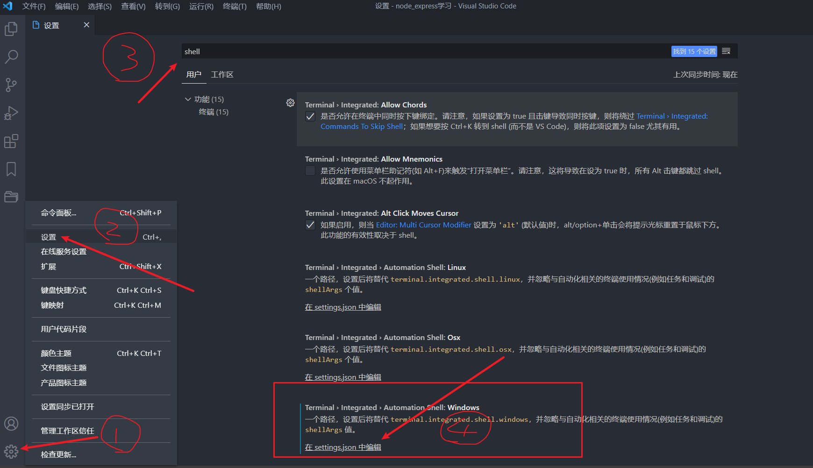

### **Git常用命令**

```shell
# 初始化仓库
git init
# 工作区提交到暂存区
git add file
# 从暂存区提交到本地仓库
git commit -m '提交说明'
# 删除文件
git rm file
# 查看版本库日志信息
git log
# 查看当前文件修改状态
git status
# 添加远程仓库
git remote add origin git@github.com:jiwei-hemeng/node-96.git
# 将本地仓库推送到远程仓库
git push -u origin master
# 清除远程仓库
git remote rm origin
# 保存当前未commit的代码并添加备注
git stash save "备注的内容"
# 列出stash的所有记录
git stash list
# 删除stash的所有记录
git stash clear
# 应用最近一次的stash
git stash apply
# 应用最近一次的stash，随后删除该记录
git stash pop
# 删除最近的一次stash
git stash drop
# 撤回未提交的更改
git checkout src/view/index/index.vue
# 比较文件
git diff src/view/index/index.vue
# 清除本地库的缓存
git rm -r --cached .
# 撤销已被放入暂存区的文件
git reset HEAD -- .
# 将已经提交到本地仓库的代码退回到暂存区
git reset --soft [版本号]
# 更改远程仓库的 URL
git remote set-url git@github.com:jiwei-hemeng/node-96.git
```

### **Git 配置命令**

> 相关链接 https://www.liuvv.com/p/a9407b5.html

```shell
# 设置用户名
git config --global user.name 'userName'
# 设置邮箱
git config --global user.email 'example@xx.com'
# 配置SSH
ssh-keygen -t rsa -C "你的邮箱地址"
# 查看你的 public key
cat ~/.ssh/id_rsa.pub
# 测试是否连接到github, 现在带上私钥
ssh -T git@github.com -i github
# 测试是否连接到码云, 现在带上私钥
ssh -T git@gitee.com -i mayun
```

### **关于分支的命令**

```shell
# 查看当前分支
git branch
# 查看所有分支
git branch -a
# 创建分支
git branch name
# 修改当前分支名称
git branch -m oldName newName
# 创建分支并切换分支
git checkout -b name
# 切换分支
git checkout name
# 合并dev到当前分支
git merge dev
# 删除dev分支
git branch -D dev
# 查看本地分支及追踪的分支
git branch -vv
# 设置追踪, 需要已有该远程分支
git branch --set-upstream-to=origin/dev dev
# 如果是第一次提交, 新建追踪可以使用
git push -u origin dev
# 删除追踪
git branch -r -d origin/dev
# 删除git仓库上的远程dev分支
git push origin --delete dev
```

### 工作中想将dev分支合并到master分支，操作如下

**首先切换到master分支上**

```shell
git  checkout master
```

**如果是多人开发的话 需要把远程master上的代码pull下来**

```shell
git pull origin master
# 如果是自己一个开发就没有必要了，为了保险起见还是pull
```

**然后我们把dev分支的代码合并到master上**

```shell
git  merge dev
```

**然后查看状态及执行提交命令**

```shell
git status

On branch master
Your branch is ahead of 'origin/master' by 12 commits.
  (use "git push" to publish your local commits)
nothing to commit, working tree clean

//上面的意思就是你有12个commit，需要push到远程master上 
> 最后执行下面提交命令
git push origin master
```

###  免密远程登陆及免密远程拷贝设置

> chmod 文件读写权限：
>
> 三个数代表： - 所有者 - 用户组 - 其它用户 
>
> 读写权限： wrx 分别对应读、写、执行，用数字表示 4、2、1

```shell
# 生成公钥
ssh-keygen -t rsa
# 进入shh 文件夹
cd ~/.ssh/
# 将RSA密钥添加到authorized_keys文件
cat id_rsa.pub >>authorized_keys
# 配置ssh文件的权限
chmod 600 authorized_keys
# 登录并上传公钥
scp authorized_keys root@192.168.112.131:/root/.ssh
# 去登录
ssh 192.168.112.131
# 本地文件拷贝到远程主机
scp anaconda-ks.cfg root@192.168.112.131:/tmp
# 远程主机文件拷贝到本地
scp  root@192.168.112.130:/tmp/anaconda-ks.cfg  /root
```

### 在vscode中配置GIT终端



```json
{
  "terminal.integrates.profiles.windows": {
    "Git-Bash": {
      "path": "D:\\Program Files\\Git\\bin\\bash.exe",
      "args": []
    }
  }
}
```

### cmd 常用命令
```shell
# 刷新本地dns
ipconfig /flushdns
# 列出所有连接过的WiFi的配置文件  
netsh wlan show profiles
# 查看到某个具体WiFi的配置详情，包括密码：
netsh wlan show profiles name="XXXXXX" key=clear
# 磁盘检查
chkdsk
# 打开磁盘清理工具
cleanmgr
# 向对方电脑发送一条文本提示
msg /server:192.168.1.109 * "需要发送的消息"
# 磁盘修复
chkdsk d: /f
# D盘下生成一个指向E盘文件夹system\systemconfig的软连接link文件夹
mklink /j D:\systemconfig D:\system\systemconfig
# 清除日志垃圾
%temp%
```

### cmd 安装jdk并配置环境变量

```shell
# 引号中换成自己的路径
setx JAVA_HOME "C:\Program Files\Java\jdk1.8.0"
setx Path "%PATH%;%JAVA_HOME%\bin";
# 设置classpath命令
setx -m CLASSPATH "%JAVA_HOME%\lib;%CLASSPATH%"; 
```

### ssh 远程操作

```shell
# 远程登陆
ssh root@192.168.5.128 -p 22
# 把本机生成的公钥添加到远程服务器
ssh-copy-id -i /root/.ssh/id_dsa.pub root@192.168.5.128
# 也可以使用第二种，方式添加
cat ~/.ssh/id_rsa.pub | ssh root@192.168.5.128 "mkdir ~/.ssh; cat >> ~/.ssh/authorized_keys"
# 将本地的文件或者文件夹上传到服务器 -r 选项表示上传文件夹
scp -r D:\etc\liLianInfo\unpackage\dist\dev\mp-weixin root@192.168.5.128:/home/root/path
# 下载整个目录
scp -r root@192.168.5.128:/home/root/path D:/path
# 安装yum
sudo apt-get install yum
# 解决liunx ifconfig 命令找不到
sudo apt-get install net-tools
# 设置root用户的密码
sudo passwd root
# 切换root用户
su root
# 查找ifconfig 脚本的位置
find / -name ifconfig -print
# linux 安装Openssh
sudo apt-get install openssh-server
# 安装nodejs
sudo apt-get install -y nodejs
# 删除非空目录
rm -rf [目录名]
```

### reset 命令会以特定的顺序重写这三棵树，在你指定以下选项时停止：
+ 移动 HEAD 指向的分支 （若指定了 --soft，则到此停止）；
  ```shell
  # 它本质上是撤销了上一次 git commit 命令
  git reset –soft HEAD~
  ```
+ 重置 index 以便和 HEAD 相匹配 （若未指定 --hard，则到此停止）；
  ```shell
  # 它依然会撤销一上次提交，但还会取消所有暂存。 于是，我们回滚到了所有 git add 和 git commit 的命令执行之前。
  git reset –mixed HEAD~
  ```
+ 使工作目录看起来像索引
  ```shell
  # 撤销了最后的提交（git commit ）、git add 和工作目录中的所有工作。
  git reset –hard HEAD~
  ```

