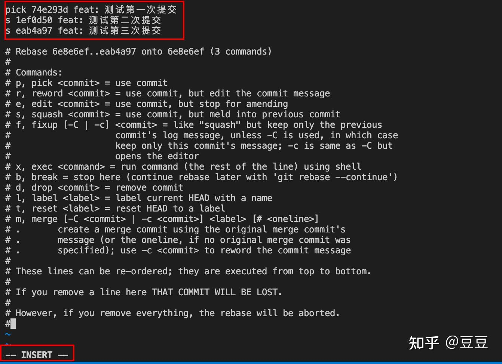

# Git 常用命令

```shell
# 初始化仓库
git init
# 工作区提交到暂存区
git add file
# 从暂存区提交到本地仓库
git commit -m '提交说明'
# 删除文件
git rm file
# 查看版本库日志信息
git log
# 查看当前文件修改状态
git status
# 将本地仓库推送到远程仓库
git push -u origin master
# 比较文件
git diff src/view/index/index.vue
# 清除本地库的缓存
git rm -r --cached .
# 撤销已被放入暂存区的文件
git reset HEAD -- .
# 添加远程仓库
git remote add origin git@github.com:jiwei-hemeng/node-96.git
# 更改远程仓库的 URL
git remote set-url origin git@github.com:jiwei-hemeng/node-96.git
# 清除远程仓库
git remote rm origin
# 查找当前存在冲突的文件
git diff --check
# 修改提交信息(commit message)
git commit --amend --only -m 'xxxxxxx'
# 修改上次提交的用户名和邮箱
git commit --amend --author="name <email>" --no-edit
# 强制推送到main分支
git push -f origin mian
# 查看上次提交的内容
git show
# 显示某一特定用户（例如，用户 Agil）在两个指定的日期之间的提交记录
git log --oneline --since="2022-04-22" --until="2022-04-24" --author="Agil"
# 查看已经暂存起来的文件(staged)和上次提交时的快照之间(HEAD)的差异
git diff --staged
# 查询lib/component/BasicInfoCard.jsx 文件1539行最后一次修改信息
git blame -L 1539,1539 lib/component/BasicInfoCard.jsx
git blame -C -w -L 2,2 lib/index.jsx
# 搜索提交信息
git log --grep="闭包陷阱"
```

# Git 配置命令

```shell
# 设置用户名
git config --global user.name 'userName'
# 设置邮箱
git config --global user.email 'example@xx.com'
# 设置log 的时间格式
git config --global log.date format:'%Y-%m-%d %H:%M:%S'
# 基于RSA算法，生成密钥对命令如下：
ssh-keygen -t rsa -C "你的邮箱地址"
# 基于ED25519算法，生成密钥对命令如下：
ssh-keygen -t ed25519 -C "your_email@example.com"
# 查看你的 public key
cat ~/.ssh/id_rsa.pub
# 测试是否连接到github, 现在带上私钥
ssh -T git@github.com -i github
# 测试是否连接到码云, 现在带上私钥
ssh -T git@gitee.com -i mayun
#查看git配置
git config --list
git config -l
#查看系统配置
git config --system --list
#查看当前用户（global）全局配置
git config --list --global
#查看当前仓库配置信息
git config --local  --list
```

# git 缓存命令

```shell
# 保存当前未commit的代码并添加备注
git stash save "备注的内容"
# 列出stash的所有记录
git stash list
# 删除stash的所有记录
git stash clear
# 应用最近一次的stash
git stash apply
# 应用最近一次的stash，随后删除该记录
git stash pop
# 删除最近的一次stash
git stash drop
# 通过传递标识符作为最后一个参数来选择你想要弹出或应用的储藏
git stash pop stash@{1}
# 删除某个本地缓存
git stash drop stash@{0}
# 使用某个本地缓存
git stash apply stash@{1}
```

# 变基

```shell
# 3=> 代表的是最近三次
git rebase -i HEAD~3
```

常用指令说明

```text
pick：保留该commit（缩写:p）
reword：保留该commit，但我需要修改该commit的注释（缩写:r）
edit：保留该commit, 但我要停下来修改该提交(不仅仅修改注释)（缩写:e）
squash：将该commit和前一个commit合并（缩写:s）
fixup：将该commit和前一个commit合并，但我不要保留该提交的注释信息（缩写:f）
exec：执行shell命令（缩写:x）
drop：我要丢弃该commit（缩写:d）
```

我们按 `i` 进入编辑页面



上面的意思就是把第二次、第三次提交都合并到第一次提交上

# 关于分支的命令

```shell
# 查看当前分支
git branch
# 查看所有分支
git branch -a
# 创建分支
git branch name
# 修改当前分支名称
git branch -m oldName newName
# 创建分支并切换分支
git checkout -b name
# 切换分支
git checkout name
# 合并dev到当前分支
git merge dev
# 删除dev分支
git branch -D dev
# 查看本地分支及追踪的分支
git branch -vv
# 如果是第一次提交, 新建追踪可以使用
git push -u origin dev
# 删除追踪
git branch -r -d origin/dev
# 删除git仓库上的远程dev分支
git push origin --delete dev
```

# git checkout 与 git switch, git resotre 的关系

## git switch

```shell
# 创建并且切换dev分支
git switch -c dev
# 切换dev分支
git switch dev
# 切换到某一个commit但是不创建新的分支
git switch --detach a434bda
```

## git restore

```shell
# 放弃工作区的更改，相当于git checkout . 命令
git restore .
git restore --worktree .
# 从暂存区退回到工作区
git restore --staged .
# 用 HEAD 的文件同时重置缓存去和工作区的所有文件
git restore --staged --worktree .
# 用 dev2 分支的 READEME.md 替换当前工作区
git restore --source dev2 READEME.md
```

# git 别名

```shell
# 定义别名
git config --global alias.lg "log --pretty='%C(red)%h%Creset%C(yellow)%d%Creset %s %C(cyan)(%ar)%Creset'"
git config --global alias.lg "log --color --graph --pretty=format:'%Cred%h%Creset -%C(yellow)%d%Creset %s %Cgreen(%cr) %C(bold blue)<%an>%Creset' --abbrev-commit"
# 使用别名
git lg
# 提交到本地仓库
git config --global alias.cm "commit -m"
# 使用别名
git cm "xxxx"
```

# git 版本升级

```shell
# 下载安装包
winget install --id Git.Git -e --source winget
# 通过 git 命令升级
git update-git-for-windows
```

# git hook 使用

**创建文件**

```shell
cd .git/hooks && touch pre-commit
```

**编辑文件内容**

```js
#!/usr/bin/env node
const child_process = require("child_process");
const fs = require("fs");
const command = "git diff --cached --name-only --diff-filter=ACMR -- .";
const trimReg = /(\ +)|([ ])|([\r\n]|(["]))/g;
let commitFile = child_process.execSync(command).toString();
commitFile = commitFile.split("\n");
const fileList = [];
for (let i = 0; i < commitFile.length; i++) {
  const name = commitFile[i];
  if (!name) break;
  fileList.push(decodeURIComponent(name.replace(trimReg, "")));
}
const editFiles = [];
fileList.forEach((file) => {
  const txt = fs.readFileSync(file, "utf8");
  if (txt.includes("debugger")) {
    editFiles.push(file);
    fs.writeFileSync(file, txt.replace(/(debugger);?(\s*\n)*/g, ""));
    const commandAdd = "git add " + file;
    child_process.execSync(commandAdd).toString();
  }
});
process.exit(0);
```

**赋予可执行权限**

```shell
chmod +x pre-commit
```

此时再次执行`git commit` 就能运行 `git hooks` 清除 提交文件的 `debugger` 了

**其他常见的 hooks**

commit-msg

```js
#!/usr/bin/env node
const childProcess = require("child_process");
const fs = require("fs");

const email = childProcess.execSync("git config user.email").toString().trim();
const msg = fs.readFileSync(process.argv[2], "utf-8").trim(); // 索引 2 对应的 commit 消息文件
const commitRE =
  /^(feat|fix|docs|style|refactor|perf|test|workflow|build|ci|chore|release|workflow)(\(.+\))?: .{1,100}/;

if (!commitRE.test(msg)) {
  console.log();
  console.error("不合法的 commit 消息格式，请使用正确的提交格式：");
  console.error("feat: add 'comments' option");
  console.error("fix: handle events on blur (close #28)");
  console.error(
    "详情请查看 git commit 提交规范：https://github.com/woai3c/Front-end-articles/blob/master/git%20commit%20style.md。"
  );
  process.exit(1);
}

if (!/@qq\.com$/.test(email)) {
  console.error("此用户没有权限，具有权限的用户为： xxx@qq.com");
  process.exit(1);
}
```

pre-push 提交之前修改版本号

```js
#!/usr/bin/env node
const child_process = require("child_process");
const fs = require("fs");
const txt = fs.readFileSync("package.json", "utf8");
const parseTxt = JSON.parse(txt);
let min = Number(parseTxt.version.split(".")[1]);
let patch = Number(parseTxt.version.split(".")[2]);
patch++;
let command = "npm version patch";
if (patch == 100) {
  min += 1;
  command = "npm version minor";
}

if (min == 100) {
  command = "npm version major";
}
child_process.execSync(command).toString();
process.exit(0);
```

# git reset 三棵树

移动 HEAD 指向的分支 （若指定了 --soft，则到此停止）；

```shell
# 它本质上是撤销了上一次 git commit 命令
git reset --soft HEAD~
```

重置 index 以便和 HEAD 相匹配 （若未指定 --hard，则到此停止）；**默认的可以不用带该参数**

```shell
# 它依然会撤销一上次提交，但还会取消所有暂存。 于是，我们回滚到了所有 git add 和 git commit 的命令执行之前。
git reset --mixed HEAD~
# 相当于执行
git reset HEAD~
```

使工作目录看起来像索引

```shell
# 撤销了最后的提交（git commit ）、git add 和工作目录中的所有工作。
git reset --hard HEAD~
```

HEAD 说明：

- HEAD 表示当前版本
- HEAD^ 上一个版本
- HEAD^^ 上上一个版本

可以使用 ～数字表示

- HEAD~0 表示当前版本
- HEAD~1 上一个版本
- HEAD~2 上上一个版本

# 解决 github 网速慢的方案

修改 host 文件

```txt
https://raw.hellogithub.com/hosts
```

# git pull 使用变基模式

> 我们都知道`git push` 命令是 `git fetch`、`git merge` 两个命令的组合，但是这种模式会让提交历史变得很复杂，难以追溯问题，其解决方案就是使用git push 的变基模式

```shell
git pull --rebase
```

但是每次提交代码都是用这个命令是非常繁琐的，此时我们就可以设置全局配置，一劳永逸

```shell
git config --global pull.rebase true
```

想要关闭也很简单，只需要执行

```shell
git config --global pull.rebase false
```

使用变基有一个额外的问题是：如果你本地文件有更改的话，变基会失败，因为变基前服务区必须是干净的，可以通过以下两个方案解决：

+ `git pull` 前，先使用`git commit` 提交代码
+ `git pull` 前，先使用`git stash` 将代码暂存

执行完 `git pull --rebase`之后如果有合并冲突，使用以下三种方式处理这些冲突：

+ `git rebase --abort` 会放弃合并，回到rebase操作之前的状态，之前的提交的不会丢弃；

+ `git rebase --skip` 则会将引起冲突的commits丢弃掉（慎用！！）；

+ `git rebase --continue` 合并冲突，结合"git add 文件"命令一起用与修复冲突，提示开发者，一步一步地有没有解决冲突。（fix conflicts and then run “git rebase --continue”）

  ```shell
  git add .
  git rebase --continue
  ```

其他和先前没有区别

# Cherry Pick

Cherry Pick 是 Git 提供的一个功能强大的命令，**用于将某个特定的提交从一个分支复制到另一个分支**。与直接合并整个分支的 `git merge` 和 `git rebase` 不同，Cherry Pick 的独特之处在于它可以只挑选一个或几个具体的提交，而无需处理整个分支的更改。

```shell
git cherry-pick abc123
```

如果产生了冲突, 在解决冲突后，执行以下命令标记为已解决：

```shell
git add <file>
git cherry-pick --continue
```

如果发现问题或不想继续，可以执行以下命令中止 Cherry Pick：

```shell
git cherry-pick --abort
```

# 未来无忧的哈希算法：SHA-256

随着 SHA-1 算法的安全性逐渐受到质疑，Git 2.29 引入了对 SHA-256 的支持。通过 core.hashAlgorithm 配置，你可以将仓库迁移到更安全的哈希算法。

```shell
git config --global core.hashAlgorithm sha256
```

# git revert  

> git revert 是 Git 中用于撤销一个或多个历史提交的命令。与 git reset 不同，git revert 不会直接修改 Git 历史，而是通过创建一个新的提交来“反向”应用某个提交的内容，撤销该提交的所有修改。因此，git revert 是一个安全的操作，尤其适合在多人协作的项目中使用，因为它不会改变历史提交记录，而是以新的提交形式记录撤销的操作
>

常见用途：

+ 撤销某次提交：可以撤销某次提交的修改内容，而不破坏历史。
+ 在公开分支上撤销提交：因为 git revert 不会改变提交历史，所以适合在公开分支（如 master 或 main）上撤销不需要的提交，而不影响其他开发者的工作。
+ 创建反向提交：通过 git revert，可以创建一个新的提交，该提交是撤销某个错误提交的反向修改。

```shell
# 撤销指定提交
git revert abc1234
# 撤销最后一次提交
git revert HEAD
# 撤销从 abc1234 到 def5678 之间的所有提交：可以提供多个提交的哈希值或通过 .. 指定一个范围
git revert abc1234..def5678
# 撤销多个不连续的提交
git revert abc1234 def5678 ghi9012
```

命令的常用选项及参数

+ ` --no-commit `  执行撤销操作，但不创建提交，而是将更改保留在工作区和暂存区。此选项允许你在查看更改后决定是否提交 

  ```shell
  git revert --no-commit abc1234
  ```

+  `--edit`：默认情况下，`git revert` 会自动生成提交信息。使用 `--edit` 选项可以手动编辑提交信息，通常用于当你需要详细描述撤销操作时。 

  ```shell
  git revert --edit abc1234
  ```

+  `--no-edit`：如果你希望跳过编辑提交信息的步骤，可以使用该选项 

  ```shell
  git revert --no-edit abc1234
  ```

+  `-n` 或 `--no-commit`：与 `--no-commit` 相同，将更改保留在工作区和暂存区，而不自动提交。 

  ```shell
  git revert -n abc1234
  ```

总结： 假如依次提交了a--> a-->c-->d-->f  使用`git revert c` 撤销以后仅仅只是撤销了c 而 d、f 依然在

# 生成ssl证书

```shell
# 查看 openssl 是否安装
openssl version -a
# 生成私钥
openssl genrsa -out server.key 2048
# 创建证书签名请求
openssl req -new -key server.key -out server.csr
# 生成自签名证书
openssl x509 -req -days 365 -in server.csr -signkey server.key -out server.crt
```

