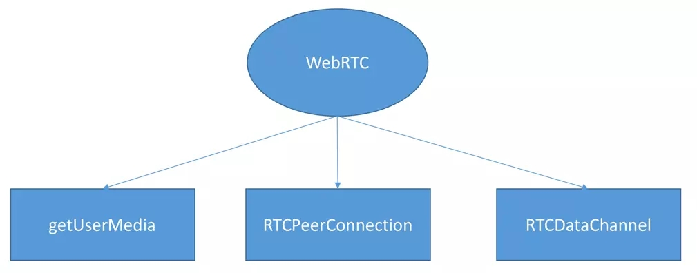
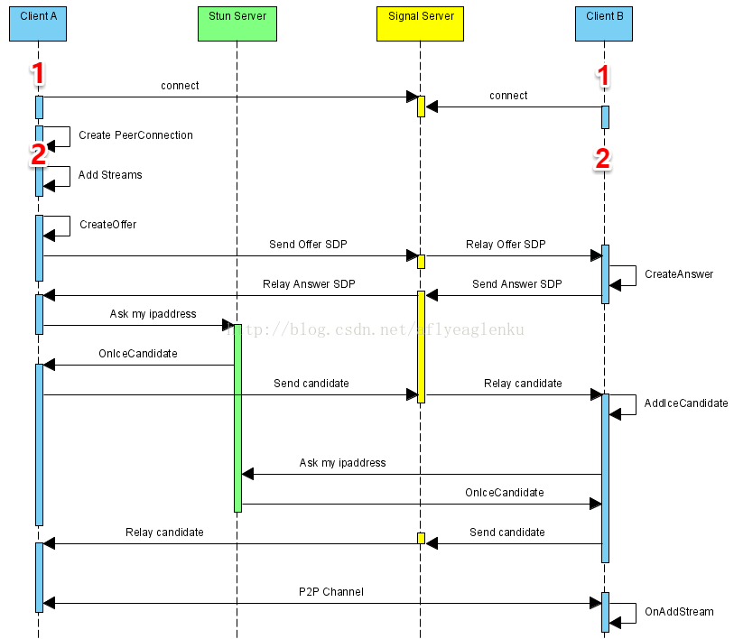

### 简介
  > 目的 帮助自己了解webrtc 实现端对端通信
  
  

  ```bash
    # 使用流程
    git clone https://gitee.com/wjj0720/webrtc.git
    cd ./webRTC
    npm i
    npm run dev

    # 访问 127.0.0.1:3003/test-1.html 演示h5媒体流捕获
    # 访问 127.0.0.1:3003/local.html 演示rtc 本地传输
    # 访问 127.0.0.1:3003/p2p.html 演示局域网端对端视屏    

  ```


### what is WebRTC
  ```
    WebRTC(Web Real-Time Communication) 网页即时通信 ，是一个支持网页浏览器进行实时语音、视频对话的API。
    于2011年6月1日开源并在Google、Mozilla、Opera支持下被纳入万维网联盟的W3C推荐标准
  ```
  ```
    闲话：目前主流实时流媒体 实现方式
    RTP :(Real-time Transport Protocol) 建立在 UDP 协议上的一种协议加控制

    HLS（HTTP Live Streamin）苹果公司实现的基于HTTP的流媒体传输协议

    RTMP（Real Time Messaging Protocol） Adobe公司基于TCP

    WebRTC google 基于RTP协议
  ```

### WebRTC组成
  

  - getUserMedia负责获取用户本地的多媒体数据

  - RTCPeerConnection负责建立P2P连接以及传输多媒体数据。

  - RTCDataChannel提供的一个信令通道实现双向通信

### h5 获取媒体流
  > 目标：打开摄像头将媒体流显示到页面

  [MediaDevices 文档](https://developer.mozilla.org/en-US/docs/Web/API/MediaDevices/getUserMedia)

```js
  navigator.mediaDevices.getUserMedia({
    video: true, // 摄像头
    audio: true // 麦克风
  }).then(steam => {
    // video标签的srcObject
    video.srcObject = stream
  }).catch(e => {
    console.log(e)
  })
```

### RTCPeerConnection
  > RTCPeerConnection api提供了 WebRTC端创建、链接、保持、监控闭连接的方法的实现
  [RTCPeerConnection MDN](https://developer.mozilla.org/zh-CN/docs/Web/API/RTCPeerConnection)

  1. webRTC流程
  

  ```
    以 A<=>B 创建p2p连接为例
    
    A端：
      1.创建RTCPeerConnection实例：peerA
      2.将自己本地媒体流(音、视频)加入实例，peerA.addStream
      3.监听来自远端传输过来的媒体流 peerA.onaddstream
      4.创建[SDP offer]目的是启动到远程(此时的远端也叫候选人)))对等点的新WebRTC连接 peerA.createOffer 
      5.通过[信令服务器]将offer传递给呼叫方
      6.收到answer后去[stun]服务拿到自己的IP,通过信令服务将其发送给呼叫放

    B端:
      1.收到信令服务的通知 创建RTCPeerConnection peerB，
      2.也需要将自己本地媒体流加入通信 peerB.addstream
      3.监听来自远端传输过来的媒体流 peerA.onaddstream
      4.同样创建[SDP offer] peerA.createAnswer
      5.通过[信令服务器]将Answer传递给呼叫方
      6.收到对方IP 同样去[stun]服务拿到自己的IP 传递给对方
  
      至此完成p2p连接 触发双发onaddstream事件
      
  ```

  2. 信令服务
  ```
    信令服务器：
      webRTC中负责呼叫建立、监控(Supervision)、拆除(Teardown)的系统
    为什么需要：
      webRTC是p2p连接，那么连接之前如何获得对方信息，有如何将自己的信息发送给对方，这就需要信令服务
  ```

  3. SDP
  ```
    什么是SDP
      SDP 完全是一种会话描述格式 ― 它不属于传输协议
      它只使用不同的适当的传输协议，包括会话通知协议（SAP）、会话初始协议（SIP）、实时流协议（RTSP）、MIME 扩展协议的电子邮件以及超文本传输协议（HTTP）
      SDP协议是基于文本的协议，可扩展性比较强，这样就使其具有广泛的应用范围。
    
    WebRTC中SDP
      SDP不支持会话内容或媒体编码的协商。webrtc中sdp用于媒体信息(编码解码信息)的描述，媒体协商这一块要用RTP来实现
  ```

  4. stun
  ```
    1.什么是STUN
      STUN（Session Traversal Utilities for NAT，NAT会话穿越应用程序）是一种网络协议，它允许位于NAT（或多重NAT）后的客户端找出自己的公网地址，查出自己位于哪种类型的NAT之后以及NAT为某一个本地端口所绑定的Internet端端口。这些信息被用来在两个同时处于NAT路由器之后的主机之间创建UDP通信。这种通过穿过路由直接通信的方式叫穿墙
    
    2.什么是NAT
      NAT（Network Address Translation，网络地址转换)，是1994年提出的。当在专用网内部的一些主机本来已经分配到了本地IP地址，但现在又想和因特网上的主机通信时，于是乎在路由器上安装NAT软件。装有NAT软件的路由器叫做NAT路由器，它可以通过一个全球IP地址。使所有使用本地地址的主机在和外界通信时，这种通过使用少量的公有IP地址代表较多的私有IP地址的方式，将有助于减缓可用的IP地址空间的枯竭

    3.WebRTC的穿墙
      目前常用的针对UDP连接的NAT穿透方法主要有：STUN、TURN、ICE、uPnP等。其中ICE方式由于其结合了STUN和TURN的特点 webrtc是用的就是这个
      google提供的免费地址：https://webrtc.github.io/samples/src/content/peerconnection/trickle-ice/
  ```

### 搭建 STUN/TURN
  > 因为没有钱买服务器 没试过
  
  [coturn](https://github.com/coturn/coturn) 据说使用它搭建 STUN/TURN 服务非常的方便

  ```bash
    # 编译
    cd coturn
    ./configure --prefix=/usr/local/coturn
    sudo make -j 4 && make install

    # 配置
    listening-port=3478        #指定侦听的端口
    external-ip=39.105.185.198 #指定云主机的公网IP地址
    user=aaaaaa:bbbbbb         #访问 stun/turn服务的用户名和密码
    realm=stun.xxx.cn          #域名，这个一定要设置
 
    #启动
    cd /usr/local/coturn/bin
    turnserver -c ../etc/turnserver.conf

    trickle-ice https://webrtc.github.io/samples/src/content/peerconnection/trickle-ice 按里面的要求输入 stun/turn 地址、用户和密码 
    输入的信息分别是： 
      STUN or TURN URI 的值为： turn:stun.xxx.cn
      用户名为： aaaaaa
      密码为： bbbbbb

  ```


### STUN参数传递
```js
  let ice = {"iceServers": [
    {"url": "stun:stun.l.google.com:19302"},  // 无需密码的
    // TURN 一般需要自己去定义
    {
      'url': 'turn:192.158.29.39:3478?transport=udp',
      'credential': 'JZEOEt2V3Qb0y27GRntt2u2PAYA=', // 密码
      'username': '28224511:1379330808' // 用户名
    },
    {
      'url': 'turn:192.158.29.39:3478?transport=tcp',
      'credential': 'JZEOEt2V3Qb0y27GRntt2u2PAYA=',
      'username': '28224511:1379330808'
    }
  ]}
  // 可以提供多iceServers地址，但RTC追选择一个进行协商


  // 实例化的是给上参数 RTC会在合适的时候去获取本地墙后IP
  let pc = new RTCPeerConnection(ice);

  /*
    // 据说这些免费的地址都可以用
    stun:stun1.l.google.com:19302
    stun:stun2.l.google.com:19302
    stun:stun3.l.google.com:19302
    stun:stun4.l.google.com:19302
    stun:23.21.150.121
    stun:stun01.sipphone.com
    stun:stun.ekiga.net
    stun:stun.fwdnet.net
    stun:stun.ideasip.com
    stun:stun.iptel.org
    stun:stun.rixtelecom.se
    stun:stun.schlund.de
    stun:stunserver.org
    stun:stun.softjoys.com
    stun:stun.voiparound.com
    stun:stun.voipbuster.com
    stun:stun.voipstunt.com
    stun:stun.voxgratia.org
    stun:stun.xten.com
  */
```