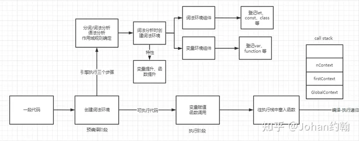

# 闭包 

> [MDN](https://developer.mozilla.org/zh-CN/docs/Web/JavaScript/Closures)

## 定义

**闭包**（closure）是一个封闭的函数以及其捆绑的周边环境状态（**lexical environment**，**词法环境**）的引用的组合。换而言之，闭包让开发者可以从内部函数访问外部函数的作用域。在 JavaScript 中，闭包会随着函数的创建而被同时创建。

## 本质

闭包是将函数内部和函数外部连接起来的桥梁。

## 形成闭包的必要条件：

- 两个函数形成嵌套关系
- 内部函数访问外部函数的变量

## 闭包的例子

```js
function warp () {
  let num = 1
  return function () {
    console.log(num)
  }
}
const p = warp()
p()
```

## 优点

外部函数能访问到内部变量

延长变量的生命周期（函数内部的变量是局部变量垃圾回收机制不能自动清除，所以会延长生命周期）

## 缺点

会形成数据的缓存，用完之后需要手动清空（给该变量赋一个空值null）

## 为啥没有销毁变量

+ 被赋值就有了引用关系，那么内部的函数就不会销毁（其函数的作用域自然也就不会销毁）
+ 闭包的作用域：在函数**定义**的地方开始向上查找

## 使用

### 用闭包模拟私有方法

> 编程语言中，比如 Java，是支持将方法声明为私有的，即它们只能被同一个类中的其它方法所调用。而 JavaScript 没有这种原生支持，但我们可以使用闭包来模拟私有方法。私有方法不仅仅有利于限制对代码的访问：还提供了管理全局命名空间的强大能力，避免非核心的方法弄乱了代码的公共接口部分。

```js
var makeCounter = function() {
  var privateCounter = 0;
  function changeBy(val) {
    privateCounter += val;
  }
  return {
    increment: function() {
      changeBy(1);
    },
    decrement: function() {
      changeBy(-1);
    },
    value: function() {
      return privateCounter;
    }
  }
};

var Counter1 = makeCounter();
var Counter2 = makeCounter();
console.log(Counter1.value()); /* logs 0 */
Counter1.increment();
Counter1.increment();
console.log(Counter1.value()); /* logs 2 */
Counter1.decrement();
console.log(Counter1.value()); /* logs 1 */
console.log(Counter2.value()); /* logs 0 */
```

### 模拟块级作用域

```js
for (var i = 0; i < 10; i++) {
  (function(i) {
    setTimeout(() => {
      console.log(i)
    }, 5000)
  })(i)
}
```

### 柯里化

> 柯里化（Currying）是把接受多个参数的函数变换成接受一个单一参数(最初函数的第一个参数)的函数，并且返回接受余下的参数且返回结果的新函数的技术。

```js
function foo() {
  console.log(this.name);
}
const obj = {
  name: "xiaom",
};
const obj1 = {
  name: "xiaoh"
}
function curryingFn(fn) {
  return (obj) => {     
    return fn.bind(obj)
  }
}
const newFoo = curryingFn(foo)
newFoo(obj)() // xiaom
newFoo(obj1)() // xiaoh
```

**柯里化实例**

```js
function curring(reg) {
  return (str) => {
    return reg.test(str);
  };
}
var checkPhone = curring(/^1[34578]\d{9}$/);
var checkEmail = curring(/^(\w)+(\.\w+)*@(\w)+((\.\w+)+)$/);
console.log(checkPhone("183888888")); // false
console.log(checkPhone("17654239819")); // true
console.log(checkEmail("exy@163.com")); // true
```

### 防抖与节流

**防抖**

> [lodash 防抖](https://www.lodashjs.com/docs/lodash.debounce#_debouncefunc-wait0-options)

```js
function debounce(fn, wait = 50) {
  let timer;
  return function () {
    if (timer) clearTimeout(timer);
    timer = setTimeout(() => {
      fn.call(this, ...arguments);
    }, wait);
  };
}
```

**节流**

> [lodash 节流](https://www.lodashjs.com/docs/lodash.throttle#_throttlefunc-wait0-options)

```js
function throttle(fn, wait = 50) {
  let canRun = true;
  return function () {
    if (canRun) {
      setTimeout(() => {
        fn.call(this, ...arguments);
        canRun = true;
      }, wait);
      canRun = false;
    }
  };
}
```

### 树形数组转普通数组

```js
export function treeToArr(data) {
  const result = [];
  data.forEach(item => {
    const loop = data => {
      result.push({
        id: data.key, // 此处的id对应子节点的parentId
        termName: data.termName,
        termValue: data.termValue,
        parentId: data.parentId
      });
      let child = data.children
      if (child) {
        for (let i = 0; i < child.length; i++) {
          loop(child[i])
        }
      }
    }
    loop(item);
  })
  return result;
}
```

### 普通数组转树形数组

```js
export function arrToTree(data, pId) {
  const loop = parentId => {
    const res = []
    data.forEach(item => {
      if (item.parentId === parentId) {
        const childArr = loop(item.id);
        if(childArr.length > 0) {
          item.children = childArr;
        } 
        res.push(item)
      }
    })
    return res
  }
  return loop(pId)
}
```

# 词法环境(Lexical Environment)

## 定义

词法环境是一种存在于规范中的类型，用来定义变量名与变量及函数之间的映射关系。它由两部分组成:

+ 环境记录(Environment Record)，用于记录与当前词法环境相关的变量名与变量值绑定(在后文会经常提到绑定)，也就是上面提到的映射关系。
+ 对外部词法环境的引用(outer reference)，可能是一个 null。这个引用在逻辑上建立了词法环境之间的嵌套关系，可以通过引用一层层寻找外部的词法环境。当然，一个外部的词法环境也可以被多人内部的词法环境所引用(其实就是一个复杂点的链表)。

# 作用域

## 定义

**作用域是一套用于确定在何处以及如何查找变量的规则**。这是 YDKJS 中给出的关于作用域的定义。我们知道JavaScript采用的是**词法作用域(静态作用域)**，简单讲，JavaScript的作用域是根据代码书写位置确定的。

# JavaScript 的生命周期

JavaScript 的执行生命周期分成两个阶段，**编译阶段** 和 **执行阶段**

+ 编编译阶段由编译器完成，它将代码翻译成可执行代码，这个阶段能知道**全部标识符**在哪里、如何声明的以及**作用域规则**
  + 编译阶段进行变量申明
  + 编译阶段变量声明进行提升，但是值为 undefined
  + 编译阶段所有非表达式的函数声明进行提升
+ 代码执行阶段即执行可运行代码，生成执行上下文，这部分由引擎实现
  + 负责 `变量赋值` ，`函数引用` 以及`执行代码`



# 声明与定义的区别

下例叫做**声明变量：**

```js
var a;
```

下例叫做**定义变量:**

```js
var a = 1;
```

声明：是指你声称某样东西的存在，比如一个变量或一个函数；但你没有说明这样东西到底是什么，仅仅是告诉解释器这样东西存在而已；定义：是指你指明了某样东西的具体实现，比如一个变量的值是多少，一个函数的函数体是什么，确切的表达了这样东西的意义。

**总结： 定义相当于声明 +  赋值**
