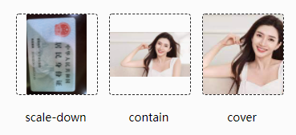

## 文本选择颜色

```css
::selection {
    background-color: #ccc;
    color: #666;
}
```

## 首字下沉

> 使用 first-letter 伪元素来装饰你的第一个字母，不需要使用 span 和 .dropcap 类名。

```css
p:first-of-type::first-letter {
    color: #666;
    float: left;
    font-family: "Georgio";
    font-size: 4em;
    line-height: 4vh;
    padding-right: 4px;
}
```

## 平滑滚动

```css
html {
    scorll-behavior: smooth !important;
}
```

## 投影

```css
.img-wrapper img {
    width: 100%;
    height: 100%;
    object-fit: cover;
    filter: drop-shadow(30px 10px 4px #757575);
}
```

## 自定义滚动条

```css
.content-warpper {
    width: 100%;
    height: 260px;
}
/* 滚动条的样式 */
.content-warpper::-webkit-scrollbar {
    width: 2px;
    background-color: #dbdbdb;
    border-radius: 1px;
}
.content-warpper::-webkit-scrollbar:active {
    background-color: #616161;
}
/* 滚动条里面的小方块 */
.content-warpper::-webkit-scrollbar-thumb {
  border-radius: 10px;
  background-color: skyblue;
}
/* 滚动条里面的轨道 */
.content-warpper::-webkit-scrollbar-track {
  box-shadow: inset 0 0 5px rbga(0,0,0, 0.5);
}
```

## 禁用用户选择

```CSS
.content-header h2 {
    user-select: none;
}
```

## 竖排文字

```css
.sidebar h3 {
    writing-mode: lb-rl;
    transform: rotate(-180deg)
}
```

## css 实现背景图片固定在浏览器

```css
/* 设置背景图片 */
background-image: url('./fisrtbg.jpg');
/* 背景图片的尺寸  */
background-size: cover;
/* 背景图像是否固定或者随着页面的其余部分滚动，默认值scroll, 默认会滚动 */
background-attachment: fixed;
/* 设置背景图片的位置 */
background-position: center;
```

## object-fit

> object-fit 属性控制被替换元素的纵横比，例如 img 和 video，如果它们有宽度或高度，以及缩放过程。



```css
img {
    width: 100px;
    height: 100px;
    object-fit: scale-down;
    border: 1px dashed #262626;
    border-radius: 4px;
}
```

## css中的attr()函数

> 使用 attr() 函数，你可以检索所选元素的属性值并在样式中使用它。

例如

```html
<p>Some <span data-tooltip="tooltip">text</span> here</p>
```

使用

```css
span::after {
    content: attr(data-tooltip);
}
```

## css的calc()函数

**在less或sass中经常会遇到**

```css
$width = 100px;
.box {
    width: $width + 100px;
}
```

然而 **clac()**  函数提供了更好的

```css
.box {
    width: clac(100% - 50px);
}
```

表示box元素的宽度总是小于父元素的50px

**应用1：创建根栅格尺寸**

```css
html {
    font-size: calc(100vw / 750);
}
```

**应用2：实现元素的居中**

```css
.box {
    position: absolute;
    top: calc(50% - 150px);
    left: calc(50% - 150px);
}
```

## 使用CSS自定义属性（变量）

> [相关链接](https://developer.mozilla.org/zh-CN/docs/Web/CSS/Using_CSS_custom_properties)
>
> **自定义属性**（有时候也被称作**CSS变量**或者**级联变量**）是由CSS作者定义的，它包含的值可以在整个文档中重复使用。由自定义属性标记设定值（比如： **`--main-color: black;`**），由[var() ](https://developer.mozilla.org/zh-CN/docs/Web/CSS/var())函数来获取值（比如： `color: **var(--main-color)**;`）

```css
:root {
  --main-bg-color: brown;
}
.one {
  color: white;
  background-color: var(--main-bg-color);
  margin: 10px;
  width: 50px;
  height: 50px;
  display: inline-block;
}
```

## 常见的让盒子居中显示的方法

**方法一：**

父盒子给 position：relative；

盒子给 position：absolute；top：0；right：0；bottom：0；left：0；margin：auto；

**方法二：**

父盒子给 position：relative；

盒子给 position：absolute；top：50%；left：50%；transform：translate（-50%，-50%）；

**方法三：**

父盒子给 display: flex;align-items: center;justify-content: center;

## C3新特性

- CSS实现圆角（border-radius）,阴影（box-shadow）,边框图片border-image
- 对文字加特效（text-shadow）,强制文本换行（word-wrap）,线性渐变（linear-gradient）
- 旋转，缩放，定位，倾斜
- 媒体查询（@media）,多栏布局（flex）

## less 中的混入(mixin)

> 混入作用：提取公用的代码，在组合新的功能，可以混入公用的代码，提高逻辑的复用。

```less
.red {
    color: red;
}
.bg {
    background: #ccc;
}
.box {
    // 同时有上面两个类的特性，并且可以有自己的属性
    .red()
    .bg()
    width: 100px;
}
```

## 清除浮动

**1. 额外标签法**：给谁清除浮动，就在其后额外添加一个空白标签 。

```css
.clear {
    clear: both;
}
```

**2. 父级添加overflow方法**：

```css
.father {
    overflow: hidden;
}
```

**3. 使用after伪元素清除浮动**

```css
.clearfix::after {
    content: "";
    display: block;
    clear: both;
    width:0;
    visibility: hidden;
    height: 0
}
.clearfix {
    /*   IE6、7、8的写法  */
    zoom: 1
}
```

## 关于flex布局

+ flex-direction：设置主轴的方向
+ justify-content：设置主轴上的子元素排列方式
+ flex-wrap：设置子元素是否换行  
+ align-content：设置侧轴上的子元素的排列方式（多行）
+ align-items：设置侧轴上的子元素排列方式（单行）
+ flex-flow：复合属性，相当于同时设置了 flex-direction 和 flex-wrap

### 让flex布局的最后一行左对齐

**方案一：行数固定解决办法**

**对应的html**

```html
<div class="container">
  <div class="list"></div>
  <div class="list"></div>
  <div class="list"></div>
  <div class="list"></div>
  <div class="list"></div>
</div>
```

**对应的css**

```css
.container {
  display: flex;
  flex-wrap: wrap;
}
.list {
  width: 24%;
  height: 100px;
  background-color: skyblue;
  margin-top: 15px;
}
.list:not(:nth-child(4n)) {
  margin-right: calc(4% / 3);
}
```

**方案二：每一行列数不固定**

**对应的html**

```html
<div class="container">
  <div class="list"></div>
  <div class="list"></div>
  <div class="list"></div>
  <div class="list"></div>
  <div class="list"></div>
  <div class="list"></div>
  <!--比div少一个-->
  <i></i><i></i><i></i><i></i><i></i> 
</div>
```

**对应的css**

```css
.container {
  display: flex;
  jusify-content: space-between;
  flex-wrap: wrap;
  margin-right: -10px;
}
.list {
  width: 100px;
  height: 100px;
  background-color: skyblue;
  margin: 15px 10px 0 0;
}
.container>i {
  /* 此处必须和list宽度保持一致 */
  width: 100px;
  margin-right: 10px;
}
```

## 关于媒体查询

H5的新特性，为了移动端的使用而新增的特性，使用 @media 查询，你可以针对不同的媒体类型定义不同的样式，响应式布局就是使用媒体查询的原理

```css
/*and  可以将多个媒体特性链接到一块,相当于且*/
/*only   指定某个特定的媒体类型, 可以省略*/
@media only screen and (min-width: 320px) and (max-width: 767px) {}
/* 横屏显示 */
@media screen and (orientation: landscape) {}
/* 竖屏显示 */
@media screen and (orientation: portrait) {}
```

## 怎么让Chrome支持小于12px 的文字

> 谷歌Chrome最小字体是12px，不管你设置成8px还是10px，在浏览器中只会显示12px，那么如何解决这个坑爹的问题呢？

```css
p span{
    font-size:10px;
    -webkit-transform:scale(0.8);
    display:block;
}
```

## 文字溢出时显示点点点

**单行**

```css
overflow: hidden;
text-overflow: ellipsis;
white-space: nowrap;
```

**多行**

```css
display: -webkit-box;
-webkit-box-orient: vertical;
-webkit-line-clamp: 3;  //这里是在第二行有省略号
overflow: hidden;
```

## px 、em 和 rem 的区别

+ px 是一个固定单位
+ em是一个相对单位，相对于当前标签的字体大小
+ rem是一个相对单位，相对于html的字体大小

## 纯css的遮罩层

在html中定义html元素

```html
<div class="mask"></div>
```

在css中写样式

```css
.mask {
  position: fixed;
  top: 0;
  left: 0;
  width: 100%;
  height: 100%;
  background-color: rgba(101, 101, 101, 0.6);
  z-index: 99;
  display: none;
}
```

## 移动端特殊的css

```css
/* 清除移动端高亮 */
-webkit-tap-highlight-color: transparent;
/* 清除ios默认样式 */
-webkit-appearance: none;
/* 禁止长按弹出菜单 */
-webkit-touch-callout: none;
```

## content-visibility

> content-visibility是一个css属性，它控制一个元素是否呈现其内容，能让用户潜在地控制元素的呈现。用户可以使用它跳过元素的呈现(包括布局和绘制)，直到用户需要为止，让页面的初始渲染得到极大的提升。

content-visibility属性有三个可选值:

+ visible: 默认值。对布局和呈现不会产生什么影响。
+ hidden: 元素跳过其内容的呈现。用户代理功能（例如，在页面中查找，按Tab键顺序导航等）不可访问已跳过的内容，也不能选择或聚焦。类似于对其内容设置了display: none属性
+ auto: 对于用户可见区域的元素，浏览器会正常渲染其内容；对于不可见区域的元素，浏览器会暂时跳过其内容的呈现，等到其处于用户可见区域时，浏览器在渲染其内容。

## 去掉数字输入框中上下箭头

```css
input[type="number"] {
    -moz-appearance: textfield;
}
input[type="number"]::-webkit-inner-spin-button,
input[type="number"]::-webkit-outer-spin-button {
    -webkit-appearance: none;
    margin: 0;
}
```

## 伪类选择器 `:focus-within`

> 它表示一个元素获得焦点，或，该元素的后代元素获得焦点。划重点，它或它的后代获得焦点。这也就意味着，它或它的后代获得焦点，都可以触发 `:focus-within`。

```html
<div class="warp">
    <label for="name">姓名</label>
    <input type="text" name="" id="name" />
</div>
<style>
    .warp {
        width: 100%;
        height: 100px;
    }
    .warp:focus-within {
        border: 1px dashed skyblue;
    }
</style>
```

## 标准盒模型和怪异盒模型的区别

标准盒模型 box-sizing: content-box; IE盒子模型 box-sizing: border-box; 

标准盒与怪异盒的区别在于他们的总宽度的计算公式不一样。

+ 标准模式(也称w3c盒模型)下总宽度=width+margin（左右）+ padding（左右）+ border（左右）；
+ 怪异模式下总宽度=width+margin（左右）（就是说width已经包含了padding和border值）

## flex属性 是哪些属性的简写

> flex: 1就是flex-grow: 1; flex-shrink; 1; flex-basis: 0 的简写。

 **flex-grow**

该属性用来设置当父元素的宽度大于所有子元素的宽度的和时（即父元素会有剩余空间），子元素如何分配父元素的剩余空间。 `flex-grow`的默认值为0，意思是该元素不索取父元素的剩余空间，如果值大于0，表示索取。值越大，索取的越厉害。

**flex-shrink**

该属性用来设置，当父元素的宽度小于所有子元素的宽度的和时（即子元素会超出父元素），子元素如何缩小自己的宽度的。 `flex-shrink`的默认值为1，当父元素的宽度小于所有子元素的宽度的和时，子元素的宽度会减小。值越大，减小的越厉害。如果值为0，表示不减小。

**flex-basis**

该属性用来设置元素的宽度，其实，width也可以设置宽度。如果元素上同时设置了width和flex-basis，那么width 的值就会被flex-basis覆盖掉。

##  li与li之间有看不见的空白间隔是什么原因引起的？有什么解决方法？

> 行框的排列会受到之间空白(回车空格)等的影响，因为空格也属于字符，这些空白也会被应用样式，占据空间，所以会用空格

**解决办法**

+ 可以将<li>代码写成一排
+ 浮动li中float: left;
+ 在ul中用font-size: 0(谷歌不支持);可以使用letter-space: -3px;

##  行内元素什么时候会显示间隙

> 元素被当成行内元素排版时，原来的html代码这回车换行被转换成一个空白字符，在字体不为0的情况下，空白符会占据一定的宽度，所以行内元素会显示间隙

**解决办法**

+ 给父元素设置字体为0
+ 改变书写方式
+ 使用margin负值
+ 使用word-spacing或者letter-spacing