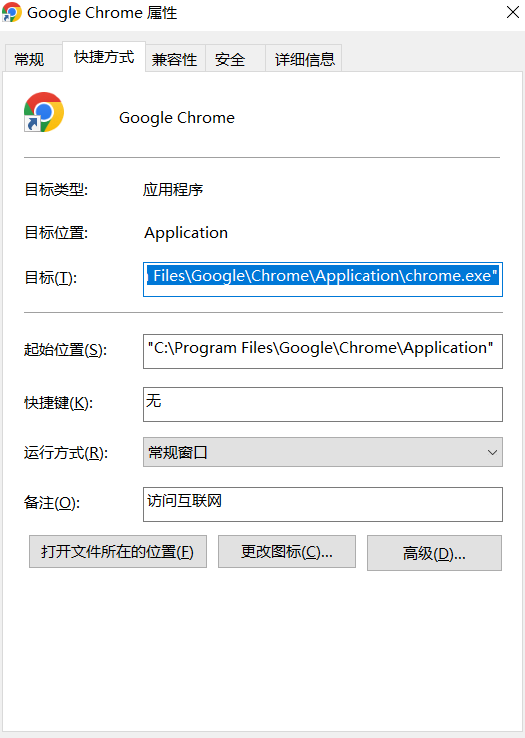

### cmd 常用命令

```shell
# 列出所有连接过的WiFi的配置文件
netsh wlan show profiles
# 查询当前wifi信息
netsh wlan show network mode=bssid 
# 查看到某个具体WiFi的配置详情，包括密码：
netsh wlan show profiles name="XXXXXX" key=clear
# 磁盘检查
chkdsk
# 打开磁盘清理工具
cleanmgr
# 向对方电脑发送一条文本提示
msg /server:192.168.1.109 * "需要发送的消息"
# 磁盘修复
chkdsk d: /f
# D盘下生成一个指向E盘文件夹system\systemconfig的软连接link文件夹
mklink /j D:\systemconfig D:\system\systemconfig
# PowerShell 终端中创建软连接
New-Item -Path D:\App\client -ItemType SymbolicLink -Value D:\App\runarch\client
# 清除日志垃圾
%temp%
# 删除恶意软件
MRT
# 查看系统配置
dxdiag
# 查看系统服务
services.msc
# 查找被占用的端口号的pid号
netstat -ano | findstr 8001
# 杀死进程
taskkill /f /pid 9020
# 查看全局安装的npm包
npm list -g
# 刷新网络
ipconfig /release
# 重新获取DHCP给的地址
ipconfig /renew
# 刷新dns记录
ipconfig /flushdns
# 查看cpu信息
wmic cpu get name
# 查看显卡名称
wmic path win32_videocontroller get name
# 查看硬盘信息
wmic diskdrive get model,size
# 递归查询扩展名是.html文件 
dir /s /b | findstr ".html"
# 在当前目录中查找字符串
findstr /s /i "switch_btn_0" *.*
# 查看mac地址
getmac
# 查看某个文件夹被哪个进程（PID）占用
Get-Process | Where-Object { $_.Path -like "*文件夹路径*" } | Select-Object Id, ProcessName
```
### 关于 diskpart 命令

```shell
# 启动 diskpart
diskpart
# 列出所有磁盘
list disk
# 选择磁盘（X 为磁盘编号，如 0、1）
select disk X
# 列出所选磁盘上的所有分区
list partition
# 选择分区（X 为分区编号）
select partition X
# 创建主分区，大小为 XXXX MB
create partition primary size=XXXX
# 快速格式化为 NTFS 文件系统
format fs=ntfs quick
# 分配盘符（如 C、D 等）
assign letter=X
# 将分区标记为活动分区（用于系统引导）
active
# 删除所选分区（⚠️ 数据会丢失）
delete partition
# 清除磁盘上所有分区和数据（⚠️ 慎用）
clean
# 退出
exit
```

常见使用场景示例

创建新分区

```shell
diskpart
list disk
select disk 1
clean
create partition primary size=50000
format fs=ntfs quick
assign letter=D
exit
```

设置活动分区（用于系统引导）

```shell
diskpart
list disk
select disk 0
list partition
select partition 1
active
exit
```

### cmd 安装 jdk 并配置环境变量

```shell
# 引号中换成自己的路径
setx JAVA_HOME "C:\Program Files\Java\jdk1.8.0"
setx Path "%PATH%;%JAVA_HOME%\bin";
# 设置classpath命令
setx -m CLASSPATH "%JAVA_HOME%\lib;%CLASSPATH%";
```

### PowerShell  常用命令

```cmd
# 查询某个文件夹占用的pid
$folderPath = "D:\summary"
Get-Process | Where-Object {
    $_.Path -like "$folderPath*" -or
    ($_.Modules | Where-Object { $_.FileName -like "$folderPath*" })
} | Select-Object Id, ProcessName, Path

# CPU 占用 > 50% 的进程
Get-Process | Where-Object { $_.CPU -gt 50 } | Select-Object Id, ProcessName, CPU

# 内存占用 > 500MB 的进程
Get-Process | Where-Object { $_.WorkingSet64 -gt 500MB } | Format-Table Id, ProcessName, @{Name="Memory(MB)";Expression={$_.WorkingSet64 / 1MB}}
```

### PowerShell 中使用函数

```powershell
# 定义函数
function make-link ($target, $link) {
   New-Item -Path $link -ItemType SymbolicLink -Value $target
}
# 使用函数
make-link D:\App\runarch\client D:\App\client
```

### npm 如何优雅的升级版本

#### 升级主版本号 Major

```shell
npm version major
```

当前版本号是 1.0.0，执行该命令后版本号变成 2.0.0。

#### 升级次版本号 Minor

```shell
npm version minor
```

当前版本号是 1.0.0，执行该命令后版本号变成 1.1.0。

#### 升级修订号 Patch

```shell
npm version patch
```

当前版本号是 1.0.0，执行该命令后版本号变成 1.0.1。

### ssh 远程操作

```shell
# 远程登陆
ssh root@192.168.5.128 -p 22
# 把本机生成的公钥添加到远程服务器
ssh-copy-id -i ~/.ssh/id_dsa.pub root@192.168.5.128
# 也可以使用第二种，方式添加
cat ~/.ssh/id_rsa.pub | ssh root@192.168.5.128 "mkdir ~/.ssh; cat >> ~/.ssh/authorized_keys"
# 将本地的文件或者文件夹上传到服务器 -r 选项表示上传文件夹
scp -r -P 22 D:\etc\liLianInfo\unpackage\dist\dev\mp-weixin root@192.168.5.128:/home/root/path
# 下载整个目录
scp -r -P 22 root@192.168.5.128:/home/root/path D:/path
# 压缩传输
scp -r -C -P 22 root@192.168.5.128:/home/root/path D:/path
```

#### 使用 ssh config 配置文件来管理 ssh 连接

创建文件

```shell
cd ~/.ssh
touch config
```

编辑文件

```
Host jw
  HostName 192.168.1.111
  User u0_a238
  Port 8022
  IdentityFile ~/.ssh/id_rsa
```

#### 端口转发

> ssh 实现内网穿透

+ **本地端口转发**（Local Port Forwarding）

  ```shell
  # 语法 ssh -L 本地端口:目标主机:目标端口 用户名@ssh服务器地址
  ssh -L 9000:localhost:8080 user@ssh-server-address
  ssh -L 80:localhost:8080 -p 8022 u0_a238@192.168.100.3 
  ```

  这样，当你尝试访问本地机器的9000端口时，实际上你是在访问远程服务器上的8080端口

+ **远程端口转发**（Remote Port Forwarding）

  ```shell
  # 语法：ssh -R 远程端口:localhost:本地端口 用户名@ssh服务器地址
  ssh -R 2525:localhost:25 user@ssh-server-address
  ```

  这样，任何尝试连接到远程服务器2525端口的连接都会被转发到你的本地机器的25端口。

+ **动态端口转发**（Dynamic Port Forwarding）

关闭端口转发

+ 如果该 SSH 会话在前台运行，直接退出会话即可终止端口转发。

+ 如果 SSH 端口转发在后台运行，使用 `-f` 选项启动，可以通过终止对应的 SSH 进程来停止端口转发。

```shell
# 先找到 SSH 进程的 PID：
ps aux | grep ssh
kill [PID]
```

### ubantu 的相关命令

```shell
# 解决liunx ifconfig 命令找不到
sudo apt-get install net-tools
# 设置root用户的密码
sudo passwd root
# 切换root用户
su root
# 查找ifconfig 脚本的位置
find / -name ifconfig -print
# linux 安装Openssh
sudo apt-get install openssh-server
# 安装nodejs
sudo apt-get install -y nodejs
```

### linux 命令

> chmod 文件读写权限：
>
> 三个数代表： - 所有者u - 用户组g - 其它用户o - 所有用户 a
>
> 读写权限： wrx 分别对应读、写、执行，用数字表示 4、2、1
>
> 操作符可以是： 添加某个权限（+）、取消某个权限（-） 

```shell
# 生成公钥
ssh-keygen -t rsa
# 配置ssh文件的权限
chmod 600 authorized_keys
# 添加可执行的权限
chmod +x [文件名]
# 删除非空目录
rm -rf [目录名]
# 将2.txt 文件的内容追加到1.txt 文件内容的后面
cat 2.txt >> 1.txt
# 用2.txt 文件的内容替换1.txt 文件内容
cat 2.txt > 1.txt
# 压缩文件
tar -czvf test.tar.gz a.c
# 解压文件
tar -xzvf test.tar.gz a.c
# 建立软连接
ln -s /usr/local/node/node-v18.12.0-linux-x64/bin/node /usr/local/bin/node
ln -s /usr/local/node/node-v18.12.0-linux-x64/bin/npm /usr/local/bin/npm
# 检查文件系统的磁盘空间占用情况
df -h --total
# lsof 命令用于查看端口占用情况
lsof -i:3000
# 将css.md 文件复制到 docs目录下
cp css.md docs
# 将assets 文件复制到 docs 目录下
cp -r assets docs
# 查看文件的最后400行
tail -n 400 /d/App/1.sh
# 实时查看文件的最后400行
tail -f /d/App/1.sh
```

### find 命令

```shell
# 通过文件名查找文件所在路径
find /d/summary -name "exp.html"
# 模糊匹配查找
find /d/summary -name "*.log"
# 查找指定目录/d/summary下大小大于1M的文件
find /d/summary -size +1M
# 在当前目录下查找最近7天内被修改过的文件
find . -mtime -7
# 当前目录下查找大小大于1MB并且小于10MB的文件
find . -size +1M -size -10M
# 当前目录下查找所有的包含csdn.net字样的文件，并输出文件名
find . | xargs grep -ri "csdn.net" -l
# 在当前目录下递归查找特定字符串并打印行
grep -r 'zh-CN' .
```

### nrm

> 作用：1. 更换国内镜像包源，解决国内 npm 国外包慢的问题 2. 更换某些内网独立的包源，实现安装内网独立的 npm 包

**使用方法**

```shell
# 全局安装
npm install -g nrm
# 查看npm 的包源
nrm ls
# 切换npm包源
nrm use taobao
# 增加npm包源
nrm add npmName http://registry.com
# 删除包源
nrm del npmName
```

对于某些情况可能不支持nrm,可以使用npm原生命令

```shell
# 全局设置npm镜像源
npm config set registry http://config.zhgw.cnpc:8091/repository/npm-group/
# 查看当前npm镜像源
npm get registry
# 安装某个依赖使用特定的镜像源
npm install node-sass --save --registry=https://registry.npm.taobao.org
```

### yarn

```shell
# 查看yarn全局缓存目录
yarn cache dir
# 清除缓存
yarn cache clean
# 设置缓冲目录
yarn config set cache-folder
# 切换淘宝镜像源
yarn config set registry https://registry.npm.taobao.org
```

### Termux

[Github 地址](https://github.com/termux/termux-app/releases)

```shell
# 更换源
termux-change-repo
# ssh 登录
ssh u0_a238@192.168.1.113 -p 8022
# 安装 openssh
pkg install openssh
# 安装 openssl
pkg install openssl
# 更改密码
passwd
# 开启sshd服务
sshd
# 生成主机密钥
ssh-keygen -A
# 查看IP
ifconfig
# 查看用户名
whoami
# 需要允许手机的读写存储权限
termux-setup-storage
# 查看进程
ps
# 查看实时进程
top
# 杀死进程
kill [pid]
```

### 谷歌浏览器长截屏

按 f12 , 再按 ctrl+shift+P ,输入 Capture full size screenshot

### thisisunsafe chrome

在Chrome浏览器中，当遇到“您的连接不是私密连接”的警告时，输入“thisisunsafe”是一个临时的绕过机制，允许用户忽略安全警告并继续访问网站。但需要注意的是，这样做会使您的连接变得不安全，容易受到中间人攻击或其他安全威胁。然而，在某些情况下，用户可能了解并确认访问的网站是安全的，或者用户需要访问该网站以完成特定的工作或任务。此时，用户可以在当前页面上（而不是在地址栏中）输入“thisisunsafe”，然后按回车键。Chrome浏览器会识别这个命令，并允许用户继续访问网站

### --disable-web-security



```txt
"C:\Program Files\Google\Chrome\Application\chrome.exe" --disable-web-security --user-data-dir=D:\chrometempdata
```

>  重要警告：`D:\chrometempdata` 是咱们自己创建的本地文件夹 ，随便建一个就行

### Windows 下实现端口映射

**查询某一个 IP 的所有端口映射情况**

> 语法： netsh interface portproxy show v4tov4 | find "[IP]"

```shell
netsh interface portproxy show v4tov4 | find "192.168.1.1"
```

**增加一个端口映射**

> 语法： netsh interface portproxy add v4tov4 listenaddress=[外网 IP] listenport=[外网端口] connectaddress=[内网 IP] connectport=[内网端口]

```shell
netsh interface portproxy add v4tov4 listenaddress=2.2.2.2 listenport=80 connectaddress=192.168.1.110 connectport=8000
```

**删除一个端口映射**

> 语法： netsh interface portproxy delete v4tov4 listenaddress=[外网 IP] listenport=[外网端口]

```shell
netsh interface portproxy delete v4tov4 listenaddress=2.2.2.2 listenport=80
```

### 解决 github 网速慢的方案

修改 host 文件

```txt
https://raw.hellogithub.com/hosts
```

### 使用Windows内置工具定时备份文件、文件夹

创建文件

```shell
touch AutoBackup.bat
```

编写内容

```bat
@echo off
rem 删除之前备份
del /f /s /q E:\ftp2\*
rem 需要的话生成日期参数
set dt=%date:~0,4%%date:~5,2%%date:~8,2%_%time:~0,2%%time:~3,2%%time:~6,2%
rem 复制文件
xcopy "E:\ftp\*" "E:\ftp2" /e
echo Backup completed at %date% %time% >> E:\ftp\backup_log.txt
pause
```

按 Win + R 输入taskschd.msc打开任务计划程序，右侧点击【创建任务】按照引导完成即可

自动删除指定的目录

```bat
@echo off
chcp 65001
REM 删除 node_modules/.cache 目录及其内容
set CACHE_DIR=D:\klsz\roc_new_safe_web\node_modules\.cache

echo 正在删除 %CACHE_DIR% 目录...
if exist "%CACHE_DIR%" (
  rmdir /s /q "%CACHE_DIR%"
  echo 成功删除 %CACHE_DIR% 目录。
) else (
  echo %CACHE_DIR% 目录不存在，无需删除。
)
echo clean completed at %date% %time% >> D:\AutoRun\clean_log.txt
echo 操作完成。
@REM pause
```

### windows禁用系统更新的方法

 #### 彻底关闭更新服务（永久禁用） 

+ 按下 Win + R，输入 services.msc 回车。
+ 找到 【Windows Update】 服务 → 右键选择 【属性】。
+ 将 【启动类型】 改为 【禁用】 → 点击 【停止】 → 最后点击 【确定】。

**注意：**  关键设置：在 【恢复】 选项卡中，将“第一次失败”改为 【无操作】，防止系统自动重启服务 

####   组策略封锁更新（Win10/11专业版专用） 

+ 按下 Win + R，输入 gpedit.msc 回车。
+ 依次展开：计算机配置 → 管理模板 → Windows组件 → Windows更新。
+ 双击 【配置自动更新】 → 选择 【已禁用】 → 点击 【确定】。
+ 继续双击 【删除使用所有Windows更新功能的访问权限】 → 设为 【已启用】

