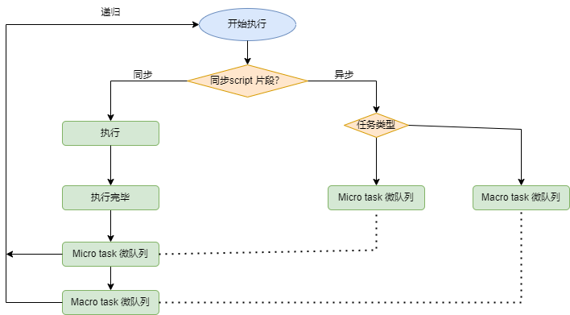

## 浏览器渲染过程是怎么样的

- 构建 DOM 树

  DOM 树是 HTML 文档在浏览器中的对象表示。浏览器只有一个主线程负责解析 HTML，如果遇到`<script>`, 那么浏览器主线程暂停解析 HTML，然后开始加载 javaScript 文件并执行里面的代码，只有 js 代码执行完之后才会继续解析。对于图片和 css 文件、或者设置了 defer 或 asynch 的 js 文件，他们不会影响主线程，而是异步加载。

  另外，浏览器有一个预扫描（Pre Scanner）线程，它会扫描 html 代码，提前把 css 文件、字体以及 js 文件下载下来，加速文件的下载，并且不会影响主线程。

- 构建 CSSOM 树

  CSSOM 是 css 在浏览器中的对象表示，也是树状结构

- 合并 DOM 和 CSSDOM

  浏览器会从 DOM 的根节点，合并 CSSOM 中的样式到每个节点，形成一颗渲染树（Render Tree）

- 布局

  生成渲染树之后，浏览器会根据样式，计算每个（没有设置 display: none ）的宽高和位置等，对所有节点进行布局规划。

  对于像图片这样的节点，如果没有指定宽高，那么浏览器会先忽略它的大小，在图片加载完成之后，浏览器根据图片的宽高和位置，再次计算受影响的节点的宽高和位置，这个过程叫**回流**。

- 绘制

  在完成第一次布局以后，浏览器会把真正的节点和节点样式（例如背景、阴影、边框等）绘制到屏幕上，这个过程必须十分快速，否则会影响动画和交互的性能。如果之前的布局发生了回流，浏览器还会发生**重绘**，把变化的布局重新绘制到屏幕上。

- 合并

  这一步将绘制过程的分层合并，确保它们以正确的顺序绘制到屏幕上。

## Event Loop(事件循环)

> Javascript 是**单线程**，同一时间只能做一件事，原因是作为脚本语言，Javascript 是可以直接操作 DOM，而如果同时有两个线程操作 DOM，浏览器不知道如何进行处理，为了避免复杂性，Javascript 从诞生以来就一直都是单线程。为了充分利用 CPU，Javascript 将任务分为两种：一种是**同步任务**（synchronous）和**异步任务**（asynchronous），其中异步任务又分为两种：**(宏队列)macrotask**和 **(微队列)microtask** 。
>
> 因为 Javascript 单线程的特性，实际上很多需要耗时的任务，Javascript 都会把异步任务都放到`queue` 中，在主线程的事情做完后，会定期的轮询`queue` ，把里面的结果拿出来，这样循环往复的过程就构成了`Event Loop` 。比如：点击了一个元素，不会立刻的执行，但是等到 js 加载完毕后就会执行刚才点击的操作，能够知道有一个队列记录了所有有待执行的操作，这个队列分为微观和宏观。微观会比宏观执行得更快。

```js
// js 是单线程的，同一时间只能处理一段程序
function Add() {
  return new Promise((resolve, reject) => {
    setTimeout(() => {
      console.log("promise 10");
      resolve({ add: 123 });
    });
    console.log("Promise start");
  });
}
console.log("start");
Add().then((result) => {
  console.log("promise end");
});
setTimeout(() => {
  console.log("setTimeout");
});
console.log("end");
// result:  start       Promise start       end          promise 10        promise end      setTimeout
```

```js
console.log("start");
const promise1 = Promise.resolve().then(() => {
  console.log("promise1");
  const timer2 = setTimeout(() => {
    console.log("timer2");
  }, 0);
});

const timer1 = setTimeout(() => {
  console.log("timer1");
  const promise2 = Promise.resolve().then(() => {
    console.log("promise2");
  });
}, 0);

console.log("end");
```

result: start end promise1 timer1 promise2 timer2

**基本原则：**



- 代码按调用顺序执行
- 先执行同步代码，再执行异步代码
- 异步代码中微任务优先于宏任务

## 发布订阅者模式

> 应用场景： react 总线通信

```js
class EventEmitter {
  constructor() {
    this.events = {};
  }
  on(name, callback) {
    if (this.events[name]) {
      this.events[name].push(callback);
    } else {
      this.events[name] = [callback];
    }
  }
  off(name, callback) {
    if (!this.events[name]) return;
    if (!callback) {
      // 如果没有callback,就删掉整个事件
      this.events[name] = undefined;
    } else {
      this.events[name] = this.events[name].filter((item) => item !== callback);
    }
  }
  emit(name, ...args) {
    if (!this.events[name]) return;
    this.events[name].forEach((cb) => cb(...args));
  }
}
function sysLanguageChange(e) {
  console.log("接受到的消息", e); // 接受订阅
}
const eventEmitter = new EventEmitter();
// 订阅消息
eventEmitter.on("sysLanguageChange", sysLanguageChange);
// 发布订阅
eventEmitter.emit("sysLanguageChange", "ZH");
// 关闭订阅
eventEmitter.off("sysLanguageChange", sysLanguageChange);
```

## 进程和线程

> **单线程与多线程**，都是指**在一个进程内**的单和多。（所以核心还是得属于一个进程才行）

- 进程是 cpu 资源分配的最小单位（是能拥有资源和独立运行的最小单位），比作**车间**
- 线程是 cpu 调度的最小单位（线程是建立在进程的基础上的一次程序运行单位，一个进程中可以有多个线程）比作**车间中的工人**

### 浏览器是多进程的

- 浏览器是多进程的
- 浏览器之所以能够运行，是因为系统给它的进程分配了资源（cpu、内存）
- 简单点理解，每打开一个 Tab 页，就相当于创建了一个独立的浏览器进程。

### 浏览器都包含哪些进程

1. rowser 进程：浏览器的主进程（负责协调、主控），只有一个。作用有

   - 负责浏览器界面显示，与用户交互。如前进，后退等

   * 负责各个页面的管理，创建和销毁其他进程
   * 将 Renderer 进程得到的内存中的 Bitmap，绘制到用户界面上
   * 网络资源的管理，下载等

2. 第三方插件进程：每种类型的插件对应一个进程，仅当使用该插件时才创建

3. GPU 进程：最多一个，用于 3D 绘制等

4. 浏览器渲染进程（浏览器内核）（Renderer 进程，内部是多线程的）：默认每个 Tab 页面一个进程，互不影响。主要作用为

   - 页面渲染，脚本执行，事件处理等

### 浏览器内核（渲染进程）

1. GUI 渲染线程

   - 负责渲染浏览器界面，解析 HTML，CSS，构建 DOM 树和 RenderObject 树，布局和绘制等。

   * 当界面需要重绘（Repaint）或由于某种操作引发回流(reflow)时，该线程就会执行
   * 注意，**GUI 渲染线程与 JS 引擎线程是互斥的**，当 JS 引擎执行时 GUI 线程会被挂起（相当于被冻结了），GUI 更新会被保存在一个队列中**等到 JS 引擎空闲时**立即被执行。

2. JS 引擎线程

   - 也称为 JS 内核，负责处理 Javascript 脚本程序。（例如 V8 引擎）

   * JS 引擎线程负责解析 Javascript 脚本，运行代码。
   * JS 引擎一直等待着任务队列中任务的到来，然后加以处理，一个 Tab 页（renderer 进程）中无论什么时候都只有一个 JS 线程在运行 JS 程序
   * 同样注意，**GUI 渲染线程与 JS 引擎线程是互斥的**，所以如果 JS 执行的时间过长，这样就会造成页面的渲染不连贯，导致页面渲染加载阻塞。

3. 事件触发线程

   - 归属于浏览器而不是 JS 引擎，用来控制事件循环（可以理解，JS 引擎自己都忙不过来，需要浏览器另开线程协助）

   * 当 JS 引擎执行代码块如 setTimeOut 时（也可来自浏览器内核的其他线程,如鼠标点击、AJAX 异步请求等），会将对应任务添加到事件线程中
   * 当对应的事件符合触发条件被触发时，该线程会把事件添加到待处理队列的队尾，等待 JS 引擎的处理
   * 注意，由于 JS 的单线程关系，所以这些待处理队列中的事件都得排队等待 JS 引擎处理（当 JS 引擎空闲时才会去执行）

4. 定时触发器线程

   - 传说中的`setInterval`与`setTimeout`所在线程

   * 浏览器定时计数器并不是由 JavaScript 引擎计数的,（因为 JavaScript 引擎是单线程的, 如果处于阻塞线程状态就会影响记计时的准确）
   * 因此通过单独线程来计时并触发定时（计时完毕后，添加到事件队列中，等待 JS 引擎空闲后执行）
   * 注意，W3C 在 HTML 标准中规定，规定要求 setTimeout 中低于 4ms 的时间间隔算为 4ms。

5. 异步 http 请求线程

   - 在 XMLHttpRequest 在连接后是通过浏览器新开一个线程请求

   * 将检测到状态变更时，如果设置有回调函数，异步线程就**产生状态变更事件**，将这个回调再放入事件队列中。再由 JavaScript 引擎执行。

## web work

js 采用的是单线程模型,所有任务只能在一个线程上完成，一次只能做一件事。前面的任务没做完，后面的任务只能等着。随着电脑计算能力的增强，尤其是多核 CPU 的出现，单线程带来很大的不便，无法充分发挥计算机的计算能力。相对的 webwork 就是为 js 创造多线程的环境,允许主线程创建 webwork 线程,将未处理的一些任务分给后者 运行.在 js 主线程运行的同时,work 线程在后台运行,两者互不打扰,等到 webwork 线程的任务结束后,把结果返回给主线程。

### web work 的注意点

- 同源限制：分配给 Worker 线程运行的脚本文件，必须与主线程的脚本文件同源。
- DOM 限制：Worker 线程所在的全局对象，与主线程不一样，无法读取主线程所在网页的 DOM 对象，也无法使用 document、window、parent 这些对象。但是，Worker 线程可以 navigator 对象和 location 对象
- 通信联系：Worker 线程和主线程不在同一个上下文环境，它们不能直接通信，必须通过消息完成
- 脚本限制:Worker 线程不能执行`alert()`方法和`confirm()`方法，但可以使用 XMLHttpRequest 对象发出 AJAX 请求。
- 文件限制: Worker 线程无法读取本地文件，即不能打开本机的文件系统（`file://`），它所加载的脚本，必须来自网络

### 使用

#### 主线程

```js
var worker = new Worker("work.js");
// 发送消息
worker.postMessage("Hello World");
worker.postMessage({ method: "echo", args: ["Work"] });
// 接收消息
worker.addEventListener("message", function (e) {
  console.log("接收到的消息", e.data);
});
// 关闭 Worker
worker.terminate();
```

#### Worker 线程

```js
// 监听来自主线程的消息
self.addEventListener(
  "message",
  function (e) {
    var data = e.data;
    switch (data.cmd) {
      case "start":
        self.postMessage("WORKER STARTED: " + data.msg);
        break;
      case "stop":
        self.postMessage("WORKER STOPPED: " + data.msg);
        self.close(); // Terminates the worker.
        break;
      default:
        self.postMessage("Unknown command: " + data.msg);
    }
  },
  false
);
// 关闭 Worker
self.close();
```

## 常见的异步方案

### 回调函数（Callback Functions）

最初的异步编程模型通常依赖于回调函数。当异步操作完成时，将调用一个函数以处理结果。

```js
const fs = require("fs");
fs.readFile("example.txt", "utf8", (err, data) => {
  if (err) {
    console.error(err);
    return;
  }
  console.log(data);
});
```

### 事件（Events）

在某些框架和库中，如 Node.js 的事件发射器（EventEmitter），异步编程可以通过监听和触发事件来实现。

```js
const EventEmitter = require("events");
class MyEmitter extends EventEmitter {}
const myEmitter = new MyEmitter();
myEmitter.on("event", () => {
  console.log("an event occurred!");
});
myEmitter.emit("event");
```

### Promise 对象

ES6 引入了 Promise 作为异步编程的一种解决方案。Promise 代表一个尚未完成，但未来某一时刻可能会完成的操作。它允许你将回调链式调用，从而解决了"回调地狱"的问题。

```js
fetch("https://api.example.com/data")
  .then((response) => response.json())
  .then((data) => console.log(data))
  .catch((error) => console.error("Error:", error));
```

### **Async/Await**

Async/Await 是建立在 Promise 之上的高级语法，可以让异步代码以同步的方式书写。Async 函数会隐式返回一个 Promise，而 await 关键字可以暂停 async 函数的执行，等待 Promise 解决。

```js
async function fetchData() {
  try {
    const response = await fetch("https://api.example.com/data");
    const data = await response.json();
    console.log(data);
  } catch (error) {
    console.error("Error:", error);
  }
}
fetchData();
```

### **生成器（Generators）和协程（Coroutines）**

生成器函数可以通过`yield`关键字暂停执行，并通过`.next()`方法恢复执行。结合`yield`，可以使用库（如 co）进行异步控制流管理。

```js
function* generatorExample() {
  const data = yield fetch("https://api.example.com/data");
  console.log(data);
}
const gen = generatorExample();
gen.next(); // 需要适当的处理响应和继续生成器函数的执行
```

## 浏览器一帧都会干些什么？

- 接受输入事件

- 执行事件回调

- 开始一帧

- 执行 RAF (RequestAnimationFrame) 通常用来 **执行高优先级任务**

  ```js
  //控制台输出1和0
  const timer = requestAnimationFrame(function () {
    console.log(0);
  });
  cancelAnimationFrame(timer);
  ```

- 页面布局，样式计算

- 绘制渲染

- 执行 RIC (RequestIdelCallback) 通常用来 **执行低优先级任务**

  > 强烈不建议在此处进行 dom 操作。推荐的做法是在 requestAnimationFrame 里面做 dom 的修改，可以在 requestIdleCallback 里面构建 Document Fragment，然后在下一帧的 requestAnimationFrame 里面应用 Fragment。

  ```js
  requestIdleCallback(myNonEssentialWork, { timeout: 2000 });
  // 任务队列
  const tasks = [
   () => {
     console.log("第一个任务");
   },
   () => {
     console.log("第二个任务");
   },
   () => {
     console.log("第三个任务");
   },
  ];

  function myNonEssentialWork (deadline) {
   // 如果帧内有富余的时间，或者超时
   while ((deadline.timeRemaining() > 0 || deadline.didTimeout) && tasks.length > 0) {
     work();
   }
   if (tasks.length > 0)
     requestIdleCallback(myNonEssentialWork);
   }
  }
  function work () {
   tasks.shift()();
   console.log('执行任务');
  }
  ```

## createDocumentFragment

每次 JavaScript 对 DOM 的操作都会改变当前页面的呈现，**并重新刷新整个页面，从而消耗了大量的时间**。而 createDocumentFragment()的**作用**，就是可以创建一个文档碎片，把所有的新节点附加其上，然后把文档碎片的内容一次性添加到 document 中。这样的好处是**只会发生一次回流**。

```js
const frag = document.createDocumentFragment();
for (let i = 0; i < 1000; i++) {
  const el = document.createElement("p");
  el.innerHTML = i;
  frag.appendChild(el); // 首先将新节点先添加到DocumentFragment 节点
}
document.body.appendChild(frag); // 然后用appendChild插入文档中
```

## 将 class 转为 function 的完整写法

```js
class MyClass {
  constructor() {
    this.name = "MyClassInstance";
  }
  getName() {
    return this.name;
  }
}
```

转为 function 后

```js
"use strict";
function MyClass() {
  if (new.target === undefined) {
    throw new Error("MyClass 只能通过new 调用");
  }
  this.name = "MyClassInstance";
}
Object.defineProperty(MyClass.prototype, "getName", {
  value: function () {
    if (new.target !== undefined) {
      throw new Error("getName 不允许被new 调用");
    }
    return this.name;
  },
  enumerable: false, // 不可被遍历
  configurable: true,
});

const p = new MyClass();
console.log(p.name);
console.log(p.getName());
```

## 异步任务队列

```js
/**
 * 并发任务类
 */
class SuperTask {
  /**
   * @param {number} parallelConut - 并行数量
   */
  constructor(parallelConut = 2) {
    this.parallelConut = parallelConut;
    this.taskQueue = []; // 任务队列
    this.runningCount = 0; // 当前正在运行的任务数量
  }

  /**
   * 执行任务
   */

  run() {
    while (this.runningCount < this.parallelConut && this.taskQueue.length) {
      const task = this.taskQueue.shift();
      task().finally(() => {
        this.runningCount--;
        this.run();
      });
      this.runningCount++;
    }
  }

  /**
   * 添加任务
   * @param {Function} task - 任务函数，必须返回一个 Promise
   */
  addTask(task) {
    this.taskQueue.push(task);
    this.run();
  }
}

/**
 * 模拟异步任务
 * @param {number} time - 任务执行时间
 * @returns {Promise}
 */
function timeout(time) {
  return new Promise((resolve) => {
    setTimeout(() => {
      resolve();
    }, time);
  });
}

const superTask = new SuperTask(2);
export default superTask;
/**
 * 添加任务
 * @param {number} time - 任务执行时间
 * @param {string} name - 任务名称
 * @returns {void}
 */
function addTask(time, name) {
  superTask.addTask(() => {
    return timeout(time).then(() => {
      console.log(`任务 ${name} 结束`);
    });
  });
}
addTask(10000, "1"); // 10000 执行任务
addTask(5000, "2"); // 5000 执行任务
addTask(3000, "3"); // 8000 执行任务
addTask(4000, "4"); // 12000 执行任务
addTask(5000, "5"); // 15000 执行任务
addTask(6000, "6"); // 18000 执行任务
```

## 可暂停、终止、重启的异步队列

```js
class PausableTaskQueue {
  constructor() {
    this.queue = [];
    this.isPaused = false;
    this.currentTask = null;
  }

  // 添加任务到队列
  add(task) {
    this.queue.push(task);
    this.run();
  }

  // 运行队列中的任务
  async run() {
    if (this.isPaused || this.currentTask) {
      return;
    }

    const task = this.queue.shift();
    if (!task) {
      return;
    }

    this.currentTask = task;

    try {
      await task();
    } catch (error) {
      console.error("任务执行出错：", error);
    } finally {
      this.currentTask = null;
      if (!this.isPaused) {
        this.run();
      }
    }
  }

  // 暂停队列
  pause() {
    this.isPaused = true;
  }

  // 恢复队列
  resume() {
    if (this.isPaused) {
      this.isPaused = false;
      this.run();
    }
  }

  // 清空队列
  clear() {
    this.queue = [];
  }
}

// 使用示例
const queue = new PausableTaskQueue();

// 模拟异步任务
const createTask = (id) => async () => {
  console.log(`任务 ${id} 开始执行`);
  await new Promise((resolve) => setTimeout(resolve, 1000)); // 模拟异步操作
  console.log(`任务 ${id} 执行完成`);
};

// 添加任务
queue.add(createTask(1));
queue.add(createTask(2));
queue.add(createTask(3));

// 暂停队列
queue.pause(); // 此时任务会暂停执行，后续添加的任务也不会立即执行

// 恢复队列
queue.resume(); // 队列恢复执行，会继续执行未完成的任务
```
