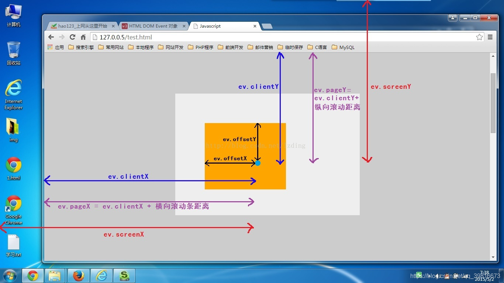

## H5C3

### html5 调用系统拍照或者摄像

```html
<label>照相机</label>
<input type="file" id="image" accept="image/*" capture="camera" />
<br />
<label>摄像机</label>
<input type="file" id="video" accept="video/*" capture="camcorder" />
```

### **iframe 的使用**

> 同源 iframe 可共享 localStorage、sessionStorage

```html
<iframe name="fm" src="index.html" style="width: 100%; heigth: 100%"></iframe>
<!-- 预览pdf 文件  -->
<iframe
  width="100%"
  height="600px"
  src="https://www.mahailushu.com/pdfjs/web/mine.pdf"
  frameborder="0"
></iframe>
<!-- 预览pdf 文件 并关闭按钮  -->
<iframe
  width="100%"
  height="600px"
  src="https://www.mahailushu.com/pdfjs/web/mine.pdf#toolbar=0&navpanes=0&scrollbar=0"
  frameborder="0"
></iframe>
```

通过点击超链接

```html
<a href="home" target="fm">首页</a>
<!-- target 属性指向特定的iframe -->
<iframe name="fm" src="index.html" style="width: 100%; heigth: 100%"></iframe>
```

### HTML5 拖放（Drag 和 Drop）

**拖拽元素**

设置元素为可拖放：为了使元素可拖动，把 draggable 属性设置为 true ，例如：

```html

```

拖动什么 - ondragstart 和 setData()：规定当元素被拖动时，会发生什么

> dataTransfer：实现数据的存储和获取 setData(format,data) 存储数据

```js
document.ondragstart = function (e) {
  e.dataTransfer.setData("nodeId", e.target.id); //存储数据
  e.target.style.opacity = 0.5;
};
```

**目标元素**

放到何处 - ondragover

> 浏览器会默认阻止 ondrop 事件，所以必须在 ondragover 事件中阻止默认行为

```js
document.ondragover = function (e) {
  e.preventDefault();
};
```

进行放置 - ondrop：当放置被拖数据时，会触发 drop 事件

> - 通过 dataTransfer.getData("Text") 方法获得被拖的数据。该方法将返回在 setData() 方法中设置为相同类型的任何数据。
> - 把被拖元素追加到放置元素（目标元素）中

```js
document.ondrop = function (e) {
  var data = e.dataTransfer.getData("nodeId");
  e.target.appendChild(document.getElementById(data));
};
```

**通过拖拽实现文件上传**

```html
<style>
    #dropZone {
      height: 200px;
      width: 200px;
      border: 1px dashed #000;
      background-color: coral;
    }
</style>
<div id="dropZone">Drop files here</div>
<script>
  const dropZone = document.getElementById("dropZone");
  dropZone.addEventListener("dragover", (e) => e.preventDefault());
  dropZone.addEventListener("drop", (e) => {
    e.preventDefault();
    const files = e.dataTransfer.files;
  });
</script>
```

### 文档对象

```js
document.querySelector("button")?.addEventListener("click", async () => {
  const [fileHandle] = await window.showOpenFilePicker({
    types: [
      {
        description: "Images",
        accept: {
          "image/*": [".png", ".gif", ".jpeg", ".jpg"],
        },
      },
      {
        description: "Excel Files",
        accept: {
          "application/vnd.openxmlformats-officedocument.spreadsheetml.sheet": [
            ".xlsx",
          ],
          "application/vnd.ms-excel": [".xls"],
        },
      },
    ],
    excludeAcceptAllOption: true,
    multiple: false,
  });
  const file = await fileHandle.getFile();
});
```

### 通过 JavaScript 来实现页面间数据传递

Window. opener 属性是一个可读可写的属性，使用 window.open 打开的两个窗口之间存在着关系“父子”关系。子窗口可以通过 window.opener 指向父窗口，访问父窗口的对象。优点：取值方便。只要 opener 指向父窗口，就可以访问所有对象。不仅可以访问值，还可以访问父窗口的方法。值长度无限制。缺点：两窗口要存在着关系。就是需要使用 open 打开窗口，不能跨域。

### postMessage 通信

a.html

```js
const targetWindow = window.open("/b.html");
window.addEventListener("message", (e) => {
  console.log("来自b 的消息");
  e.source.postMessage("来自a 的消息", "/");
});
```

b.html

```js
window.addEventListener("message", (e) => {
  console.log("来自a 的消息", e);
});
window.addEventListener("load", (e) => {
  window.opener.postMessage("b 页面加载完成了", "/");
});
```

在 iframe 中使用

```html
<iframe id="childFrame" src="https://child.com"></iframe>
<script>
  const iframe = document.getElementById("childFrame");
  // 发送消息给iframe
  iframe.onload = () => {
    iframe.contentWindow.postMessage(
      { type: "greeting", text: "Hello from parent" },
      "https://child.com"
    );
  };
  // 接收来自iframe的消息
  window.addEventListener("message", (event) => {
    if (event.origin !== "https://child.com") return;
    console.log("Parent received:", event.data);
    if (event.data.type === "response") {
      alert(event.data.text);
    }
  });
</script>
```

### 广播频道-BroadcastChannel

> BroadcastChannel API 提供了一种简单的方法来实现跨窗口、跨标签页和跨框架之间的通信，而无需使用 WebSocket 或 SSE。它是一个非常便捷的工具，可以帮助我们将实时通信功能集成到我们的 Web 应用程序中

```js
const bc = new BroadcastChannel("test-channel");
```

接收消息

```js
bc.addEventListener("message", (e) => {
  console.log("Received message:", e.data);
});
```

发送消息

```js
bc.postMessage({ timeStarp: Date.now(), meaage: "hahh" });
```

关闭消息

```js
bc.close();
```

### hash 模式与 history 模式

**hash 模式**

> hsah 模式是一种把前端路由的路径用`#`拼接在真实的 URL 后面的模式。当`#`号后面的路径变化时，浏览器并不会重新发起请求，而是会触发`hashchange`事件。

```html
<a href="#/a"></a>
<a href="#/b"></a>
<div id="app"></div>
<script>
  function render() {
    const app = document.querySelector("#app");
    app.innerHTML = window.location.hash;
  }
  window.addEventListener("hashchange", render);
</script>
```

**history 模式**

> history API 是 h5 提供的新特性，允许开发者直接更改前端路由，即`更改前端路由而不重新发起网络请求`

```html
<a href="javascript: toA();">A页面</a>
<a href="javascript: toB();">B页面</a>
<div id="app"></div>
<script>
  function render() {
    console.log("render");
    app.innerHTML = window.location.pathname;
  }
  function ToA() {
    history.pushState({}, null, "/a");
    render();
  }
  function ToB() {
    history.pushState({}, null, "/b");
    render();
  }
  window.addEventListener("popState", render);
</script>
```

### 超链接的一些实用属性

**download** 属性表明当前链接用于下载。而不是跳转到例另外一个 URL。如果*download* 属性设置了值，表示下载的文件名。

```html
<a href="demo.html" download="demo.html">点击下载</a>
```

**邮件链接**

```html
<a href="mailto:1441036958@qq.com?subject=主题&body=邮件内容&cc=抄送&bcc=密送"
  >联系我们</a
>
```

**电话链接**

```html
<a href="tel:18834177065">联系我</a>
```

## 使用标签元素触发隐藏文件输入元素

> [MDN](https://developer.mozilla.org/en-US/docs/Web/API/File/Using_files_from_web_applications)

```html
<input
  type="file"
  id="fileElem"
  multiple
  accept="image/*"
  class="visually-hidden"
/>
<label for="fileElem">Select some files</label>
```

```css
.visually-hidden {
  position: absolute !important;
  height: 1px;
  width: 1px;
  overflow: hidden;
  clip: rect(1px, 1px, 1px, 1px);
}
input.visually-hidden:focus + label {
  outline: thin dotted;
}
input.visually-hidden:focus-within + label {
  outline: thin dotted;
}
```

> clip: rect(1px, 1px, 1px, 1px); 将编译成 left:1px; rigth: 1px; top: 1px; bottom:1px;

### H5 新特性

- 多媒体，用于媒介回放的 video 和 audio 元素
- 图像效果，用于绘画的 canvas 元素，svg 元素等。
- 离线&存储，对本地离线存储能够更好地支持，比如 localstorage,Cookies 等
- 设备兼容特性
- 语义化标签（nav、header、footer、aside）
- 表单标签（Email、tel、password、color）
- 地理位置

### localStorage 与 sessionStorage 与 cookie 的区别总结

- **共同的** ：都保存在浏览器端，且同源
- **不同点**
  - 传递的数据量不同，cookie 不能超过 4k，而 localStorage 与 sessionStorage 大小为 5M
  - 传递方式不同，cookie 在浏览器和服务器间来回传递（即使不需要），而 localStorage 与 sessionStorage 不会自动把数据发给服务器，仅在本地保存。
  - 生命周期不同:localStorage 永久保存, sessionStorage 当前会话, 都可手动清除，cookie 只在设置的 cookie 过期时间之前一直有效，即使窗口或浏览器关闭。
  - 作用域不同 sessionStorage 不在不同的浏览器窗口中共享，即使是同一个页面；localStorage 在所有同源窗口中都是共享的；cookie 也是在所有同源窗口中都是共享的。

### 前端网站常规优化方案

- 合并、压缩、混淆 html/css/js 文件（webpack 实现，减小资源大小）
- Nginx 开启 Gzip，进一步压缩资源（减小资源大小）
- 图片资源使用 CDN 加速（提高加载速度）
- 符合条件的图标做 base64 处理（减小资源大小）
- 样式表放首部，JS 放尾部（JS 单线程，会阻塞页面；资源加载方式）
- 设置缓存（强缓存和协商缓存，提高加载速度）
- link 或者 src 添加 rel 属性，设置 prefetch 或 preload 可预加载资源。（加载时机）
- 如果使用了 UI 组件库，采用按需加载（减小资源大小）
- SPA 项目，通过 import 或者 require 做路由按需（减小资源大小）
- 服务端渲染 SSR，加快首屏渲染，利于 SEO
- 页面使用骨架屏，提高首页加载速度（提高加载速度）
- 使用 JPEG 2000, JPEG XR, and WebP 的图片格式来代替现有的 jpeg 和 png，当页面图片较多时，这点作用非常明显
- 使用图片懒加载-lazyload

## javascript

### 写 Javascript 的基本规范

- 不要在一行申明多个变量
- 使用 _===_ 或 _！==_ 来比较 true/false
- switch 必须带有 default 分支
- 函数应该返回值
- for if else 必须使用大括号
- 语句结束加分号
- 命名要有意义，使用驼峰命名法

### 一行代码让页面可编辑

```js
document.designMode = "on";
```

### 终极奥义——动态 Debug 艺术

```js
function logWithStyle(type, message) {
  const styles = {
    error:
      "color: red; font-weight: bold; background: #ffe5e5; padding: 2px 5px;",
    warn: "color: orange; background: #fff3e0; padding: 2px 5px;",
    success: "color: green; background: #e8f5e9; padding: 2px 5px;",
    debug: "color: #666; background: #f5f5f5; padding: 2px 5px;",
  };
  console.log(`%c${type.toUpperCase()} ➤ ${message}`, styles[type]);
}

// 用法：
logWithStyle("error", "这个Bug我改不动了！"); // 红色警告
logWithStyle("success", "Bug已祭天！"); // 绿色嘚瑟
```

### 浏览器指纹

```js
function getCanvasFingerprint() {
  const canvas = document.createElement("canvas");
  const ctx = canvas.getContext("2d");
  const text = "hello, fingerprint!";

  ctx.textBaseline = "top";
  ctx.font = "14px Arial";
  ctx.fillStyle = "#f60";
  ctx.fillRect(0, 0, 100, 60);
  ctx.fillStyle = "#069";
  ctx.fillText(text, 2, 15);

  return canvas.toDataURL();
}

function hashFingerprint(str) {
  let hash = 0;
  for (let i = 0; i < str.length; i++) {
    hash = (hash << 5) - hash + str.charCodeAt(i);
    hash |= 0;
  }
  return hash;
}

const dataUrl = getCanvasFingerprint();
const fingerprint = hashFingerprint(dataUrl);

console.log("你的Canvas指纹是：", fingerprint);
```

### Intl API：原生国际化 API

多语言货币格式化（适配中英文）：

```js
const price = 123223342344.5698765;

// 人民币格式（自动加 ¥ 和千分位）
const cnyPrice = new Intl.NumberFormat("zh-CN", {
  style: "currency",
  currency: "CNY",
}).format(price);

// 美元格式（自动加 $ 和千分位）
const usdPrice = new Intl.NumberFormat("en-US", {
  style: "currency",
  currency: "USD",
}).format(price);

console.log(cnyPrice, usdPrice); // ¥123,223,342,344.57 $123,223,342,344.57
```

日期本地化（不用手动拼接年月日）

```js
const now = new Date();

// 中文日期：2025年11月3日 15:40:22
const cnDate = new Intl.DateTimeFormat("zh-CN", {
  year: "numeric",
  month: "long",
  day: "numeric",
  hour: "2-digit",
  minute: "2-digit",
  second: "2-digit",
}).format(now);

// 英文日期：November 3, 2025, 03:40:22 PM
const enDate = new Intl.DateTimeFormat("en-US", {
  year: "numeric",
  month: "long",
  day: "numeric",
  hour: "2-digit",
  minute: "2-digit",
  second: "2-digit",
}).format(now);
console.log(cnDate, enDate); // 2025年11月5日 13:18:39 November 5, 2025 at 01:18:39 PM
```

### 分析 JS 与 CSS 是否阻塞 DOM 的渲染和解析

- `CSS`不会阻塞`DOM`解析，但是会阻塞`DOM`渲染，严谨一点则是`CSS`会阻塞`render tree`的生成，进而会阻塞`DOM`的渲染
- `JS`会阻塞`DOM`解析
- `CSS`会阻塞`JS`的执行
- 浏览器遇到`<script>`标签且没有`defer`或`async`属性时会触发页面渲染
- `Body`内部的外链`CSS`较为特殊，请慎用

### Js 数据类型如何判断

- typeof 可以用此来判断`number`, `string`, `object`, `boolean`, `function`, `undefined` ，但是对于对象、数组、`null` 返回的值是 `object`
- `instanceof`运算符用于检测构造函数的 `prototype`属性是否出现在某个实例对象的原型链上,返回值为布尔值，用于指示一个变量是否属于某个对象的实例。

### input 事件和 change 事件的区别

input 输入框的 onchange 事件，要在 input 失去焦点的时候才会触发；

在输入框内容变化的时候不会触发 change，当鼠标在其他地方点一下才会触发；

onchange 事件也可用于单选框与复选框改变后触发的事件。

### js 触屏事件

```js
window.addEventListener("touchstart", (e) => {
  console.log("开始触屏", e);
});
window.addEventListener("touchend", (e) => {
  console.log("触屏结束", e);
});
window.addEventListener("touchmove", (e) => {
  console.log(
    "手指移动位置",
    e.targetTouches[0].clientX,
    e.targetTouches[0].clientY
  );
});
window.addEventListener("touchcancel", (e) => {
  console.log("touchcancel", e);
});
```

### 简单数据类型和复杂数据类型的存储方式？

- 数据类型

  - 基本数据类型：Number、Boolean、null、undefined、Symbol（ES6 新增，表示独一无二的值）和 Bigint（ES10 新增）
  - 引用数据类型：Object、Array、Function、SET、Map 等

- 如何存储
  - 原始数据类型：直接存储在栈中，占据空间小、大小固定，属于被频繁使用数据，所以放入栈中存储。
  - 引用数据类型：同时存储在栈和堆中，占据空间大，大小不固定。引用数据类型在栈中存储了指针，该指针指向堆中该实体的起始地址。当解释器寻找引用值时，会首先检索其在栈中的地址，取得地址后从堆中获得实体。
- 栈和堆的区别

  - 栈：由编译器自动分配释放，存放函数的参数值，局部变量等
  - 堆：一般由程序员分配释放，若程序员不释放，程序结束可能由操作系统释放

### 如何获取 Dom 元素？

- _document.getElementById(‘id’)_ 通过 id 获取元素
- _document.querySelect()_ 通过选择器获取元素
- _document.querrySelectAll()_ 通过选择器获取一类元素，得到伪数组

### **原生 javascript 的 dom 操作**

**获取 dom 元素**

```js
var box = document.querySelector(".box");
```

**添加类名**

```js
box.classList.add("one");
```

**删除类名**

```js
box.classList.remove("one");
```

**设置属性**

```js
box.setAttribute("title", "哎呀，不错呀！！");
```

**获取属性**

```js
var title = box.getAttribute("title");
console.log("得到的标题是：", title);
```

**创建 dom 元素**

```js
var li = document.createElement("li");
```

**给 _li_ 元素添加内容**

```js
li.innerHTML = "我是li的内容";
```

**将 _li_ 元素追加到 box**

```js
box.appendChild(li);
```

**将 box 里面的 li 元素删除掉**

```js
box.removeChild(li);
```

**操作 style 样式**

```js
box.style.backgroundColor = "red";
```

### 原生 javascript 的事件委托注册

> 事件委托的原理是事件冒泡，常用于为页面中相同的元素注册事件

在页面

```html
<ul>
  <li>132</li>
  <li>456</li>
  <li>456</li>
  <li>sahxj</li>
  <li>sahxjsxh</li>
</ul>
```

在 js 中

```js
document.querySelector("ul").addEventListener("click", function (e) {
  if (e.target.tagName === "LI") {
    console.log("事件源", e.target); // 用于指向事件源
    console.log("事件源的父元素", e.target.parentNode); // 得到的结果是伪元素
    console.log("事件源的子元素", e.target.childNodes); // 得到的结果是伪元素
  }
});
```

### 获取 html 的自定义属性值

```html
<div id="root" data-list="bbbbbb">bbbbb</div>
<script>
  const root = document.querySelector("#root");
  console.dir(root.dataset.list);
</script>
```

### 设置 element 的滚动条位置

```js
element.scrollTop = 0; // 设置 element 的滚动条位置居首
element.scrollTop = element.scrollHeight; // 设置 element 的滚动条位置始终居底
// 页面滚动
document.body.scrollTop = 0;
document.documentElement.scrollTop = 0;
```

### js 获取浏览器可视高度

```js
const clientHeigh = document.documentElement.clientHeigh;
```

### 检测系统主题

```js
window.addEventListener("theme-mode", (event) => {
  if (event.mode == "dark") {
  }
  if (event.mode == "light") {
  }
});

window
  .matchMedia("(prefers-color-scheme: dark)")
  .addEventListener("change", (event) => {
    if (event.matches) {
    } // dark mode
  });
```

### 在指定的 DOM 元素后面插入新的 DOM

```js
function inSetDom(el, newEl) {
  // 确保存在下一个兄弟节点
  if (el.nextSibling) {
    // 在parent的下一个兄弟节点前插入新元素
    el.parentNode.insertBefore(newEl, el.nextSibling);
  } else {
    el.parentNode.appendChild(newEl); // 如果没有下一个兄弟节点，则直接添加到父节点的末尾
  }
}
const targetDOM = document.getElementById("target");
const newElement = document.createElement("div"); // 创建一个新的div元素
inSetDom(targetDOM, newElement);
```

### 函数的 length 属性

- 函数的 length 是 js 函数对象的一个属性，函数的 length 代表形参的个数（即有多少必传参数）
- 形参的数量不包括剩余参数的个数，仅包括“第一个具有默认值之前的参数个数”

```js
function a1(a, b, c) {} // result: 3
function a2(a, b = 2, c) {} // result: 1
function a2(a = 1, b, c) {} // result: 0
```

### 0.1 + 0.2 === 0.3 嘛？为什么

在两数相加时，会先转换成二进制，0.1 和 0.2 转换成二进制的时候尾数会发生无限循环，然后进行对阶运算，JS 引擎对二进制进行截断，所以造成精度丢失。

> **总结：** 精度丢失可能出现在进制转换和对阶运算中

解决方案 bigNumber

```sh
npm install bignumber.js --save
```

```js
import BigNumber from "bignumber.js";
// 加法
console.log(new BigNumber(0.1).plus(0.2));
// 减法
console.log(new BigNumber(0.2).minus(0.05));
// 乘法
console.log(new BigNumber(3).times(0.8));
// 除法
console.log(new BigNumber(3).div(0.8));
// 指数运算
console.log(new BigNumber(0.3).pow(2));
// 开平方
console.log(new BigNumber(0.04).sqrt(2));
```

### 实现函数能够深度克隆基本类型

**递归的方法实现**

[lodash 深拷贝 cloneDeep 函数](https://www.lodashjs.com/docs/lodash.cloneDeep#_clonedeepvalue) 、[深入剖析 JavaScript 中深浅拷贝](https://baijiahao.baidu.com/s?id=1765652696079292086&wfr=spider&for=pc)

```js
function deepClone(obj) {
  const map = new WeakMap();

  function _deepClone(obj) {
    // 基本数据类型的克隆（包括 null 和 undefined）
    if (obj === null || typeof obj !== "object") {
      return obj;
    }

    // 检查是否已经克隆过，防止循环引用
    if (map.has(obj)) {
      return map.get(obj);
    }

    // 克隆函数
    if (typeof obj === "function") {
      // 创建一个新的匿名函数，继承原函数体
      // 注意: 这样做的局限性在于不能保留原函数的作用域链
      let result = function () {
        return obj.apply(this, arguments);
      };

      // 拷贝静态属性
      for (let key in obj) {
        if (obj.hasOwnProperty(key)) {
          result[key] = _deepClone(obj[key]);
        }
      }

      // 保留原函数的 prototype 和 constructor
      result.prototype = _deepClone(obj.prototype);
      return result;
    }

    // 特殊对象类型的克隆
    if (obj instanceof Date) {
      return new Date(obj.getTime());
    }
    if (obj instanceof RegExp) {
      return new RegExp(obj);
    }

    // 数组或普通对象的克隆
    let result = new obj.__proto__.constructor();
    map.set(obj, result); // 提前设置，避免无限递归

    for (let key in obj) {
      if (obj.hasOwnProperty(key)) {
        result[key] = _deepClone(obj[key]);
      }
    }
    return result;
  }
  return _deepClone(obj);
}
```

**深度克隆的其他方法：**

JSON.stringify 转为字符串再 JSON.parse

序列化深拷贝的缺点：

- JSON.stringify() 会默认一处函数
- 无法拷贝 Map、Set、 RegExp 这些特殊数据类型
- 循环引用会报错

structuredClone()

缺点不能拷贝函数类型 ， 不会遍历或复制原型链

### 复制到剪切板

[相关连接](https://www.ruanyifeng.com/blog/2021/01/clipboard-api.html)

```js
const copyToClipboard = (text) => {
  navigator.clipboard.writeText(text);
};
async function clipboardReadText() {
  const text = await navigator.clipboard.readText();
  console.log(text);
}
copyToClipboard("哈哈哈");
```

### URLSearchParams

**获取 url 参数**

```js
const url = new URL(`http://www.programmer.com?a=1&b=2`);
const searchParams = new URLSearchParams(url.search);
for (let [key, value] of searchParams.entries()) {
  console.log(key, value);
}
```

**设置 url 参数**

```js
const formData = { id: 12, name: "zsf" };
let query = new URLSearchParams(formData).toString(); // 'id=12&name=zsf'
```

### 让当前的元素滚动到浏览器窗口的可视区域内

```js
element.scrollIntoView();
element.scrollIntoViewIfNeeded();
```

**scrollIntoView** 只接受一个参数，但接受两种类型的参数，分别是 Boolean 型参数和 Object 型参数;

- Boolean 型参数，顾名思义，参数可以使 true 和 false。如果为 true，元素的顶端将和其所在滚动区的可视区域的顶端对齐。若为 false，元素的底端将和其所在滚动区的可视区域的底端对齐
- Object 型参数，这个对象有两个选项，也就是对象里面的 key。block 与之前的 Boolean 型参数一致，不过值不再是 true 和 false，是更语义化的 start、center、end。另一个选项是 behavior，MDN 上给出三个可取的值，分别是 auto、instant 与 smooth。这个选项决定页面是如何滚动的

  ```js
  element.scrollIntoView({ behavior: "smooth", block: "end" }); // 平滑的滚动
  ```

**scrollIntoViewIfNeeded** 可以接受一个 Boolean 型参数，和 scrollIntoView 不同，true 为默认值，但不是滚动到顶部，而是让元素在可视区域中居中对齐；false 时元素可能顶部或底部对齐，视乎元素靠哪边更近

scrollTo 函数

```js
// 方式1：直接传坐标
element.scrollTo(x, y); 

// 方式2：传配置对象（推荐）
element.scrollTo({
  top: 100,           // 垂直位置（像素）
  left: 0,            // 水平位置
  behavior: 'smooth'  // 滚动动画
});
```

区别

scrollIntoView 是“让元素可见”，scrollTo 是“滚到指定位置”，根据需求选择即可。

### URL 的编码与解码

- 编码使用 encodeURI()函数---> 解码使用 decodeURI()函数
- 编码使用 encodeURIComponent()函数 ---> 解码使用 decodeURIComponent()函数

### 关于 FileReader

> fileReader 是一种一部文件读取机制，结合 input:file 可以很方便地读取本地文件

**创建 File Reader 对象**

```js
const fileReader = new FileReader();
```

**FileReader 对象的常用方法**

- **readerAsArrayBuffer(file)** 按字节读取文件内容，结果为 ArrayBuffer 对象
- **raederAsBinaryString(file)** 按字节读取文件内容，结果为二进制串
- **raederAsDataUrl(file)** 结果为 base64 文件

**案例**

```html
<input type="file" id="file" />
<script>
  document.querySelector("#file").addEventListener("change", (fileList) => {
    const file = fileList.target.files[0];
    const fileReader = new FileReader();
    fileReader.raederAsDataUrl(file);
    fileReader.onload = function (e) {
      console.log("base64文件", e.target.result);
    };
  });
</script>
```

### 关于 reduce 函数的介绍

- reduce 函数有两个参数
  - 累加器函数
  - 初始值
- 累加器函数的参数说明
  - 第一个参数表示 reduce 函数的初始值或者上一次回调的返回值
  - 第二个参数表示当前要处理的值
  - 第三个参数表示当前元素在数组中的索引
  - 第四个参数表示调用 reduce 函数的数组本身
- 初始值非必传函数

**使用例子**

```js
// reduce累加
let arr = [1, 2, 3, 4];
arr.reduce((pre, cru, index, arr) => {
  return pre + cru;
}, 0);
// result: 10

// 获取arr的最大值
arr.reduce((pre, cru, index, arr) => {
  return Math.max(pre, cru);
});
// result: 4
```

### 如何在浏览器控制台中优雅地安装 npm 包

```js
const { log, warn, error } = console;

function getVariablesLeakingIntoGlobalScope() {
  const iframe = window.document.createElement("iframe");
  iframe.src = "about:blank";

  window.document.body.appendChild(iframe);

  const builtinGlobals = new Set(Object.keys(iframe.contentWindow));

  window.document.body.removeChild(iframe);

  const runtimeGlobals = new Set(Object.keys(window)).difference(
    builtinGlobals
  );

  return [...runtimeGlobals].sort();
}

function npmDownload(
  src,
  { originName, successCallback, errorCallback, beforeInsert }
) {
  const label = "📦";
  log(label, `'${originName}' installing ⏳...`);

  const successTimerLabel = `${label} '${originName}' installed success ✅ costs ⏱️`;
  const failedTimerLabel = `${label} '${originName}' installed failed 😱 costs ⏱️`;

  console.time(successTimerLabel);
  console.time(failedTimerLabel);

  const npmInstallScript = document.createElement("script");

  const id = [
    "tampermonkey-utils-npm-install",
    originName.replaceAll("@", "-").replaceAll(".", "-"),
    Date.now(),
  ].join("-");

  npmInstallScript.setAttribute("id", id);

  npmInstallScript.src = src; // npmInstallScript.setAttribute('crossorigin', '');

  npmInstallScript.onload = (resp) => {
    console.timeEnd(successTimerLabel);
    successCallback(resp);
  };

  npmInstallScript.onerror = (error) => {
    console.timeEnd(failedTimerLabel);
    errorCallback(error);
  };

  const append = getSafeAppend();

  beforeInsert();
  append(npmInstallScript);

  try {
    if (!document.querySelector(`#${id}`)) {
      // console.error(new Error('Failed to insert script'))
      throw new Error("Failed to insert script");
    }
  } finally {
    npmInstallScript.remove();
  }
}

const isNativeCode = (func) => {
  return func?.toString().includes("[native code]");
};

/**
 * 更健壮的 `document.body.appendChild`
 * @param {HTMLScriptElement} script
 * @returns {(element: HTMLElement) => void}
 */
function getSafeAppend() {
  // bing.com 会拦截非本 hostname 的 script 标签的插入，我们需要找到一个原生的插入方法
  const candidates = ["appendChild", "append", "prepend", "before", "after"];

  let nativeOperation = candidates.find((op) =>
    isNativeCode(document.body[op])
  ); // console.log('nativeOperation:', nativeOperation)
  if (!nativeOperation) {
    warn(
      label,
      "insert method not found in",
      candidates,
      "but the installment is still trying to insert."
    );

    nativeOperation = candidates[0];
  }

  const insert = document.body[nativeOperation].bind(document.body);

  return insert;
}

async function npmInstallInBrowser(name, { info, beforeInsert }) {
  const label = "📦";

  const originName = name.trim(); // console.log(originName);
  const { promise, resolve, reject } = Promise.withResolvers();

  const options = {
    originName,
    info,
    successCallback: resolve,
    errorCallback: reject,
    beforeInsert,
  };

  if (/^https?:\/\//.test(originName)) {
    npmDownload(originName, options);
  } else {
    const url = `https://unpkg.com/${originName}`;

    log(label, "install script", url);

    npmDownload(url, options);
  }

  return promise;
}

/**
 * Install js package in your console.
 * @param {string} name npm package name or github url
 * @param {{ force?: boolean }} info
 * @returns {Promise<boolean>}
 * @example
 * install('lodash')
 * install('lodash@4.17.15')
 *
 */
async function install(name, info = {}) {
  const { force } = info;

  const label = "📦";

  if (name === "lodash") {
    const _ = window._;

    if (
      typeof _ === "function" &&
      typeof _.flowRight === "function" &&
      typeof _.VERSION === "string"
    ) {
      log(
        label,
        `lodash@${_.VERSION} has been installed already. Enable \`force\` option to reinstall.`
      );

      if (!force) return true;
    }
  }

  if (!name) {
    error(label, "invalid params: missing package name or url");
    return false;
  } // figure out what installed in global scope

  let globalsBefore;
  const beforeInsert = () => {
    globalsBefore = new Set(getVariablesLeakingIntoGlobalScope());
  };

  const success = () => {
    const globalsAfter = new Set(getVariablesLeakingIntoGlobalScope());
    const added = [...globalsAfter.difference(globalsBefore)];
    if (info.force) {
      console.assert(added.length === 0);
    } else {
      added.length !== 1 &&
        warn(label, "Should be only one global variable installed", added);
    } // console.log('added', added)

    added.length &&
      log(label, "Try input", `\`${added.at(-1)}\``, "in the console.");
  };

  try {
    await npmInstallInBrowser(name, { info, beforeInsert });
    success();

    return true;
  } catch (err) {
    error(label, err);
    return false;
  }
}
console.install = install;
```

多种安装方式支持

```js
// 1. 通过包名安装（自动解析版本）
await install("lodash");

// 2. 安装特定版本
await install("lodash@4.17.15");

// 3. 强制重新安装（即使已存在）
await install("lodash", { force: true });

// 4. 直接使用 CDN URL（跳过解析）
await install("https://cdn.jsdelivr.net/npm/lodash@4.17.15/lodash.min.js");
```

### 原生 js 实现 base64 转 blob 对象

**创建方法**

```js
function convertBase64UrlToImgFile(urlData, fileName, fileType) {
  var bytes = window.atob(urlData);
  var ab = new ArrayBuffer(bytes.length);
  var ia = new Int8Array(ab);
  var i;
  for (i = 0; i < bytes.length; i++) {
    ia[i] = bytes.charCodeAt(i);
  }
  var blob = new Blob([ab], { type: fileType });
  blob.lastModifiedDate = new Date();
  blob.name = fileName;
  return blob;
}
```

**调用方法**

```js
const base64 = "data:image/png;base64,iVBORw0KGgoAAAANSUhEUgAAA...";
// 随机文件名
const fileName = new Date().getTime() + ".jpeg";
let imageURI = base64.split(",")[1];
// 调用方法获取文件对象
const imgfile = convertBase64UrlToImgFile(imageURI, fileName, "image/jpeg");
```

### 数组的常用方法

- _join(separator)_ 将数组的元素组起一个字符串
- _push()_ 追加数组元素，将其放在数组的最后一个位置，并增加数组的长度
- _pop()_ 数组末尾移除最后一项，减少数组的 length 值，然后返回移除的项。
- _shift()_ 删除原数组第一项，并返回删除元素的值；如果数组为空则返回 undefined 。
- _unshift()_ 将参数添加到原数组开头，并返回数组的长度 。
- _splice(index, length)_ 删除数组中的元素，参数一：删除的开始位置，参数二：删除数组元素的条目数
- _forEach()_ 对数组进行遍历循环，对数组中的每一项运行给定函数。这个方法没有返回值。参数都是 function 类型，默认有传参，参数分别为：遍历的数组内容；第对应的数组索引，数组本身。
- _map()_ 循环遍历数组 参数是一个函数，该函数的第一个参数是 item 表示遍历项目，第二个参数是遍历项的索引,第三个参数循环项本身

### 数组 sort()函数

```js
let arr = [5, 2, 3, 1, 4];
arr.sort((a, b) => {
  return a - b;
});
console.log(arr); // result [1, 2, 3, 4, 5]
```

对于 callback(a，b)：主要根据返回值的正负来确定 a，b 的位置

如果返回值小于 0，则 sort()函数自动将 a 排列到 b 之前；

如果返回值等于 0，则 a 与 b 的相对位置不变；

如果返回值大于 0，则 sort()函数自动将 a 排列到 b 之后；

### 获取文件对象的 blob 地址

> 注意： 使用完成后一定要调用 revokeObjectURL 方法解除内存的占用

```js
const blobUrl = window.URL.createObjectURL(this.$refs.file.files[0]);
// 删除映射，释放内存
window.URL.revokeObjectURL(blobUrl);
```

### 加入收藏夹

```js
function addFavorite(sURL, sTitle) {
  try {
    window.external.addFavorite(sURL, sTitle);
  } catch (e) {
    try {
      window.sidebar.addPanel(sTitle, sURL, "");
    } catch (e) {
      alert("加入收藏失败，请使用Ctrl+D进行添加");
    }
  }
}
```

### 压缩 CSS 样式代码

```js
function compressCss(s) {
  //压缩代码
  s = s.replace(/\/\*(.|\n)*?\*\//g, ""); //删除注释
  s = s.replace(/\s*([\{\}\:\;\,])\s*/g, "$1");
  s = s.replace(/\,[\s\.\#\d]*\{/g, "{"); //容错处理
  s = s.replace(/;\s*;/g, ";"); //清除连续分号
  s = s.match(/^\s*(\S+(\s+\S+)*)\s*$/); //去掉首尾空白
  return s == null ? "" : s[1];
}
```

### 字符串常用的方法

- _split()_ 用于将字符串按照某个分隔符分隔，得到一个数组

  ```js
  var myStr = "I,Love,You,Do,you,love,me";
  var substrArray = myStr.split(","); // ["I", "Love", "You", "Do", "you", "love", "me"];
  ```

- _str.length()_ 用于计算字符串长度

- _indexOf()_ 用于查找某个字符在字符串中的位置

- 常用的转换为大写或者小写字符串函数，如下：

  ```js
  var myStr = "I,love,you,Do,you,love,me";
  var lowCaseStr = myStr.toLowerCase();
  //"i,love,you,do,you,love,me"
  var upCaseStr = myStr.toUpperCase();
  //"I,LOVE,YOU,DO,YOU,LOVE,ME"
  ```

- _字符串切割和提取_

  有三种可以从字符串中抽取和切割的方法，如：

  第一种，使用 slice():

  > 语法：slice(start, [end])

  ```js
  var myStr = "I,love,you,Do,you,love,me";
  var subStr = myStr.slice(1, 5); //",lov"
  ```

  第二种，使用 substring():

  > 语法： substring(start, [end])

  ```js
  var myStr = "I,love,you,Do,you,love,me";
  var subStr = myStr.substring(1, 5); //",lov"
  ```

  第三种，使用 substr():

  > 语法: subsrt(index, [length])

  ```js
  var myStr = "I,love,you,Do,you,love,me";
  var subStr = myStr.substr(1, 5); //",love"
  ```

  与第一种和第二种不同的是，substr()第二个参数代表截取的字符串最大长度，如上结果所示

- _replace()_ 用于字符串的替换

  ```js
  var myStr = "I,love,you,Do,you,love,me";
  var replacedStr = myStr.replace(/love/g, "hate");
  ```

- _charAt(8)_ 查找给定位置的字符或其字符编码值

  ```js
  var myStr = "I,love,you,Do,you,love,me";
  var theChar = myStr.charAt(8); // "o",同样从0开始
  ```

### 事件的组成以及执行是什么？

- 事件的组成：事件源、事件类型、事件处理函数
- 在 js 中绑定的事件默认执行时间是在冒泡阶段执行，而非在捕获阶段

### 如何阻止事件的冒泡？如何阻止时间的默认行为？

- 阻止事件冒泡 _event.stopPropagation()_
- 阻止默认行为 _event.preventDefault()_

### 事件委托的原理是什么？

- 事件冒泡
- 当事件冒泡到上级元素时会被上级监听并捕获，可以通过 e.target 找到事件源

### JQuery 的两大特点是什么

- 链式编程
- 隐式迭代

### 一段范围内的随机数

```js
function GetRandomNum(Min, Max) {
  var Range = Max - Min;
  var Rand = Math.random();
  return Min + Math.round(Rand * Range);
}
var num = GetRandomNum(1, 10);
```

### 获取随机字符串

```js
var chars = [
  "0",
  "1",
  "2",
  "3",
  "4",
  "5",
  "6",
  "7",
  "8",
  "9",
  "A",
  "B",
  "C",
  "D",
  "E",
  "F",
  "G",
  "H",
  "I",
  "J",
  "K",
  "L",
  "M",
  "N",
  "O",
  "P",
  "Q",
  "R",
  "S",
  "T",
  "U",
  "V",
  "W",
  "X",
  "Y",
  "Z",
];

function generateMixed(n) {
  var res = "";
  for (var i = 0; i < n; i++) {
    var id = Math.ceil(Math.random() * (chars.length - 1));
    res += chars[id];
  }
  return res;
}
```

### 变量提升

> ES6 之前我们一般使用 var 来声明变量，提升简单来说就是把我们所写的类似于 var a = 123;这样的代码，声明提升到它所在作用域的顶端去执行，到我们代码所在的位置来赋值。

```js
function test() {
  console.log(a);
  var a = 123;
}
test(); // undefined
// 它的实际执行顺序如下：
function test() {
    vat a;
    console.log(a);
    a = 123;
}
```

下面来看一道经典面试题：

```js
console.log(a);
var a = 100;
function foo() {
  console.log(a);
  var a = 200;
  console.log(a);
}
foo();
console.log(a);
// result: undefined undefined 200 100
```

**函数提升**

```js
console.log(bar)
function bar() {
  console.log(123)
}
// result: f bar() {console.log(123) }
执行顺序相当于：
function bar() {
    console.log(123);
}
console.log(bar);
```

函数提升是整个代码块提升到它所在的作用域的最开始执行, 这就是**函数优先规则**

```js
foo();
var foo;
function foo() {
  console.log(1);
}
foo = function () {
  console.log(2);
};
// result: 1
```

### null 和 undefined 的区别

- undefined 表示变量声明过但并未赋过值； 而 null 表示赋值为空
- undefined 转为数字类型是 NAN；而 null 转为数字类型是 0
- undefined 是所有没有赋值变量的默认值，自动赋值; 而 null 主动释放一个变量引用的对象，表示一个变量不再指向任何对象地址

### 数组扁平化的方式

**方法一：**

```js
const arr = [1, [2, [3, [4, 5]]], 6];
//  方法一：数组自带的扁平化方法,flat的参数代表的是需要展开几层，如果是Infinity的话，就是不过嵌套几层，全部都展开
console.log(arr.flat(Infinity));
```

**方法二**

```js
const newArr = (arr) => {
  return arr.reduce((pre, cur) => {
    return pre.concat(Array.isArray(cur) ? newArr(cur) : cur);
  }, []);
};
console.log(newArr(arr), "reduce方法");
```

### screenX、clientX、pageX 和 offsetX 的区别

1、screenX 和 screenY
参照点：电脑屏幕左上角
screenX：鼠标点击位置相对于电脑屏幕左上角的水平偏移量
screenY：鼠标点击位置相对于电脑屏幕左上角的垂直偏移量

2、clientX 和 clientY
参照点：浏览器内容区域左上角
clientX：鼠标点击位置相对于浏览器可视区域的水平偏移量（不会计算水平滚动的距离）
clientY：鼠标点击位置相对于浏览器可视区域的垂直偏移量（不会计算垂直滚动条的距离）

3、pageX 和 pageY
参照点：网页的左上角
pageX：鼠标点击位置相对于网页左上角的水平偏移量，也就是 clientX 加上水平滚动条的距离
pageY：鼠标点击位置相对于网页左上角的垂直平偏移量，也就是 clientY 加上垂直滚动条的距离

4、offsetX 和 offsetY
offsetX：鼠标点击位置相对于触发事件对象的水平距离
offsetY：鼠标点击位置相对于触发事件对象的垂直距离



### requestAnimationFrame

> **`window.requestAnimationFrame()`** 告诉浏览器——你希望执行一个动画，并且要求浏览器在下次重绘之前调用指定的[回调函数](https://so.csdn.net/so/search?q=回调函数&spm=1001.2101.3001.7020)更新动画。该方法需要传入一个回调函数作为参数，该回调函数会在浏览器下一次重绘之前执行。
>
> 语法：requestAnimationFrame(callback);
>
> 应用：用于渲染大量 dom

```js
const rAF = requestAnimationFrame(() => {
  console.log("requestAnimationFrame执行了");
});
cancelAnimationFrame(rAF); // 取消执行
```

**使用**

```js
const frame = ref(0);
function updateFrame() {
  requestAnimationFrame(() => {
    // 每一帧的时候递增
    frame.value++;
    updateFrame();
  });
}
updateFrame();
```

**requestAnimationFrame 的优点**

- 与 setTimeout 相比，rAF 最大的优势是 **由系统来决定回调函数的执行时机。**具体一点讲就是，**系统每次绘制之前会主动调用 rAF 中的回调函数**，如果系统绘制率是 60Hz，那么回调函数就每 16.7ms 被执行一次，如果绘制频率是 75Hz，那么这个间隔时间就变成了 1000/75=13.3ms。

- 使用 setTimeout 实现的动画，当页面被隐藏或最小化时，setTimeout 仍然在后台执行动画任务，由于此时页面处于不可见或不可用状态，刷新动画是没有意义的，而且还浪费 CPU 资源。而 rAF 则完全不同，当页面处理未激活的状态下，该页面的屏幕绘制任务也会被系统暂停，因此跟着系统步伐走的 rAF 也会停止渲染，当页面被激活时，动画就从上次停留的地方继续执行，有效节省了 CPU 开销。

**requestAnimationFrame 和 requestIdleCallback 总结**

- 一些低优先级的任务可使用 `requestIdleCallback` 等浏览器不忙的时候来执行，同时因为时间有限，它所执行的任务应该尽量是能够量化，细分的微任务（micro task）。

- 不能在 requestIdleCallback 里进行 dom 操作。因为它发生在一帧的最后，此时页面布局已经完成，**所以不建议在 `requestIdleCallback` 里再操作 DOM**，这样会导致页面再次重绘。

* **DOM 操作建议在 rAF 中进行**。同时，操作 DOM 所需要的耗时是不确定的，因为会导致重新计算布局和视图的绘制，所以这类操作不具备可预测性。

- Promise 也不建议在这里面进行，因为 Promise 的回调属性 Event loop 中优先级较高的一种微任务，会在 `requestIdleCallback` 结束时立即执行，不管此时是否还有富余的时间，这样有很大可能会让一帧超过 16 ms。

### JavaScript 的 new Function

```js
const arr = ["a", "b", "return a + b"];
let sum = new Function(...arr);
sum(1, 2); // 3
```

**注意：** 最后一个参数必须是函数体，其余参数作为传递给函数体的参数。

### 触底加载更多原理

```js
const body = document.body;
let page = 0;
function scrollBotton() {
  // 页面滚动的距离
  const scrollTop =
    document.documentElement.scrollTop || document.body.scrollTop;
  // 页面可视高度 + 页面滚动的出去的高度 + 偏移值 大于 页面dom文档的高度
  if (window.innerHeight + scrollTop + 200 >= body.scrollHeight) {
    console.log("触底了");
    page++;
  }
}
window.addEventListener("scroll", scrollBotton);
```

### MutationObserver 详解

> [参考地址](https://javascript.ruanyifeng.com/dom/mutationobserver.html)

MutationObserver 用来监视 DOM 变动。DOM 的任何变动，比如节点的增减、属性的变动、文本内容的变动都会触发 MutationObserver 事件。
但是，它与事件有一个本质不同：事件是同步触发，也就是说，DOM 的变动立刻会触发相应的事件；Mutation Observer 则是**异步**触发，DOM 的变动并不会马上触发，而是要等到当前所有 DOM 操作都结束才触发。
Mutation Observer 有以下特点：

- 它等待所有脚本任务完成后，才会运行（即异步触发方式）。
- 它把 DOM 变动记录封装成一个数组进行处理，而不是一条条个别处理 DOM 变动。
- 它既可以观察 DOM 的所有类型变动，也可以指定只观察某一类变动。

#### MutationObserver 构造函数

```js
const observer = new MutationObserver(function (mutationRecoards, observer) {
  // mutationRecoards变动数组
  // observer 观察者实例
});
```

构造函数接收一个回调函数，回调函数有两个参数，一个变动数组，第二个是观察者实例。

#### MutationObserver 的实例方法

##### 1. observe(node, config)

启动监听，它接受两个参数。
第一个参数：所要观察的 DOM 节点
第二个参数：一个配置对象，指定所要观察的特定变动
配置对象如下：

- childList：子节点的变动（指新增，删除或者更改）。
- attributes：属性的变动。
- characterData：节点内容或节点文本的变动。
- subtree：布尔值，表示是否将该观察器应用于该节点的所有后代节点。
- attributeOldValue：布尔值，表示观察 attributes 变动时，是否需要记录变动前的属性值。
- characterDataOldValue：布尔值，表示观察 characterData 变动时，是否需要记录变动前的值。
- attributeFilter：数组，表示需要观察的特定属性（比如[‘class’,‘src’]）。

```js
// 开始监听文档根节点（即<html>标签）的变动
mutationObserver.observe(document.documentElement, {
  attributes: true,
  characterData: true,
  childList: true,
  subtree: true,
  attributeOldValue: true,
  characterDataOldValue: true,
});
```

##### 2. disconnect()

disconnect 方法用来停止观察。调用该方法后，DOM 再发生变动，也不会触发观察器。

##### 3. takeRecords()

用来清除变动记录，即不再处理未处理的变动。该方法返回变动记录的数组。

### MVC 与 MVVM 的区别

MVC 是单向通信，数据模型必须通过 Controller 层进行承上启下。MVVM 是将 View 和 Model 实现自动同步，当 Model 属性改变时，不用再自己手动操作 Dom 元素，提高页面渲染性能。

## JQuery

### jQuery 获取元素的兄弟节点的几种方法

```js
$("#id").siblings(); // 当前元素所有的兄弟节点
$("#id").prev(); // 当前元素前一个兄弟节点
$("#id").prevaAll(); // 当前元素之前所有的兄弟节点
$("#id").next(); // 当前元素之后第一个兄弟节点
$("#id").nextAll(); // 当前元素之后所有的兄弟节点
```

### width 方法与 height 方法

```js
// 带参数表示设置高度
$("img").height(200);
// 不带参数获取高度
$("img").height();
```

### jQuery 操作属性

**attr 操作**

```js
// 设置单个属性
$("img").attr("alt", "哎哟，不错哦");
// 同时设置多个属性
$("img").attr({
  title: "哎哟，不错哦",
  alt: "哎哟，不错哦",
  style: "opacity:.5",
});
```

**prop 操作**

```js
// 在jQuery1.6之后，对于checked、selected、disabled这类boolean类型的属性来说，不能用attr方法，只能用prop方法。
// 设置属性
$(":checked").prop("checked", true);
// 获取属性
$(":checked").prop("checked"); // 返回true或者false
```

### jQuery 操作样式

**CSS 操作**

```js
// 获取单个样式
$("#one").css("background", "gray"); // 将背景色修改为灰色
// 获取多个样式
$("#one").css({
  background: "gray",
  width: "400px",
  height: "200px",
});
```

**class 操作**

```js
// 添加样式类
$("div").addClass("one");
// 移除样式类
$("div").removeClass("one");
// 判断是否有某个样式类
$("div").hasClass("one");
// 切换样式类
$("div").toggleClass("one");
```

### jQuery 的节点操作

**append()** 父元素将子元素追加到末尾

```js
$("#father").append($(".son")); // 将son添加到father元素内部，并且在末尾
```

**prepend()** 父元素将子元素追加到开头

```js
$("#father").prepend($(".son")); // 将son添加到father元素内部，并且在开头
```

**appendTo()** 将子元素添加到父元素的末尾

```js
$(".son").appendTo($(".father")); // 将son添加到father内部，并且在末尾
```

**prependTo()** 将子元素添加到父元素的开头

```js
$(".son").prependTo($(".father")); // 将son添加到father内部，并且在开头
```

**remove()** 移除元素

```js
$(".one").remove(); // 将对象删除掉
```

**empty()** 清空元素的所有后代元素。

```js
$(".one").empty(); // 将对象的后代元素全部清空，但是保留当前对象以及其属性节点
```

### jQuery 筛选选择器(方法)

| 名称               | 用法                        | 描述                                |
| ------------------ | --------------------------- | :---------------------------------- |
| children(selector) | $('ul').children('li')      | 相当于$('ul>li')，子类选择器        |
| find(selector)     | $('ul').find('li');         | 相当于$('ul li'),后代选择器         |
| siblings(selector) | $('#first').siblings('li'); | 查找兄弟节点，不包括自己本身。      |
| parent()           | $('#first').parent();       | 查找父亲                            |
| eq(index)          | $('li').eq(2);              | 相当于$('li:eq(2)'),index 从 0 开始 |
| next()             | $('li').next()              | 找下一个兄弟                        |
| prev()             | $('li').prev()              | 找上一次兄弟                        |

如何快速收集 form 表单数据

```js
使用$(form表单).serialize()快速收集表单信息。
注意：
- 在使用serialize()收集表单数据时，必须为每个表单元素添加name属性，并且属性值一定要和接口中定义的参数名称相同。
- 通过serialize()获取到的数据是查询字符串的格式，不能用来提交文件。
```
