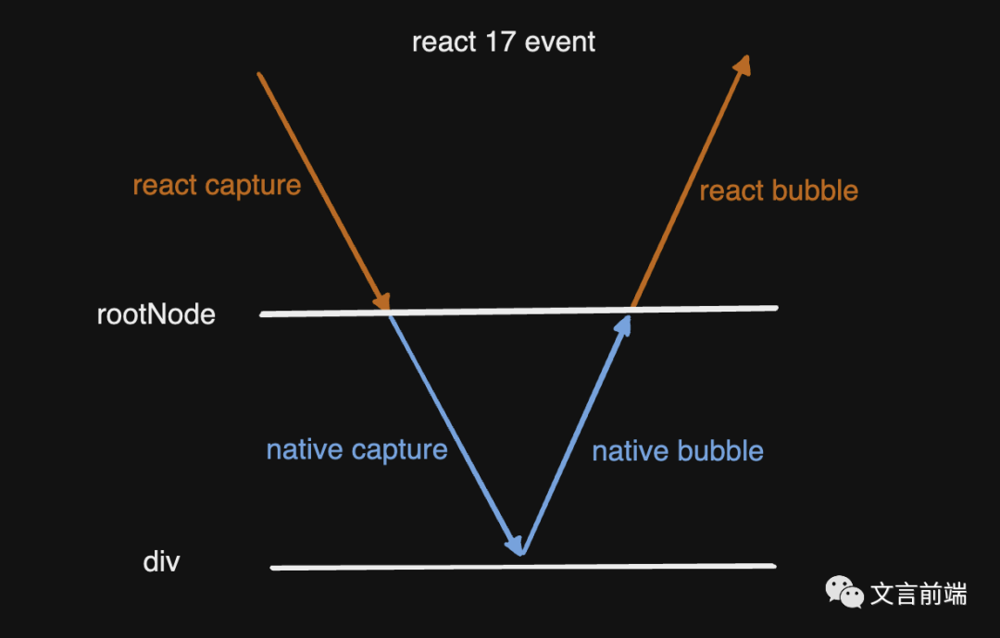

### 原理

- 虚拟`dom` 它是一个js对象，它和页面真实dom一一对应。react会在页面加载时自动在内存中生成虚拟dom，根据虚拟dom会在页面生成真实的dom
- diff算法，它会一层一层、一级一级的比较，如果发现不同将不会在继续进行比较，而是直接更新其组件、及其后代组件

### 特点

- 数据驱动视图的更新
- 组件化开发

### react和vue的异同

+ 相同点
  + 虚拟DOM
  + 单页面应用程序
+ 不同点
  + vue采用template;而react采用jsx
  + vue双向数据绑定，其核心是Object.defineProperty()方法；react采用的是diff算法
  + vue和react的生命周期钩子函数不同
  + vue本质是是MVVM框架；react是组件化

### 鉴权路由 **AuthRoute**

```js
import React, { Component } from 'react'
import { Route, Redirect } from 'react-router-dom'
// 导入获取token的文件
import { isAuto } from '../../utils/token'
export default class AuthRoute extends Component {
  render() {
    const { path, exact, Page } = this.props
    return (
      <Route
        path={path}
        exact={exact}
        render={(props)=>{
          if(isAuth()){
            // 封装以后必须先张开props然后传给相应的页面
            return <Page {...props}></Page>
          }
          return <Redirect to="/login"></Redirect>
        }}
      ></Route>
    )
  }
}
```

### 关于ref的使用步骤

> 1 调用 *React.createRef()* 方法创建ref对象	2 将创建好的 ref 对象添加到文本框中	3 通过ref对象获取到文本框的值

```js
class App extends React.Component {
    constructor(){
        super()  
        //创建 ref
        this.txtRef = React.createRef()
    }
    // 获取文本框的值
    getTxt =() => {
        console.log(this.txtRef.current.value)
    }
    render(){
        return (
          <div>
            <input type ="text" ref={this.txtRef} />
            <button onClick ={this.getTxt}>获取值</button>
          </div>
        )
    }
}
```

### 组件之间的传值

+ 父传子
  + 父组件：传入一个自定义属性
  + 子组件：通过props接受
+ 子传父
  + 父组件：定义并传入一个方法
  + 子组件：通过props调用该方法

### 数据的双向绑定原理

react没有v-modle，但是其可以使用value实现从数据到视图的绑定，onChange事件可以实现从视图到数据的绑定，从而实现了数据的双向绑定

### react的生命周期

- 创建时
  - *constructor()*
    - 初始化state
    - 为事件处理程序绑定 *this*
  - *render()*
    - 加载到内存上
  - *componentDidMount()*
    - 组件DOM初次渲染完成时调用此函数
    - 在该函数中可以发送ajax请求，也可以获取DOM元素
- 更新时
  - *shouldComponentUpdate()*
    - 控制组件是否更新。*return true*  表示可以更新，*return false* 表示不更新
  - *render()*
    - 把更新的结果加载到内存上
  - *componeentsDidUpdate()*
    - 组件更新完成时调用该函数
- 组件卸载时
  - *componentWillUnmount()*
    - 组件卸载完成时调用的函数

### 路由的使用

> 现代的前端应用大多数是SPA（单页应用程序），也就是只有一个HTML页面的应用程序。因为它的用户体验更好、对服务器压力更小，所以更受欢迎。为了有效的使用单个页面来管理多页面的功能，前端路由应运而生。
>
> [react router v6 中文文档](http://www.reactrouter.cn/docs/upgrading/)

安装

```shell
npm i react-router-dom -S
```

在**src/App.js**导入

```js
import React, { Suspense } from 'react'
// 导入路由组件
import { BrowserRouter, Route, Redirect } from 'react-router-dom'
// 导入封装的鉴权路由
import AuthRoute from './components/AuthRoute'
// 导入 Home 组件
const Home = React.lazy(()=> import('./pages/Home'))
const Login = React.lazy(()=> import('./pages/Login'))
const Map = React.lazy(()=> import('./pages/Map'))
const CityList = React.lazy(()=> import('./pages/citylist'))
const Detail = React.lazy(()=> import('./pages/HouseDetail'))
const Rent = React.lazy(()=> import('./pages/Rent'))
const RentAdd = React.lazy(()=> import('./pages/Rent/Add'))
const RentSearch = React.lazy(()=> import('./pages/Rent/Search'))
export default class App extends React.Component{
  render(){
    return <BrowserRouter>
      <Suspense
        fallback={<div className="route-loading">loading</div>}
      >
        <div className="App">
          <Route exact path="/login" component={ Login }></Route>
          <Route exact path="/map" component={ Map }></Route>
          <Route exact path="/citylist" component={ CityList }></Route>
          <Route path="/home" component={ Home }></Route>
          <Route path="/login" component={ Login }></Route>
          <Route path="/detail/:id" component={ Detail }></Route>
          <AuthRoute path="/rent" exact={true} Page={Rent}></AuthRoute>
          <AuthRoute path="/rent/search" exact={true} Page={RentSearch}></AuthRoute>
          <AuthRoute path="/rent/add" exact={true} Page={RentAdd}></AuthRoute>
          
          {/* 路由重定向 */}
          <Route exact path="/" render={(props)=>{
            return <Redirect to="/home/index"></Redirect>
          }}></Route>
        </div>
      </Suspense>
    </BrowserRouter>
  }
}
```

**编程式导航**

```js
const { history } = this.props;
history.push({
  pathName: "/home",
  state:{name : 'sunny' },
  query:{
	id: 123,
  }
})
```

### setState() 修改state

> 用来修改state，且更新数据是异步的。如果立即获取修改后的state，需要使用第二个参数。如果触发多次setstate() 它会先缓存起来，最后进行合并，也就是说只会执行一次DOM更新

```js
this.setState({
  xx:123
},(props) => {
    // 在这里获取修改后的值
})
```

### React 封装组件步骤及校验和默认值

安装校验规则

> 对于组件来说，props是外来的，无法保证组件使用者传入什么格式的数据，简单来说就是组件调用者可能不知道组件封装着需要什么样的数据

```shell
npm i prop-types
```

封装组件

```js
import React, { Component } from 'react'
import { withRouter} from 'react-router-dom'
import { Flex } from 'antd-mobile'
import PropTypes from 'prop-types'
class SearchHeader extends Component {
  render() {
    return (
      <Flex className='searchBox'>
          <Flex className='searchLeft'>
            <div
              className='location'
              onClick={() => {
                this.props.history.push('/citylist')
              }}
            >
            <span>{this.props.cityname}</span>
            <i className="iconfont icon-below-s" />
            </div>
            <div
            className='searchForm'
            >
              <i className="iconfont icon-search1" />
              <span>请输入小区或地址</span>
            </div>
          </Flex>
          <i className="iconfont icon-map" onClick={() => {
            this.props.history.push('/map')
          }}  />
        </Flex>
    )
  }
}

// 校验数据类型
SearchHeader.propsTypes = {
  cityname: PropTypes.string
}

// 设置传参默认值
SearchHeader.defaultProps={
  cityname: '火星'
}
// 必须使用withRouter()高阶组件，否则没用路由
export default withRouter(SearchHeader)

```

### React 局部样式 - CSS Modules

> 在react中写局部样式不能像vue那样给style组件加个scoped属性就行了

在该组件的同级目录下创建 *index.module.css* 文件

```css
.house {
  height: 120px;
  position: relative;
  box-sizing: border-box;
  justify-content: space-around;
  padding-top: 18px;
  border-bottom: 1px solid #e5e5e5;
}
```

导入类组件并使用

```js
import React from 'react'
// 导入局部样式
import styles from './index.module.css'
class HouseItem extends React.Component {
  render() {
      return (
        <div className={styles.house} onClick={onClick} style={style}></div>
      )
  }
}
export default HouseItem
```

导入函数组件并使用

```js
import React from 'react'
import styles from './index.module.css'
function HouseItem({ style }) {
  return (
    <div className={styles.house} onClick={onClick} style={style}></div>
  )
}
export default HouseItem

```

同时添加多个类

```html
<a className={[styles.alink, styles.delAlink].join(' ')} href="javascript:;">删除</a>
```

### 组件之间的数据通讯

**父组件向子组件传值**

父组件

```js
class Parent extends React.Component {
  state={
    age:18,
    arr:[1,2,3],
    obj:{a:1}
  }
  render() {
    return <div className="parent">
        <Child age={this.state.age} arr={this.state.arr} obj={this.state.obj} ></Child>
    </div>
  }
}
```

子组件

```js
// 类组件
class Child extends React.Component{
  render(){
    return (
      <div className="child">
        <h2>子组件接受的传来的age: {this.props.age}</h2>
      </div>
    )
  }
}
// 函数组件
function Child(props) {
  return (
    <div className="child">
      <h2>子组件接受的传来的age: { props.age }</h2>
    </div>
  )
}
```

**子组件向父组件传值**

父组件

```js
class Parent extends React.Component {
  state={
    age:18
  }
  fatherHanshu=(num)=>{
      console.log('父亲的fatherHanshu函数执行了')
      this.setState({
        age:num
      })
  }
  render() {
    return (
      <div className="parent">
        <h1>父亲的age:{this.state.age}</h1>
        <Child fatherHanshu={this.fatherHanshu} ></Child>
      </div>
    )
  }
}
```

子组件

```js
class Child extends React.Component{
  add=()=>{
    console.log('子的this.props',this.props)
    this.props.fatherHanshu(99)
  }
  render(){
    return (
      <div className="child">
        <button onClick={this.add}>点击修改父亲的数据</button>
      </div>
    )
  }
}
```

### react中的反向代理

安装

```powershell
yarn add http-proxy-middleware
```

新建`/src/setupProxy.js` 文件

```js
const {createProxyMiddleware } = require('http-proxy-middleware');
module.exports = function (app) {
  app.use( 
    createProxyMiddleware(
      '/api',
      {
        target: 'https://www.bilibili.com',
        changeOrigin: true,
        "pathRewrite": {
          "^/api" : ""
        }
      }
    )
  )
}
```

使用

```js
componentDidMount = () => {
    axios.get('/api/index/recommend.json')
        .then((res) => {
        console.log(res.data.list);
    })
}
```

### context 跨组件传递

> **使用步骤：** 1 . 调用React.createContext() 得到 Provider Consumer  2 . Provider包裹住祖宗并写上value值 3 . 哪个孙子要用 Consumer 包裹就可以使用

```js
import React from 'react'
import ReactDOM from 'react-dom'
let { Provider,Consumer }=React.createContext()
class Zuzong extends React.Component {
  state={
      money:100,
      arr:[1,2,3]
  }
  render() {
      //  Provider包裹住祖宗  只能 叫value 
      return <Provider value={this.state.money}>
             <div>
                <h1>我是祖宗</h1>
                <Son />
            </div>
      </Provider>
     
  }
}
// 儿子
class Son extends React.Component {
  render() {
      return (
         <div>
            <h1>Son 儿子1 计数器：</h1>
             <Sunzi></Sunzi>
         </div>
      )
  }
}
class Sunzi extends React.Component {
  render() {
      return (
            // 孙子要用 要求必须这样写 在里面写个函数 
            <Consumer>
               {(data)=>{
                    return (
                        <div>
                              <h1>我是孙子组件</h1>
                              <h3>接受的祖宗数据 --{data}</h3>
                        </div>
      				)
               }}
            </Consumer>  
      )
  }
}
ReactDOM.render(<Zuzong />, document.getElementById('root'))
```

### 重写webpack配置(以antd—moblie为例)

```po
yarn add react-app-rewired customize-cra babel-plugin-import -S
```

修改`package.json` 中的 scripts

```json
"scripts": {
   "start": "react-app-rewired start",
   "build": "react-app-rewired build",
   "test": "react-app-rewired test --env=jsdom",
}
```

在项目的根目录上新建`config-overrides.js`文件

```js
const { override, fixBabelImports, addWebpackExternals, setWebpackPublicPath } = require('customize-cra');
const { resolve } = require("path");
module.exports = override(
  fixBabelImports('import', {
    libraryName: 'antd-mobile',
    style: 'css',
  }),
  addWebpackAlias({
    "@": resolve("src");
  })，
  // 设置public目录
  setWebpackPublicPath("/source"),
  addWebpackExternals({
    react: "React",
    "react-dom": "ReactDOM",
  })
);
```

### px2rem适配的配置

> 相关链接 https://www.cnblogs.com/beyonds/p/12988329.html

**安装依赖**

```shell
npm install postcss-px2rem lib-flexible --save
npm install react-app-rewire-postcss --save-dev
```

修改config-overrides.js

```js
const {override}  = require("customize-cra")
const path = require("path")
const rewirePostcss = require('react-app-rewire-postcss');
const px2rem = require('postcss-px2rem')
module.exports = override( 
    (config,env)=>{  
        // 重写postcss
        rewirePostcss(config,{
            plugins: () => [
                require('postcss-flexbugs-fixes'),
                require('postcss-preset-env')({
                    autoprefixer: {
                        flexbox: 'no-2009',
                    },
                    stage: 3,
                }),
               //关键:设置px2rem
                px2rem({
                    remUnit: 37.5,
                    exclude:/node-modules/
                })
            ],
        });
      	// 生产环境去掉 sourcemap
        if (process.env.NODE_ENV === "production") {
          config.devtool = false;
        }
        return config
    }
);
```

在index.js 直接引入 lib-flexible

```js
import 'lib-flexible'
```

### Hooks 基础

> 相关链接 [react 官网链接](https://react.docschina.org/docs/hooks-intro.html)  [腾讯IMWeb前端团队](https://mp.weixin.qq.com/s/_uCquHuFaAk8W2bVjaC7Sg)

让我们从最简单的 Hooks 使用开始。

#### **useState**

```js
import React, { useState } from 'react';
function Example() {
  // 声明一个 "count" 的 state 变量
  const [count, setCount] = useState(0);
  const [count, setCount] = useState(0);
  const [visible, setVisible] = useState(false);
  const [dataList, setDataList] = useState([]);
  return (
    <div>
      <p>You clicked {count} times</p>
      <button onClick={() => setCount(count + 1)}>
        Click me
      </button>
    </div>
  );
}
```

`useState` 就是一个 Hooks，以前的函数组件是无状态的，但是有了 Hooks 后我们可以在函数中通过 `useState` 来获取 state 属性（count）以及修改 state 属性的方法（setCount）。

#### useEffect

在 Hooks 出现之前函数组件是不能访问生命周期钩子的，所以提供了 `useEffect` Hooks 来解决钩子问题，以往的所有生命周期钩子都被合并成了 `useEffect`，并且其解决了之前所提的关于生命周期钩子的问题。

```js
import React, { useState, useEffect } from 'react';
function Example() {
  const [count, setCount] = useState(0);
  // 效果如同 componentDidMount 和 componentDidUpdate:
  useEffect(() => {
    // 更新 title
    document.title = `你点击了 ${count} 次`;
  });
  return (
    <div>
      <p>You clicked {count} times</p>
      <button onClick={() => setCount(count + 1)}>
        Click me
      </button>
    </div>
  );
}
```

可以看到无论是初始化渲染还是更新渲染，`useEffect` 总是会确保在组件渲染完毕后再执行，这就相当于组合了初始化和更新渲染时的生命周期钩子。并且由于闭包的特性，`useEffect` 可以访问到函数组件中的各种属性和方法。

**总结：** 

+ 当 useEffect 没有传递第二个参数时，组件挂载完成和组件更新时都会执行，可以看作是类组件中 componentDidMount 和 componentDidUpdate 的结合
+ 当 useEffect 的第二个参数是一个空数组时，会在组件挂载完成后执行。可以看作是类组件中 componentDidMount 。
+ 当 useEffect 的第二个参数是一个非空数组时，会在组件挂载完成后执行一次，后续当数组中的任意数据发生改变时，都会重新执行。类似于 Vue 中 watch 搭配立即侦听。
+ 当 useEffect 的第一个参数中，返回了一个函数。返回的这个函数会在当前组件销毁前执行。模拟类组件 componentWillUnmount

**useRef**

```js
import React, { useRef } from "react";
export default function UseRefExample() {
  let inputRef = useRef(null);
  const handleClick = () => {
    inputRef.current.focus();
  }
  return (
    <div>
    	使用useRef() hook:
    	<br />
    	<input type="text" ref={inputRef} />
			<button onClick={handleClick}>
        click me
      </button>
    </div>
  )
}
```

和createRef的区别是： 

+ createRef 每次渲染都会返回一个新的引用，而useRef 每次渲染都会返回相同的引用。
+ createRef 只能在class 组件中使用；useRef 只能在function组件中使用；

#### useMemo

> 类似于vue 的计算属性，可以把 useMemo 作为性能优化的手段，但不要把它当成语义上的保证
> [官网地址](https://zh-hans.reactjs.org/docs/hooks-reference.html#usememo)

把“创建”函数和依赖项数组作为参数传入 useMemo，它仅会在某个依赖项改变时才重新计算 memoized 值。这种优化有助于避免在每次渲染时都进行高开销的计算。

#### useImperativeHandle

>  react hook组件中父组件调用子组件的方法 [官网连接](https://zh-hans.reactjs.org/docs/hooks-reference.html#useimperativehandle)

```js
import React, {
  useRef,
  useImperativeHandle,
  useState,
  forwardRef,
} from "react";
function Son(props, ref) {
  const inputRef = useRef(null);
  const [inputValue, setInputValue] = useState("");
  useImperativeHandle(
    ref,
    () => {
      const handleRefs = {
        onFocus() {
          inputRef.current.focus();
        },
        onChangeValue(value) {
          setInputValue(value);
        },
      };
      return handleRefs;
    },
    []
  );
  return (
    <div>
      <input placeholder="请输入内容" ref={inputRef} value={inputValue} />
    </div>
  );
}
const ForwarSon = forwardRef(Son);
const Index = () => {
  let inputRef = useRef(null);

  const handerClick = () => {
    const { onFocus, onChangeValue } = inputRef.current;
    onFocus();
    onChangeValue("let us learn React!");
  };

  return (
    <div style={{ marginTop: "50px" }}>
      <ForwarSon ref={inputRef} />
      <button onClick={handerClick}>操控子组件</button>
    </div>
  );
};
export default Index;
```

#### useContext

`useContext` 是一个 React Hook，可以让你读取和订阅组件中的 [context](https://react.docschina.org/learn/passing-data-deeply-with-context)。

```js
import { createContext, useContext, useState } from 'react';
const ThemeContext = createContext('light');
export default function MyApp() {
  const [theme, setTheme] = useState('light');
  return (
    <>
      <ThemeContext.Provider value={theme}>
        <Form />
      </ThemeContext.Provider>
      <Button onClick={() => {
        setTheme(theme === 'dark' ? 'light' : 'dark');
      }}>
        Toggle theme
      </Button>
    </>
  )
}

function Form({ children }) {
  return (
    <Panel title="Welcome">
      <Button>Sign up</Button>
      <Button>Log in</Button>
    </Panel>
  );
}

function Panel({ title, children }) {
  const theme = useContext(ThemeContext);
  const className = 'panel-' + theme;
  return (
    <section className={className}>
      <h1>{title}</h1>
      {children}
    </section>
  )
}

function Button({ children, onClick }) {
  const theme = useContext(ThemeContext);
  const className = 'button-' + theme;
  return (
    <button className={className} onClick={onClick}>
      {children}
    </button>
  );
}
```


### react-spring

> React Spring具有基于钩子和基于组件的API，这里将专门针对所有动画使用具有基本状态的钩子，建议先学习React Hooks相关知识。

**环境安装和配置**

```shell
npm i react-spring
```

**使用**

```js
// App.js:
import React, { useState } from 'react';
import { useSpring, animated } from 'react-spring';
const App = () => {
  const animation = useSpring({
    from: { opacity: 0 },
    to: { opacity: 1 }
  });
  const colorAnimation = useSpring({
    from: { color: 'blue' },
    to: { color: `rgb(255,0,0)` }
  });
  const multiAnimation = useSpring({
    from: { opacity: 0, color: 'red' },
    to: [
        { opacity: 1, color: '#ffaaee' },
        { opacity: 1, color: 'red' },
        { opacity: .5, color: '#008000' },
        { opacity: .8, color: 'black' }
    ]
  });
  return (
    <div>
      <animated.h1 style={animation}>Hello World</animated.h1>
      <animated.h1 style={colorAnimation}>Hello World</animated.h1>
      <animated.h1 style={multiAnimation}>Hello World</animated.h1>
    </div>
  )
};
export default App;
```

### 闭包陷阱

> [相关连接](https://mp.weixin.qq.com/s/Zq1-XLHuh6-edGcTmPojjQ)

 初使用Hooks时，比较常见的一个错误就是闭包。 

```js
const IntervalDemo = () => {
    const [count, setCount] = useState(0);
    useEffect(() => {
        let timer = setInterval(() => {
            setCount(count + 1);
        }, 1000);
        return ()=>{
            clearInterval(timer)
        }
    }, []);
    return <div>{count}</div>;
};
```

 事实上每次更新之后count的值都不会变化，其原因跟 

```js
for (var i = 0; i < 10; ++i) {
    setTimeout(function () {
        console.log(i);
    }, 1000);
}
```

 一种解决办法是使用函数式的setCount，可以获取到最新的count值。 

```js
const IntervalDemo2 = () => {
    const [count, setCount] = useState(0);
    useEffect(() => {
        let timer = setInterval(() => {
            setCount((c) => c + 1); // 可以拿到上一轮的值
        }, 1000);
        return () => {
            clearInterval(timer);
        };
    }, []);
    return <div>{count}</div>;
};
```

最简单的做法是使用外部自由变量来保存。

```js
let globalCount = 0
const IntervalDemo2 = () => {
    const [count, setCount] = useState(0);
    useEffect(() => {
        let timer = setInterval(() => {
            globalCount++
            console.log(globalCount)
            setCount(globalCount);
        }, 1000);
        return () => {
            clearInterval(timer);
        };
    }, []);
    return <div>{count}</div>;
};
```

 官方的做法是使用useRef 

```js
const IntervalDemo3 = () => {
    const [count, setCount] = useState(0);
    const countRef = useRef(0);
    useEffect(() => {
        let timer = setInterval(() => {
            countRef.current += 1;
            setCount(countRef.current);
        }, 1000);

        return () => {
            clearInterval(timer);
        };
    }, []);
    return <div>{count}</div>;
};
```

### render Hook

> 在某些场景下可能期望获取组件的实例，方便调用组件上面的一些方法，最经典的场景是调用Form.validate()表单组件的字段校验。

在Class组件的使用中

```js
class Form extends React.Component {
    validate = () => {
        console.log("validate form");
    };
    render() {
        return <div>form</div>;
    }
}
```

 可以通过ref获取组件实例然后调用组件方法 

```js
const Parent = () => {
    const ref = useRef(null)
    useEffect(()=>{
        const instance = ref.current
        instance.validate()
    },[])
    return (
      <Form ref={ref}></Form>
    );
};
```

 在函数组件中，并不存在组件instance这一说法，也无法直接设置ref属性，直接在函数组件上使用ref会出现警告 

>  Warning: Function components cannot be given refs. Attempts to access this ref will fail. Did you mean to use React.forwardRef()? 

  为了实现与类组件的功能，需要使用借助forwardRef和useImperativeHandle 

```js
const Form2 = forwardRef((props, ref)=>{
      // 实现ref获取到实例相关的接口
    useImperativeHandle(ref, ()=>{
        return {
            validate(){
                console.log('validate')
            }
        }
    })
    return (<div>form</div>)
})
```

 但是现在有了Hook，我们可以将组件和操作组件的方法通过hook暴露出来，无需再通过ref了。 

```js
const useForm = () => {
    const validate = () => {
        console.log("validate form");
    };
    const render = () => {
        return <div>form</div>;
    };
    return {
        render,
        validate,
    };
};
const FormDemo = ()=>{
    const {render, validate} = useForm()
    useEffect(() => {
        validate()
    }, []);

    return render()
}
```

 相较于ref获取类组件实例，这种实现看起来更加简单清晰，一切皆是函数。 

 借助这种包含渲染render功能的hook和JSX的强大表现力，可以实现很多有趣的组件，如弹窗。 

```js
const Modal = ({ visible, children }) => {
    return <dialog open={visible}>{children}</dialog>;
};
const useModal = (content) => {
    const [visible, setVisible] = useState(false);
    const modal = <Modal visible={visible}>{content}</Modal>;

    const toggleModal = () => {
        setVisible(!visible);
    };
    return {
        modal,
        toggleModal,
    };
};
```

 使用起来很方便。 

```js
const ModalDemo = () => {
    const { modal, toggleModal } = useModal(<h1>hi model</h1>);
    return (
        <div>
            {modal}
            <button onClick={toggleModal}>toggle</button>
        </div>
    );
};
```

### react-zmage

> [官网地址](https://github.com/Caldis/react-zmage)

安装

```shell
npm i react-zmage --save
```

使用

```js
import Zmage from "react-zmage";

👆 to 👇
<Zmage src="图片源连接"/>
```

也可以通过函数调用来唤出图片

```js
// Zmage.browsing 函数接受的参数与 <Zmage/> 组件完全一致
<a onClick={() => Zmage.browsing({ src:imagePath })}>任意元素</a>
```
### 自定义hook

> 说明： 在开发中，我们会有一些数据希望通过localStorage进行存储，如果每一个里面都有这样的逻辑，那么代码就会变得非常冗余，此时我们就可以使用自定义的hook。

**定义**

```js
import React,{useState, useEffect} from 'react';
function useLocalStorage(key) {
  const [data, setData] = useState(() => {
    return JSON.parse(window.localStorage.getItem(key))
  });

  useEffect(() => {
    window.localStorage.setItem(key, JSON.stringify(data));
  }, [data]);

  return [data, setData];
}

export default useLocalStorage;
```
**使用**
```js
import React, { useState, useEffect } from 'react';
import useLocalStorage from './useLocalStorage';
export default function CustomDataStoreHook() {
  const [name, setName] = useLocalStorage("name");

  return (
    <div>
      <h2>CustomDataStoreHook: {name}</h2>
      <button onClick={e => setName("kobe")}>设置name</button>
    </div>
  )
}
```
### 分析 Bundle (包) 大小

**安装依赖**
```shell
yarn add source-map-explorer
```
**然后在 package.json 中，将以下行添加到 scripts 中：**
```json
{
  "scripts": {
    "analyze": "source-map-explorer build/static/js/main.*"
}
```
**然后分析 bundle(包) 运行生产构建然后运行分析脚本。**
```shell
npm run analyze
```

### 深入学习React的合成事件

#### 为什么使用合成事件

+ 浏览器兼容，统一行为，比如事件对象有统一的属性和方法，又比如，移除不想要的点击事件（Firefox右键点击会生成点击事件），再比如无论注册onMouseLeave还是onMouseOut都会映射成原生的mouseout事件；

+ 多平台适配，ReactNative也能使用；

+ 实现事件委托，避免大量创建事件监听；

+ 事件池机制，避免频繁创建和销毁SyntheticEvent对象，释放过程将SyntheticEvent对象的大部分属性置为null，提升旧浏览器的性能。

#### 事件优先级

+ 离散事件（DiscreteEvent），非连续触发，包括click、input、keydown、focusin等，优先级为0；

+ 用户阻塞事件（UserBlockingEvent），连续触发，包括drag、mousemove、touchmove、scroll等，优先级为1；

+ 连续事件（ContinuousEvent），包括load、progress、playing、error等音视频相关的事件，优先级为2。

#### 总结

React在浏览器原生事件的基础上实现了一套合成事件。

React 16.x及以前的合成事件：

+ 事件委托到document；

+ 部分事件还是会绑定到当前元素；

+ 存在React事件和原生事件的映射关系，比如onMouseLeave会映射成原生的mouseout事件；

+ 事件池机制。

React 17的合成事件：

+ 事件委托到root；

+ React capture阶段的合成事件提前到原生事件capture阶段执行；

  

+ 移除事件池机制；

+ 事件有优先级。

### setState一定是异步?

setState一定是异步操作吗? 其实`在React 18之前`分成两种情况：

情况一: 在组件生命周期或React的事件中，setState是**异步**；

情况二: 在setTimeout或者原生dom事件中，setState是**同步**；

`在React18之后`，默认所有的操作都被放到了批处理中（也就是默认所有操作都是异步处理的）

在React 18之后, 如果希望代码可以同步会拿到，则需要执行特殊的flushSync操作:

```JS
import { flushSync } from 'react-dom';
flushSync(() => {
  this.setState({ message: "你好啊" })
})
console.log(this.state.message) // 你好啊 这里获取就是同步的
```

### React Diff 过程详解
在传统的diff算法中复杂度会达到O(n^3)。React中定义了三种策略，在对比时，根据策略只需遍历一次树就可以完成对比，将复杂度降到了O(n)，具体如下：
+ tree diff
  两个树对比时，只会比较同一层级的节点，会忽略掉跨层级
+ 在对比两个组件时，首先会判断它们两个的类型是否相同，如果不同，则将该组件判断为 dirty component，从而替换整个组件下的所有子节点
+ 对于同一层级的一组节点，会使用具有唯一性的key来区分是否需要创建，删除，或者是移动。React diff 提供了三种节点操作，分别为：
  - INSERT_MARKUP（插入）
    新的 component 类型不在老集合里， 即是全新的节点，需要对新节点执行插入操作

  - MOVE_EXISTING（移动）

    在老集合有新 component 类型，且 element 是可更新的类型,这种情况下 prevChild=nextChild，就需要做移动操作，可以复用以前的 DOM 节点。

  - REMOVE_NODE（删除）
    老 component 类型，在新集合里也有，但对应的 element 不同则不能直接复用和更新，需要执行删除操作，或者老 component 不在新集合里的，也需要执行删除操作

