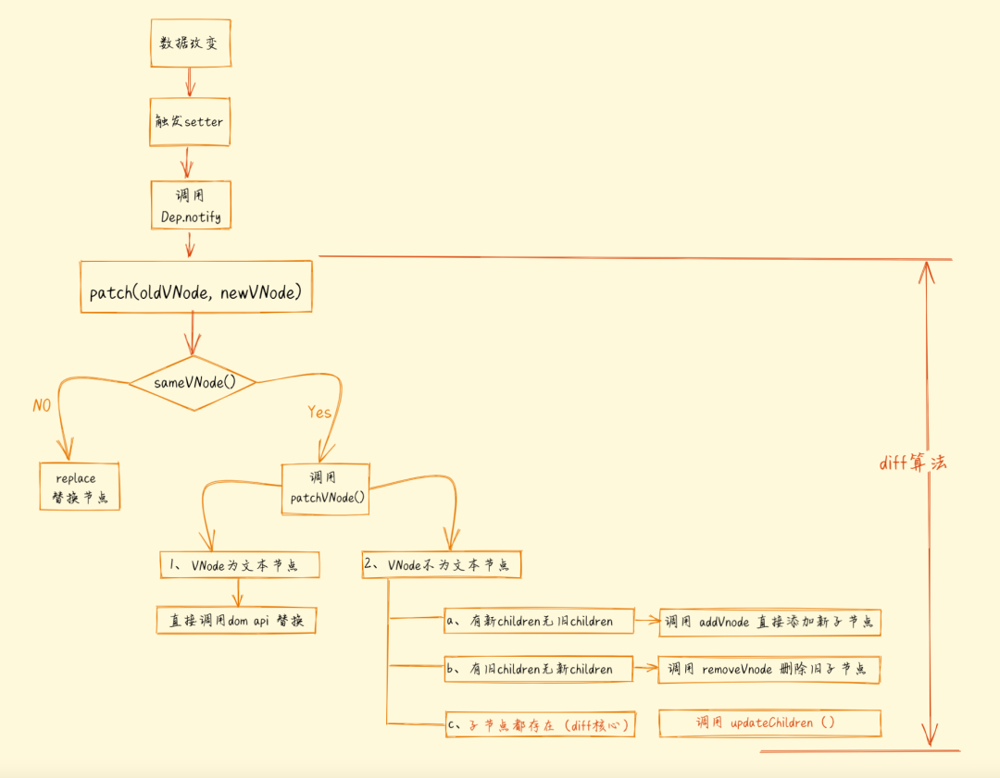
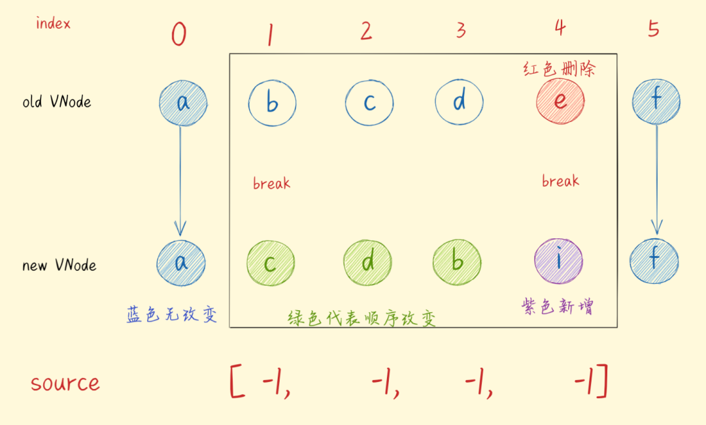
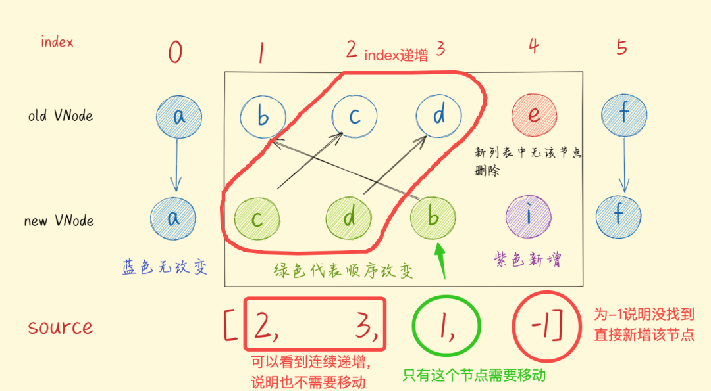
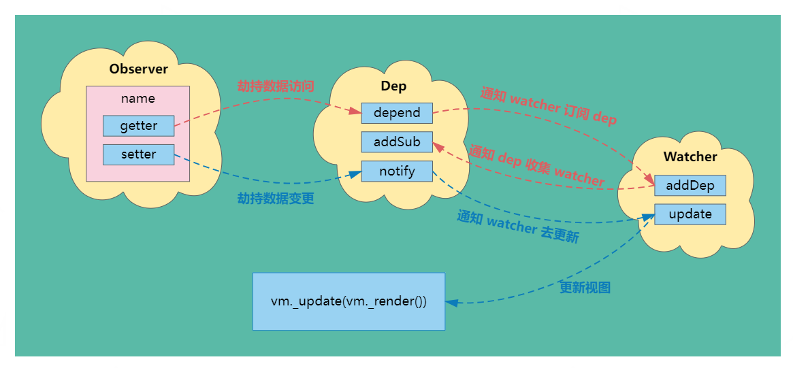

vue3.0 新特征

> 建议阅读迁移 https://v3.cn.vuejs.org/guide/migration/array-refs.html

## setup函数的特性

+ setup函数是vue3.0新特性，与之对应的是vue2.0的BeforeCreate 和Created 两个生命周期。由于在setup函数中vue实例并没有创建出来，所以该函数没有this
+ setup 函数有props、ctx两个参数。其中props对应vue2.0的props(响应式的，不能解构)，ctx 对应this(非响应式的，可以解构)
+ 在setup中return回去的数据在视图中才能用到

## ref 和 reactive 的异同点

> [探寻Vue3中ref的神奇之处，为什么说它比reactive更强大？](https://mp.weixin.qq.com/s/SUbubs9jPDqI1EyAie-AVw)

+ 相同的
  + 都是为数据添加响应式状态
+ 不同点
  + ref 既可以代理简单数据类型，又可以代理复杂数据类型，reactive 只能代理复杂数据类型
    + ref还是调用了reactive来完成对复杂数据类型的代理
  + 使用 reactive 重新分配一个新对象会导致丢失响应性，而 ref 不会受到此影响。
    + 这是因为新分配的值会经过 `toReactive` 处理，然后再赋给 `_value`，而 `get` 方法返回的就是 `_value`，也就是这个值已经经过响应式处理的数据。
  + 从ref返回的引用将自动解包，因此模板中使用不需要.value。在setup中访问必须需要`.value`

> 在 `ref` 的内部逻辑中分离 `_rawValue` 和 `_value` 使得能够明确区分原始值和经过响应式处理的值

## toRef 和 toRefs的区别

+ toRef 用于为源响应式对象上的属性新建一个ref，从而保持对其源对象属性的响应式连接。接受两个参数：源相应对象和属性名，返回一个ref数据。获取数据值的时候需要加上.value;toRef后的ref数据不是原始数据的拷贝，而是引用，改变结果数据的值也会同时改变原始数据

  ```js
  const state = reactive({
    foo: 1,
    bar: 2
  })
  // 双向 ref，会与源属性同步
  const fooRef = toRef(state, 'foo')
  // 更改该 ref 会更新源属性
  fooRef.value++
  console.log(state.foo) // 2
  // 更改源属性也会更新该 ref
  state.foo++
  console.log(fooRef.value) // 3
  ```

+ toRefs 用于将响应式对象转化为结果对象，其中结果对象的每个属性都是指向原始对象相应属性的ref.toRef需要结合reactive 使用

  ```js
  const state = reactive({
    foo: 1,
    bar: 2
  })
  const { foo } = toRefs(state)
  foo.value++
  console.log(foo.value) // 2
  foo.value++
  console.log(state.foo) // 3
  ```

## 计算属性(案例)

```js
import { computed, ref } from "vue";
const firstName = "firstName";
const lastName = "lastName";
const fullName = computed(() => {
  return firstName.value + " " + lastName.value;
})
console.log("fullName", fullName); // result: "firstName lastName"
firstName.value = "firstName1";
console.log("fullName", fullName); // result: "firstName1 lastName"
```

## watch 和 watchEffect

+ watch 是需要传入侦听的数据源，而 watchEffect 是自动收集数据源作为依赖。
+ watch 可以访问侦听状态变化前后的值，而 watchEffect 没有。
+ watch 是属性改变的时候执行，而 watchEffect 是默认会执行一次，然后属性改变也会执行

案例

```js
import { reactive, watchEffect, watch } from "vue";
const userInfo = reactive({
  name: "小娜",
  age: 10
})
watchEffect(() => {
  // 自动收集数据源作为依赖
  console.log("改变了", testmr.age);
});
watch(
  () => userInfo.age,
  (newVal, oldVal) => {
    console.log("watch监听数据的变化", newVal, oldVal);
  },
  {
    deep: true,
    immediate: true,
  }
);
```

默认情况下，用户创建的侦听器回调，都会在 Vue 组件更新**之前**被调用。这意味着你在侦听器回调中访问的 DOM 将是被 Vue 更新之前的状态。如果想在侦听器回调中能访问被 Vue 更新**之后**的 DOM，你需要指明 `flush: 'post'` 选项：

```js
watch(source, callback, {
  flush: 'post'
})
watchEffect(callback, {
  flush: 'post'
})
```

## 通过ref获取和操作DOM

单个DOM案例

```html
<template>
  <input type="number" name="userName" id="" ref="dom" />
</template>
<script>
import { ref, nextTick } from "vue";
export default {
  name: "refDom",
  setup() {
    // 单个dom获取
    const dom = ref(null);
    // 下次Dom树更新时
    nextTick(() => {
      console.log("单个dom", dom.value);
    });
    return {
      dom,
    };
  },
};
</script>
```

多个DOM(案例)

> [官网链接](https://v3.cn.vuejs.org/guide/migration/array-refs.html)

```html
<template>
  <ul>
    <li v-for="(item, index) in arr" :key="index" :ref="setRef">
      {{ item }}
    </li>
  </ul>
</template>

<script>
import { ref, nextTick } from "vue";
export default {
  name: "refDom",
  setup() {
    const arr = ref([1, 2, 3]);
    // 存储dom数组
    const myRef = ref([]);
    const setRef = (el) => {
      myRef.value.push(el);
    };
    // 下次Dom树更新时
    nextTick(() => {
      console.dir(myRef.value);
    });
    return {
      arr,
      setRef,
    };
  },
};
</script>
```

## vue3.0 jsx语法

```js
import { defineComponent } from "vue";
const Button = defineComponent({
  props: {
    type: { type: String, default: () => "primary" },
  },
  setup(props, { slots, emit }) {
    return () => (
      <button
        class={`mybtn-${props.type}`}
        onClick={() => {
          emit("addchage", "hahhah");
        }}
      >
        {slots.default()}
      </button>
    );
  },
});
export default Button;
```

## vue3.0 插槽

> v-slot:default 可以简写为 #default

```html
<Suspense>
    <template v-slot:default>
      <div>
        <AsyncShow />
      </div>
    </template>
    <template v-slot:fallback>
      <h1>Loading...</h1>
    </template>
  </Suspense>
```

作用域插槽

```html
<!-- 子组件-->
<ul>
  <li v-for="( item, index ) in items">
    <slot :item="item"></slot>
  </li>
</ul>
<!-- 父组件-->
<todo-list>
  <template v-slot:default="slotProps">
    <i class="fas fa-check"></i>
    <span class="green">{{ slotProps.item }}</span>
  </template>
  <template v-slot:other="otherSlotProps">
    ...
  </template>
</todo-list>
```

## 关于 Suspense 组件

> 相关链接 https://v3.cn.vuejs.org/guide/migration/suspense.html#%E4%BA%8B%E4%BB%B6

+ Suspense是Vue3.0推出的一个内置特殊组件，用来定义具有异步请求数据的组建的显示。如果使用Suspense，要setup函数中需要返回一个promise
+ Suspense组件内置了两个具名插槽slot,一个是default，用来显示异步组件请求成功的内容；一个是fallback用来显示异步组件请求响应前页面显示的内容
+ default插槽可以有多个组件，但是需要有一个根节点

```html
<router-view v-slot="{ Component }">
  <template v-if="Component">
    <transition mode="out-in">
      <keep-alive>
        <suspense>
          <template #default>
            <component :is="Component"></component>
          </template>
          <template #fallback>
            <div>
              Loading...
            </div>
          </template>
        </suspense>
      </keep-alive>
    </transition>
  </template>
</router-view>
```

## 挂载全局的属性和方法

方法一：

```js
// main.js
app.config.globalProperties.$title = "vue3.0 测试";
// used.vue
import { getCurrentInstance } from "vue";
const { proxy } = getCurrentInstance();
console.log("$title", proxy, proxy.$title);
```

方法二(推荐)：

```js
// main.js
app.provide($title, "vue3.0 测试")
// used.vue
import { inject } from "vue"
const $title = inject($title)
```

## 在 `setup` 中访问路由和当前路由

> [相关链接](https://next.router.vuejs.org/zh/guide/advanced/composition-api.html)

因为我们在 `setup` 里面没有访问 `this`，所以我们不能再直接访问 `this.$router` 或 `this.$route`。作为替代，我们使用 `useRouter` 函数：

```js
import { useRouter, useRoute } from 'vue-router'
export default {
  setup() {
    const router = useRouter()
    const route = useRoute()
    function pushWithQuery(query) {
      router.push({
        name: 'search',
        query: {
          ...route.query,
        },
      })
    }
  },
}
```

`route` 对象是一个响应式对象，所以它的任何属性都可以被监听，但你应该**避免监听整个 `route`** 对象

```js
import { useRoute } from 'vue-router'
export default {
  setup() {
    const route = useRoute()
    const userData = ref()
    // 当参数更改时获取用户信息
    watch(
      () => route.params,
      async newParams => {
        userData.value = await fetchUser(newParams.id)
      }
    )
  },
}
```

## 路由拦截器

```js
router.beforeEach((to) => {
  document.title = to.meta.title;
  if (to.meta.requiresAuth && !store.isLogin) {
    console.log("没有访问权限");
    // 去授权页面
    return { name: 'Login' };
  }
});
```

## 表单输入绑定v-model

`v-model` 在内部为不同的输入元素使用不同的 property 并抛出不同的事件：

+ text 和 textarea 元素使用 `value` property 和 `input` 事件

+ checkbox 和 radio 使用 `checked` property 和 `change` 事件；

+ select 字段将 `value` 作为 prop 并将 `change` 作为事件

## v-model用于自定义组件时

> [相关链接](https://v3.cn.vuejs.org/guide/migration/v-model.html#%E6%A6%82%E8%A7%88)

prop：`value` -> `modelValue`

event：`input` -> `update:modelValue`；

> 总结： vue中的v-model:title   相当于 title 的 prop 和  update:title 的 event

## 自定义指令

定义

```js
app.directive("permission", {
  mounted(el, binding) {
    // 获取到的角色权限
    const permissionList = ["B0.1add", "B0.2remove", "B0.3export"];
    const name = binding.value;
    const index = persissionList.indexOf(name);
    if(index === -1) {
      el.style.display = "none";
    }
  }
})
```

使用

```html
<!-- 拥有该权限 -->
<button v-permission="B0.1add">新增</button>
<!-- 没有该权限 -->
<button v-permission="C0.1remove">删除</button>
```

动态指令参数

```js
const app = Vue.createApp({
  template: `<div class="box" v-abs:left="100px"></div>`
})
app.directive("abs", (el, binding) => {
  el.style[binding.arg] = binding.value;
})
```

## 自定义修饰符

> [相关链接](https://v3.cn.vuejs.org/guide/component-custom-events.html#%E5%A4%84%E7%90%86-v-model-%E4%BF%AE%E9%A5%B0%E7%AC%A6)

让我们创建一个示例自定义修饰符 `capitalize`，它将 `v-model` 绑定提供的字符串的第一个字母大写。

```html
<my-component v-model.capitalize="myText"></my-component>
```

```js
app.component('my-component', {
  props: {
    modelValue: String,
    modelModifiers: {
      default: () => ({})
    }
  },
  emits: ['update:modelValue'],
  methods: {
    emitValue(e) {
      let value = e.target.value
      if (this.modelModifiers.capitalize) {
        value = value.charAt(0).toUpperCase() + value.slice(1)
      }
      this.$emit('update:modelValue', value)
    }
  },
  template: `<input
    type="text"
    :value="modelValue"
    @input="emitValue">`
})
```

## proxy与defineProperty的区别

Object.defineProperty只能监听到对象的读取或写入，Proxy除了可以监听读写还可以监听对象属性的删除、对象当中方法的调用

**多页面应用程序**

配置 `vue.config.js`

```javascript
module.exports = {
    pages: {
        index1: {
            // page 的入口
            entry: “src/views/index1/main.js”,
            // 模板来源
            template: “src/views/index1/index.html”,
            // 在 dist/index.html 的输出
            filename: “index1.html”,
            // 当使用 title 选项时，
            // template 中的 title 标签需要是 <%= htmlWebpackPlugin.options.title %>
            title: “IndexPage”,
            // 在这个页面中包含的块，默认情况下会包含
            // 提取出来的通用 chunk 和 vendor chunk。
            chunks: [“chunk-vendors”, “chunk-common”, “index1”]
        },
        index2: {
            // page 的入口
            entry: “src/views/index2/main.js”,
            // 模板来源
            template: “src/views/index2/index.html”,
            // 在 dist/index.html 的输出
            filename: “index2.html”,
            // 当使用 title 选项时，
            // template 中的 title 标签需要是 <%= htmlWebpackPlugin.options.title %>
            title: “jhd”,
            // 在这个页面中包含的块，默认情况下会包含
            // 提取出来的通用 chunk 和 vendor chunk。
            chunks: [“chunk-vendors”, “chunk-common”, “index2”]
        }
    },
}
```

## 父子组件生命周期的执行顺序

+ 父子组件在加载的时候，执行的先后顺序为

  父beforeCreate->父created->父beforeMount->子beforeCreate->子created->子beforeMount->子mounted->父mounted。

+ 子组件更新过程

  父beforeUpdate->子beforeUpdate->子updated->父updated

+ 父组件更新过程

  父beforeUpdate->父updated

+ 销毁过程

  父beforeDestroy->子beforeDestroy->子destroyed->父destroyed

## vue 的渲染过程

+ 把模板编译成render函数
+ 实例进行挂载，根据根节点render函数的调用，递归生成虚拟DOM
+ 对比虚拟DOM，渲染真实的DOM
+ 组件内部的data发生变化，组件和子组件的data作为props重新调用render函数生成虚拟DOM，使用diff算法对比新旧虚拟DOM，将变化的DOM更新

## 跨组件通讯mitt.js

>  `Vue2`中怎么实现跨组件通讯呢,很多人第一想法就是`event bus`。但是`Vue3`移除了`$on`,`$once`,`$off`导致不能使用这个方法。但是`Vue`官方给大家推荐了`mitt.js`,它的原理就是`event bus`。 

安装

```shell
npm i mitt -s
```

封装一个hook

```js
//mitt.js
import mitt from 'mitt'
const emitter = mitt();
export default emitter;
```

 子组件1 

```html
<template>
  <div>
    我是子组件1
    <h1>{{msg}}</h1>
  </div>
</template>

<script>
import { ref, onUnmounted } from 'vue'
import emitter from '../mitt'
export default {
  name: '',

  setup() {
    //初始化
    const msg = ref('hello')
    const changeMsg = () => {
      msg.value = 'world'
    }
    // 监听事件,更新数据
    emitter.on('change-msg', changeMsg)
    // 显式卸载
    onUnmounted(() => {
      emitter.off('change-msg', changeMsg)
    })
    return {
      msg,
      changeMsg,
    }
  },
}
</script>
```

组件2

```html
<template>
  <div>
    我是子组件2
  </div>
  <button @click='changeMsg'>点击修改msg</button>
</template>

<script>
import { ref } from 'vue'
import emitter from '../mitt'

export default {
  name: '',

  setup() {
    const changeMsg = () => {
      emitter.emit('change-msg')
    }
    return {
      changeMsg,
    }
  },
}
</script>
```

## setup 语法糖

> [官网链接](https://cn.vuejs.org/api/sfc-script-setup.html#defineprops-defineemits)

 虽然`Composition API`用起来已经非常方便了，但是我们还是有很烦的地方，比如 

+ 组件引入了还要注册
+ 属性和方法都要在`setup`函数中返回，有的时候仅一个`return`就十几行甚至几十行

 `Vue3`官方提供了`script setup`语法糖 

 只需要在`script`标签中添加`setup`，组件只需引入不用注册，属性和方法也不用返回，`setup`函数也不需要，甚至`export default`都不用写了，不仅是数据，计算属性和方法，甚至是自定义指令也可以在我们的`template`中自动获得。 

但是这么过瘾的语法糖，还是稍微添加了一点点心智负担，因为没有了`setup`函数，那么`props`，`emit`，`attrs`怎么获取呢，就要介绍一下新的语法了。

setup script`语法糖提供了三个新的`API`来供我们使用：`defineProps`、`defineEmit

+  **defineProps** 用来接收父组件传来的值`props` 
+  **defineEmit** 用来声明触发的事件表 

```html
// 子组件
<div class="hello">
  <button @click="btn">点击</button>
</div>
<script setup>
// 获取父组件传来的 props
const props = defineProps({
  openType: String,
  foo: { type: String, required: true, default: 'Hello, World!' },
  messageType: {
    // 自定义类型校验函数
    validator(value) {
      return ['success', 'warning', 'danger'].includes(value)
    }
  },
});
const emit = defineEmits(["change", "delete", "handle"]);
const btn = () => {
  emits('handle', '张三')
}
</script>
// 父级组件中
<div class="home">
  <HelloWorld @handle="handleClick" open-type="add" />
</div>
<script setup>
import HelloWorld from '@/components/HelloWorld'
const handleClick = function (data) {
  console.log(data)
}
</script>
```

复杂的 prop 类型

```js
<script setup lang="ts">
interface Book {
  title: string
  author: string
  year: number
}
const props = defineProps<{
  book: Book
}>()
</script>
```

## Props 解构默认值

当使用基于类型的声明时，我们失去了为 props 声明默认值的能力。这可以通过 `withDefaults` 编译器宏解决：

```ts
export interface Props {
  msg?: string
  labels?: string[]
}
const props = withDefaults(defineProps<Props>(), {
  msg: 'hello',
  labels: () => ['one', 'two']
})
```

## expose / ref 的使用

> 如果在父组件中通过`ref='xxx'`的方法来获取子组件实例，子组件使用了`script setup`语法糖,那么子组件的数据需要用expose的方式导出，否则会因为获取不到数据而报错。

子组件可以通过 expose 暴露自身的方法和数据。

父组件通过 ref 获取到子组件并调用其方法或访问数据。

```html
<!-- Parent.vue -->
<template>
  <div>父组件：拿到子组件的message数据：{{ msg }}</div>
  <button @click="childFun">调用子组件的方法</button>
  <hr />
  <Child ref="childRef" />
</template>
<script setup>
import { ref, onMounted } from "vue";
import Child from "@/components/Child.vue";
const childRef = ref(null); // 通过 模板ref 绑定子组件
const msg = ref("");
onMounted(() => {
  // 在加载完成后，将子组件的 message 赋值给 msg
  msg.value = childRef.value.message;
});
function childFun() {
  // 调用子组件的 changeMessage 方法
  childRef.value.changeMessage("前端诡刺");
  // 重新将 子组件的message 赋值给 msg
  msg.value = childRef.value.message;
}
</script>
```

```html
<!-- Child.vue -->
<template>
  <div>子组件：{{ message }}</div>
</template>
<script setup>
import { ref } from "vue";
const message = ref("前端菜鸟");
function changeMessage(data) {
  message.value = data;
}
//使用 defineExpose 向外暴露指定的数据和方法
defineExpose({
  message,
  changeMessage,
});
</script>
```

## 局部样式

### scoped的原理

vue中的scoped 通过在DOM结构以及css样式上加`唯一不重复的标记:data-v-hash的方式`，以保证唯一（而这个工作是由过PostCSS转译实现的），达到样式私有化模块化的目的。

+ 给HTML的DOM节点加一个不重复data属性(形如：data-v-123)来表示他的唯一性
+ 在每句css选择器的末尾（编译后的生成的css语句）加一个当前组件的data属性选择器（如[data-v-123]）来私有化样式
+ 如果组件内部包含有其他组件，只会给其他组件的`最外层`标签加上当前组件的data属性

### deep()深度选择器的用法

Vue 提供了样式穿透`:deep()` 他的作用就是用来改变 属性选择器的位置

```html
<style scoped>
.wrapper  :deep (.el-tag--warning) {
    color: #e6a23c;
}
</style>
```

### css module

`<style module>`标签会被编译为 CSS Modules 并且将生成的 CSS 类作为 $style 对象的键暴露给组件

```html
<template>
  <div :class="$style.red">
    弟弟
  </div>
</template>
 
<style module>
  .red {
    color: red;
    font-size: 20px;
  }
</style>
```

自定义注入名称（多个可以用数组）

```html
<template>
  <div :class="[zs.red,zs.border]">
    弟弟
  </div>
</template>
 
<style module="zs">
  .red {
    color: red;
    font-size: 20px;
  }
  .border{
    border: 1px solid #ccc;
  }
</style>
```

## vue3 setup语法糖中组件name定义的几种方法

###  1、写两个script标签，经测试是可以这么定义的，keep-alive有效： 

```html
<script setup>
  import {ref} from 'vue'
  const randomText = ref(Math.random())
</script>
<script>
  import {defineComponent} from 'vue'
  export default defineComponent({
    name: 'systemInfo'
  })
</script>
```

 这种方法比较繁琐，要写两遍script，一个有setup，一个不带。 

###  2、vite-plugin-vue-setup-extend 插件 

 ①、安装 

```shell
npm install vite-plugin-vue-setup-extend -D
```

 ②、在vite.config.ts文件引入vite-plugin-vue-setup-extend 

```ts
// vite.config.ts
import { defineConfig } from 'vite'
import vue from '@vitejs/plugin-vue'
import vueSetupExtend from 'vite-plugin-vue-setup-extend'
export default defineConfig({
  plugins: [vue(), vueSetupExtend()]
})
```

 ③、.vue(SFC)单文件组件添加name属性 

```html
<script setup name="systemInfo"></script>
```

 这种方式最优雅。 

###  3、unplugin-vue-define-options插件，Element Plus就是使用这个插件来对组件命名的 

 ①、安装 

```shell
npm install unplugin-vue-define-options -D
```

 ②、在vite.config.ts文件引入vite-plugin-vue-setup-extend 

```js
//vite.config.ts
import { defineConfig } from 'vite';
import vue from '@vitejs/plugin-vue';
import DefineOptions from 'unplugin-vue-define-options/vite';
export default defineConfig({
  plugins: [vue(), DefineOptions()],
});
```

 ③、使用 

```html
<script setup>
  defineOptions({
    name: 'MyMenuItem',
  });
</script>
```

## Vue.js 编译模板的过程

主要分为两个阶段：解析（Parse）和生成（Generate）。

+ 解析阶段：这个阶段的主要任务是将模板字符串转换为抽象语法树（AST）。抽象语法树是一种以树状的形式表现源代码结构的模型。在 Vue.js 中，解析器会将模板字符串解析为一棵 AST，每个节点都是一个普通的 JavaScript 对象，这个对象描述了元素/文本节点的各种属性。

+ 生成阶段：这个阶段的主要任务是将 AST 转换为渲染函数。渲染函数的主要任务是将模板转换为 Virtual DOM，也就是说，渲染函数的返回值是 Virtual DOM。这个过程的主要步骤如下：

  > 这个过程是 Vue.js 的编译设计的精髓，它使得 Vue.js 可以提供类似于原生 JavaScript 的性能，同时还能提供一个简单易用的模板语法。

  + Vue 接收到模板字符串。
  + Vue 使用解析器（Parser）将模板字符串解析为 AST。
  + Vue 使用优化器（Optimizer）标记静态节点。这个步骤不是必须的，但是它可以提高后续的 patch 过程。
  + Vue 使用代码生成器（Code Generator）将 AST 转换为渲染函数。

## Vue 渲染流程

+ 解析语法，生成AST
+ 根据AST结果，完成data数据初始化
+ 根据AST结果和DATA数据绑定情况，生成虚拟DOM
+ 将虚拟DOM 生成真正的DOM插入到页面中，进行页面渲染。

## vue3中引入vue-i18n, 国际化方案

下载安装

```shell
npm install vue-i18n
```

在 main.js 所在目录建立 locales 文件夹，该文件对外暴露了全局注册接口，以及对message的配置（建议）

如果需要国际化的message不是太多，可以直接将条目信息配置在getMessage.js文件中

**setupI18n.js**

```js
import { createI18n, useI18n } from 'vue-i18n'		//引入vue-i18n组件
import messages from './getMessage'
//注册i8n实例并引入语言文件
const localeData = {
  legacy: false, // composition API
  locale: 'zh-CN',
  messages,
}
export function setupI18n(app) {
  const i18n = createI18n(localeData);
  app.use(i18n);
}
```

**getMessage.js**

```js
export default {
  en: {
    header: {
      home: 'Home',
      news: 'News',
    }     
  },
  zh_CN: {
    header: {
      home: '首页',
      news: '新闻动态',
    }   
  }
}
```

在***main.js***中导入实例

```js
import { setupI18n } from '/@/locales/setupI18n';
setupI18n(app);
```

**使用语言**

```js
import { createI18n, useI18n } from 'vue-i18n';
const { locale, t } = useI18n();
locale.value = 'zh_CN' // 设置成中文
t('header.home')) // 获取结果
```

## vue中的diff算法

[原文链接](https://www.qinglite.cn/doc/72016477726b75f95)

数据改变会触发 **setter**，然后调用 Dep.notify(), 并且通过`Dep.notify`去通知所有`订阅者Watcher` **，** 订阅者们就会调用`patch方法` **，** 给真实 DOM 打补丁，更新相应的视图。



接下来我们来分析几个核心函数吧：

### patch 函数

diff的入口函数；

```js
function patch(oldVnode, newVnode) { // 传入新、旧节点
  // 比较是否为一个类型的节点
  if (sameVnode(oldVnode, newVnode)) {
    // 是：继续进行深层比较
    patchVnode(oldVnode, newVnode)
  } else {
    // 否
    const oldEl = oldVnode.el // 旧虚拟节点的真实DOM节点
    const parentEle = api.parentNode(oldEl) // 获取父节点
    createEle(newVnode) // 创建新虚拟节点对应的真实DOM节点
    if (parentEle !== null) {
      api.insertBefore(parentEle, newVnode.el, api.nextSibling(oldEl)) // 将新元素添加进父元素
      api.removeChild(parentEle, oldVnode.el)  // 移除以前的旧元素节点
      // 设置null，释放内存
      oldVnode = null
    }
  }
  return newVnode
}
```

### sameVNode 函数

主要用来判断两个节点是否完全相同，那么满足什么条件才能判断两个节点完全相同呢？

```js
function sameVnode(oldVnode, newVnode) {
  return (
    oldVnode.key === newVnode.key && // key值是否一样
    oldVnode.tagName === newVnode.tagName && // 标签名是否一样
    oldVnode.isComment === newVnode.isComment && // 是否都为注释节点
    isDef(oldVnode.data) === isDef(newVnode.data) && // 是否都定义了data
    sameInputType(oldVnode, newVnode) // 当标签为input时，type必须是否相同
  )
}
```

### patchVNode 函数

**此阶段我们已经找到了需要去对比的节点，那么该方法主要做了什么呢？**

- 拿到真实的dom节点`el`（即`oldVnode`）

- 判断当前`newVnode`和`oldVnode`是否指向同一个对象，如果是则直接return

- 如果是文本节点，且文本有变化，则直接调用api 将文本替换；若文本没有变化，则继续对比新旧节点的子节点`children`

- 如果`oldVnode`有子节点而`newVnode`没有，则删除`el`的子节点

- 如果`oldVnode`没有子节点而`newVnode`有，则将`newVnode`的子节点真实化之后添加到`el`

- 如果两者都有子节点，则执行`updateChildren`函数比较子节点，这一步很重要---**diff的核心**

```js
function patchVnode(oldVnode, newVnode) {
  const el = newVnode.el = oldVnode.el // 获取真实DOM对象
  // 获取新旧虚拟节点的子节点数组
  const oldCh = oldVnode.children, newCh = newVnode.children
  // 如果新旧虚拟节点是同一个对象，则终止
  if (oldVnode === newVnode) return
  // 如果新旧虚拟节点是文本节点，且文本不一样
  if (oldVnode.text !== null && newVnode.text !== null && oldVnode.text !== newVnode.text) {
    // 则直接将真实DOM中文本更新为新虚拟节点的文本
    api.setTextContent(el, newVnode.text)
  } else {
    if (oldCh && newCh && oldCh !== newCh) {
      // 新旧虚拟节点都有子节点，且子节点不一样
      // 对比子节点，并更新
      /*  diff核心！！*/  
      updateChildren(el, oldCh, newCh) 
    } else if (newCh) {
      // 新虚拟节点有子节点，旧虚拟节点没有
      // 创建新虚拟节点的子节点，并更新到真实DOM上去
      createEle(newVnode)
    } else if (oldCh) {
      // 旧虚拟节点有子节点，新虚拟节点没有
      // 直接删除真实DOM里对应的子节点
      api.removeChild(el)
    }
  }
}
```

### updateChildren函数

此方法就是diff算法的核心部分，当发现新旧虚拟节点的的子节点都存在时候，我们就需要通过一些方法来判断哪些节点是需要移动的，哪些节点是可以直接复用的，来提高我们整个diff的效率；

#### vue2 -- 首尾指针法

通过在新旧子节点的首尾定义四个指针，然后不断的对比找到可复用的节点，同时判断需要移动的节点。

```js
function vue2Diff(prevChildren, nextChildren, parent) {
  // 在新旧首尾，分别定义四个指针
  let oldStartIndex = 0,
    oldEndIndex = prevChildren.length - 1
    newStartIndex = 0,
    newEndIndex = nextChildren.length - 1;
  let oldStartNode = prevChildren[oldStartIndex],
    oldEndNode = prevChildren[oldEndIndex],
    newStartNode = nextChildren[newStartIndex],
    newEndNode = nextChildren[newEndIndex];
   // 不断向内收缩
  while (oldStartIndex <= oldEndIndex && newStartIndex <= newEndIndex) {
      if (oldStartNode.key === newStartNode.key) {
        ...
      } else if (oldEndNode.key === newEndNode.key) {
        ...
      } else if (oldStartNode.key === newEndNode.key) {
        ...
      } else if (oldEndNode.key === newStartNode.key) {
        ...
      }
  }
}
```

#### vue3 -- 最长递增子序列

+ 从头对比找到有相同的节点 patch ，发现不同，立即跳出。

* 如果第一步没有patch完，立即，从后往前开始patch ,如果发现不同立即跳出循环。

+ 如果新的节点大于老的节点数 ，对于剩下的节点全部以新的vnode处理（这种情况说明已经patch完相同的vnode）。

+ 对于老的节点大于新的节点的情况 ， 对于超出的节点全部卸载（这种情况说明已经patch完相同的vnode）。
+ 不确定的元素（这种情况说明没有patch完相同的vnode） 与 3 ，4对立关系。

前面的逻辑跟vue2还是比较像，逐渐向中间收缩，那么关键点就在判断哪些节点是需要变动的

首先，我们以**新节点**的数量创建一个 `source` 数组，并用 **-1** 填满；



这个`source`数组就是用来做新旧节点的对应关系的，我们将**新节点**在**旧列表**的位置存储在该数组中，我们再根据`source`计算出它的`最长递增子序列`用于移动DOM节点。

其次，我们先建立一个对象存储当前**新列表**中的`节点`与`index`的关系

```js
const newVNodeMap = {
    c: '1', 
    d: '2',
    b: '3',
    i: '4'
}
```

然后再去**旧列表**中去找相同的节点，并记录其`index`的位置。

在找节点时，**如果旧节点在新列表中没有的话，直接删除就好**。除此之外，我们还需要一个数量表示记录我们已经`patch`过的节点，如果数量已经与**新列表**剩余的节点数量一样，那么剩下的`旧节点`我们就直接删除了就可以了。



```js
function vue3Diff(prevChildren, nextChildren, parent) {
  //...
  if (move) {
    // 需要移动
    const seq = lis(source); // [0, 1]
    let j = seq.length - 1;  // 最长子序列的指针
    // 从后向前遍历
    for (let i = nextLeft - 1；i >= 0; i--) {
      let pos = nextStart + i, // 对应新列表的index
        nextNode = nextChildren[pos], // 找到vnode
        nextPos = pos + 1，    // 下一个节点的位置，用于移动DOM
        refNode = nextPos >= nextChildren.length ? null : nextChildren[nextPos].el, //DOM节点
        cur = source[i];      // 当前source的值，用来判断节点是否需要移动
      if (cur === -1) {
        // 情况1，该节点是全新节点
        mount(nextNode, parent, refNode)
      } else if (cur === seq[j]) {
        // 情况2，是递增子序列，该节点不需要移动
        // 让j指向下一个
        j--
      } else {
        // 情况3，不是递增子序列，该节点需要移动
        parent.insetBefore(nextNode.el, refNode)
      }
    }
  } else {
  // 不需要移动
  for (let i = nextLeft - 1；i >= 0; i--) {
      let cur = source[i];              // 当前source的值，用来判断节点是否需要移动
    
      if (cur === -1) {
       let pos = nextStart + i,         // 对应新列表的index
          nextNode = nextChildren[pos], // 找到vnode
          nextPos = pos + 1，           // 下一个节点的位置，用于移动DOM
          refNode = nextPos >= nextChildren.length ? null : nextChildren[nextPos].el, //DOM节点
          mount(nextNode, parent, refNode)
      }
    }
}
```

## 响应式原理

1. Object.defineProperty - get ，用于 依赖收集
2. Object.defineProperty - set，用于 依赖更新
3. 每个 data 声明的属性，都拥有一个的专属依赖收集器 subs
4. 依赖收集器 subs 保存的依赖是 watcher
5. watcher 可用于 进行视图更新

## watch 原理

### 监听的数据改变的时，watch 如何工作

watch 在一开始初始化的时候，会 **读取** 一遍 监听的数据的值，于是，此时 那个数据就收集到 watch 的 watcher 了

然后 你给 watch 设置的 handler ，watch 会放入 watcher 的更新函数中

当 数据改变时，通知 watch 的 watcher 进行更新，于是 你设置的 handler 就被调用了

### 设置 immediate 时，watch 如何工作

当你设置了 immediate 时，就不需要在 数据改变的时候 才会触发。

而是在 **初始化 watch** 时，在读取了 监听的数据的值 之后，便**立即调用**一遍你设置的监听回调，然后传入刚读取的值

### 设置了 deep

因为**读取**了监听的data 的属性，watch 的 watcher 被**收集**在 这个属性的 收集器中

在**读取** data 属性的时候，发现设置了 deep 而且值是一个对象，会递归遍历这个值，把内部所有属性逐个**读取**一遍，于是 属性和 它的对象值内每一个属性 都会**收集**到 watch 的 watcher

## $nextTick

> nextTick与setTimeout都是异步函数 不同的是`nextTick比setTimeout优先执行

### $nextTick

nextTick 在vue 源码中是利用 **Promise.resolve()** 实现的。

**Promise与setTimeout的区别** ，本质是 **Event Loop中 微任务 与 宏任务 的区别**。

nextTick: `在下次 DOM 更新循环结束之后执行延迟回调`。在修改数据之后立即使用这个方法，获取更新后的 DOM。一般使用在DOM操作上的，Vue在更新data之后并不会立即更新DOM上的数据，就是说  **如果我们修改了data中的数据，再马上获取DOM上的值，我们取得的是旧值**。

官网的原话是在下次 DOM 更新循环结束之后执行延迟回调。在修改数据之后立即使用这个方法，获取更新后的 DOM。我们把获取DOM上值的操作放进`$nextTick`里，就可以得到更新后得数据。

### setTimeout

setTimeout：只是延迟执行，在延迟执行的方法里，DOM有可能会更新也有可能没有更新。常规做法就是延迟500ms或者1s

### 自定义nextTick

```js
// 自定义的 $nextTick 方法
Vue.prototype.$myNextTick = function () {
  return new Promise((resolve) => {
    if (typeof MutationObserver !== "undefined") {
      // 使用 MutationObserver 监听 DOM 变化
      let observer = new MutationObserver(resolve);
      let textNode = document.createTextNode("1");
      observer.observe(textNode, {
        characterData: true,
      });
      textNode.textContent = "2";
    } else {
      // fallback 方案，使用 setTimeout 模拟异步
      setTimeout(resolve, 0);
    }
  });
};
```

## 自定义hook

### 监测页面触底

> 使用场景：触底加载更多

```js
import { onMounted, onUnmounted } from 'vue';
export const useScrollToBottom = (callback = () => { }) => {
  const handleScrolling = () => {
    if ((window.innerHeight + window.scrollY) >= document.body.scrollHeight) {
      callback();
    }
  }
  onMounted(() => {
    window.addEventListener('scroll', handleScrolling);
  });
  onUnmounted(() => {
    window.removeEventListener('scroll', handleScrolling);
  });
}
```

## vue 依赖收集器原理

```js
class Dep {
  constructor() {
    this.deps = new Set();  
  }
  depend() {
    if (active) {
      this.deps.add(active);
    }
  }
  notify() {
    this.deps.forEach(dep => dep());
  }
}
function ref (initValue) {
  let value = initValue;
  // 获取dep实例
  let dep = new Dep();

  return Object.defineProperty({}, "value", {
    get() {
      // 添加依赖
      dep.depend();
      return value;
    },
    set(newValue) {
      value = newValue;
      // 通知依赖更新
      dep.notify();
    },
  });
};
```

## 编译虚拟 DOM 时优化

> [文档地址](https://cn.vuejs.org/guide/extras/rendering-mechanism.html#compiler-informed-virtual-dom)

+ ### 静态提升

+ ### 更新类型标记

+ ### 树结构打平

## vue 相应式原理是如何实现的？

### vue2 相应式原理

vue 框架能够对数据的更新快速做出响应依赖于三个重要的类：



+ Observer 类：数据观察器，负责观察数据的更新。如果观察到数据更新，就把数据更新的消息发送给Dep类。
+ Dep 类：相应式系统的调度器，负责接收来自Observer的数据更新消息，并把这个消息发送给Watcher 对象。
+ Watcher 类：数据监听器。负责接受来自Dep 的数据更新消息，执行响应的相应式操作。

### vue3相应式原理

> [参考链接](https://mp.weixin.qq.com/s/lSoUlgP5LXt12AUNGZqKUQ) 、[从 Proxy 到 Vue3 响应式](https://cloud.tencent.com/developer/article/2183938?from=1068) 、[Vue 中的响应性是如何工作的](https://cn.vuejs.org/guide/extras/reactivity-in-depth.html#how-reactivity-works-in-vue)

`Vue3`响应式的关键在于两个函数：`track`（收集依赖）和`trigger`（触发依赖）

- track()实现依赖收集、层级依赖追踪、依赖清理（解决嵌套副作用）。
- trigger()当某个依赖值发生变化时触发的, 根据依赖值的变化类型, 会收集与依赖相关的不同副作用处理对象, 然后逐个触发他们的 run 函数, 通过执行副作用函数获得与依赖变化后对应的最新值

```js
const weakMap = new WeakMap();
let activeEffect;
const track = ((target,key)=>{
  if(!activeEffect){
      return;
    }
    // 从weakMap中获取当前target对象
    let depsMap = weakMap.get(target);
    if(!depsMap){
      weakMap.set(target,(depsMap=new Map()))
    }
    // 从Map中属性key获取当前对象指定属性
    let deps = depsMap.get(key)
    if(!deps){
      // 副作用函数存储
      depsMap.set(target,(deps=new Set()))
    }
    deps.add(activeEffect)  
})
const trigger = ((target,key)=>{
  // 从weakMap中获取当前target对象
  const depsMap = weakMap.get(target);
    if(!depsMap) return;
    // 从Map中获取指定key对象属性的副作用函数集合
    const effects = depsMap.get(key);
    effects&&effects.forEach(fn=>fn())
})
```

### reactive 原理

```js
// -------------创建响应式-------------
const targetMap = new WeakMap();
// 运算函数的对象
let activeEffect = null;
// 为不同对象的每个属性单独保存运算函数，从而让不同对象的每个属性具备自己独立的响应式
function track(target, key) {
  if (activeEffect) {
    // 获取对象所对应的 depsMap
    let depsMap = targetMap.get(target);
    if (!depsMap) {
      targetMap.set(target, (depsMap = new Map()));
    }
    // 获取 depsMap 对应的属性
    let dep = depsMap.get(key);
    if (!dep) {
      depsMap.set(key, (dep = new Set()));
    }
    // 保存不同对象，不同属性的 运算函数
    dep.add(activeEffect);
  }
}
// 触发器，执行指定对象的指定属性的运算函数
function trigger(target, key) {
  // 获取对象所对应的 depsMap
  let depsMap = targetMap.get(target);
  if (!depsMap) {
    return;
  }
  // 获取指定函数的 dep 数组
  const dep = depsMap.get(key);
  // 遍历 dep，执行指定函数的运算函数
  if (dep) {
    dep.forEach((eff) => eff());
  }
}

function hasChanged(value, oldValue) {
  return !Object.is(value, oldValue)
}

// 使用 proxy 代理数据源，以达到监听的目的
function reactive(target) {
  const handlers = {
    get(target, key, receiver) {
      track(target, key);
      return Reflect.get(target, key, receiver);
    },
    set(target, key, value, receiver) {
      let oldValue = target[key];
      let result = Reflect.set(target, key, value, receiver);
      if (result && hasChanged(value, oldValue)) {
        trigger(target, key);
      }
      return result;
    },
  };
  return new Proxy(target, handlers);
}
```

## Mixin vs Hook：Vue中的功能复用技术对比

+ Mixin
  + **不清晰的数据来源**：当使用了多个 mixin 时，实例上的数据属性来自哪个 mixin 变得不清晰，这使追溯实现和理解组件行为变得困难。这也是我们推荐在组合式函数中使用 ref + 解构模式的理由：让属性的来源在消费组件时一目了然。
  + **命名空间冲突**：多个来自不同作者的 mixin 可能会注册相同的属性名，造成命名冲突。若使用组合式函数，你可以通过在解构变量时对变量进行重命名来避免相同的键名。
  + **隐式的跨 mixin 交流**：多个 mixin 需要依赖共享的属性名来进行相互作用，这使得它们隐性地耦合在一起。而一个组合式函数的返回值可以作为另一个组合式函数的参数被传入，像普通函数那样。
+ Hook 函数
  + 易于组合和复用：可以将不同的钩子函数组合使用，实现代码的高度复用。
  + 更少的命名冲突和依赖问题
  + 有明确的数据来源，易于理解和维护。

# CustomEvent自定义事件

**语法**

```js
new CustomEvent(type)
new CustomEvent(type, options)
```

**参数**

+ type  提供事件名称的字符串。事件名称区分大小写。
+ options  一个对象，*除 [`Event()`](https://developer.mozilla.org/zh-CN/docs/Web/API/Event/Event) 中定义的属性外*，该对象还可以具有以下属性：
  + detail  与事件相关联的事件相关值。处理器可使用 [`CustomEvent.detail`](https://developer.mozilla.org/zh-CN/docs/Web/API/CustomEvent/detail) 属性获取该值。默认为 `null`。

**示例**

```js
// 创建自定义事件
const catFound = new CustomEvent("animalfound", {
  detail: {
    name: "猫",
  },
});
const dogFound = new CustomEvent("animalfound", {
  detail: {
    name: "狗",
  },
});

// 添加合适的事件监听器
obj.addEventListener("animalfound", (e) => console.log(e.detail.name));

// 触发事件
obj.dispatchEvent(catFound);
obj.dispatchEvent(dogFound);
```


